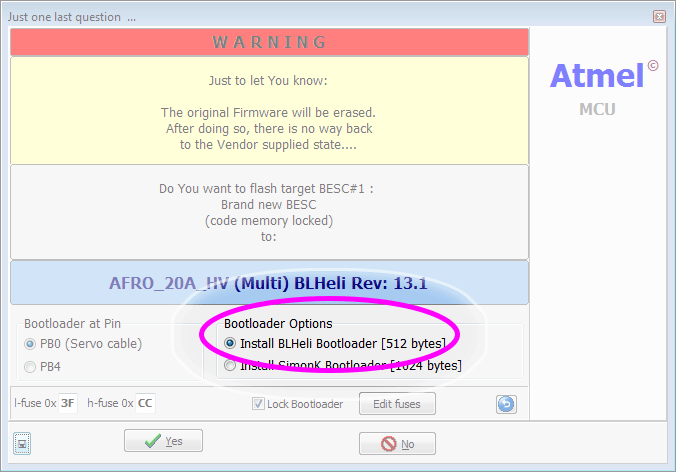
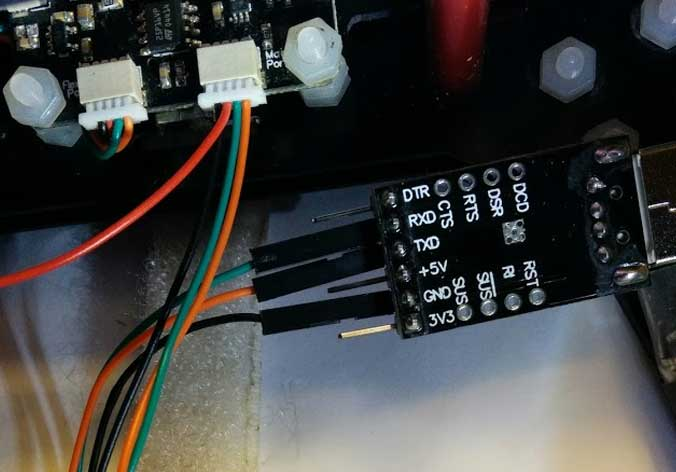

# 1-wire passthrough esc programming

### ESCs must have the BlHeli Bootloader.

If your ESCs didn't come with BlHeli Bootloader, you'll need to flash them with an ArduinoISP programmer first. [Here's a guide](http://bit.ly/blheli-f20).

This is the option you need to select for the bootloader:



Currently supported on the SPRACINGF3, STM32F3DISCOVERY, NAZE32 (including clones such as the FLIP32) and CC3D.

## Wiring

  - For the NAZE, no external wiring is necessary. Simply plug in the board via USB cable.

  - For the CC3D, connect [a USB to UART adapter](http://bit.ly/cf-cp2102) to the flex port.

    - Ensure MSP is enabled on the flex port. Unfortunatly the main port cannot be used in the current configuration due to the inverter on this port.

    - You'll only need this connection to the CC3D, do not plug in the normal USB connection.

    - If you need one, I prefer the [CP2102](http://bit.ly/cf-cp2102) as it is cheap and [the driver](https://www.silabs.com/products/mcu/Pages/USBtoUARTBridgeVCPDrivers.aspx) is readily available.

  - In the case that your board does not power on fully without a battery attached, it is OK to attach the battery before following the steps below. However, it may not be necessary in all cases.

## Usage

  - Plug in the USB cable and connect to your board with the INAV configurator.

    - For boards without a built in USB/UART adapter, you'll need to plug an external one in. Here is how you wire up the CC3D. Plug your USB/UART adapter into the Flexi port:

      

  - Open the BlHeli Suite.

  - Ensure you have selected the correct Atmel or SILABS "Cleanflight" option under the "Select ATMEL / SILABS Interface" menu option.

  - Ensure you have port for your external USB/UART adapter selected, if you're using one, otherwise pick the same COM port that you normally use for INAV.

  - Click "Connect" and wait for the connection to complete. If you get a COM error, hit connect again. It will probably work.

  - Use the boxes at the bottom to select the ESCs you have connected. Note that the boxes correspond directly to the ports on your flight controller. For example if you have motors on ports 1-4, pick boxes 1-4 or in the case of a tri-copter that uses motors on ports 3, 4 and 5, select those ports in BlHeli.

  - Click "Read Setup"

  - Use BlHeli suite as normal.

  - When you're finished with one ESC, click "Disconnect"

## Implementing and Configuring targets

The following parameters can be used to enable and configure this in the related target.h file:

    USE_SERIAL_1WIRE              Enables the 1wire code, defined in target.h


  - For new targets

    - in `target.h`

        ```
        // Turn on serial 1wire passthrough
        #define USE_SERIAL_1WIRE
        // How many escs does this board support?
        #define ESC_COUNT 6
        // STM32F3DISCOVERY TX - PC3 connects to UART RX
        #define S1W_TX_GPIO         GPIOC
        #define S1W_TX_PIN          GPIO_Pin_3
        // STM32F3DISCOVERY RX - PC1 connects to UART TX
        #define S1W_RX_GPIO         GPIOC
        #define S1W_RX_PIN          GPIO_Pin_1
        ```

    - in `serial_1wire.c`

       ```
       // Define your esc hardware
       #if defined(STM32F3DISCOVERY) && !(defined(CHEBUZZF3))
       const escHardware_t escHardware[ESC_COUNT] = {
         { GPIOD, 12 },
         { GPIOD, 13 },
         { GPIOD, 14 },
         { GPIOD, 15 },
         { GPIOA, 1 },
         { GPIOA, 2 }
       };
       ```

## Development Notes

On the STM32F3DISCOVERY, an external pullup on the ESC line may be necessary. I needed a 3v, 4.7k pullup.
