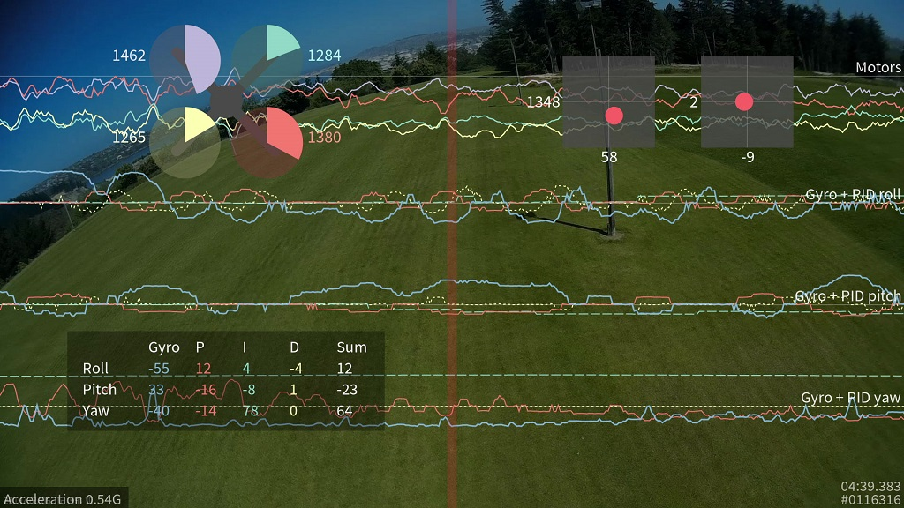
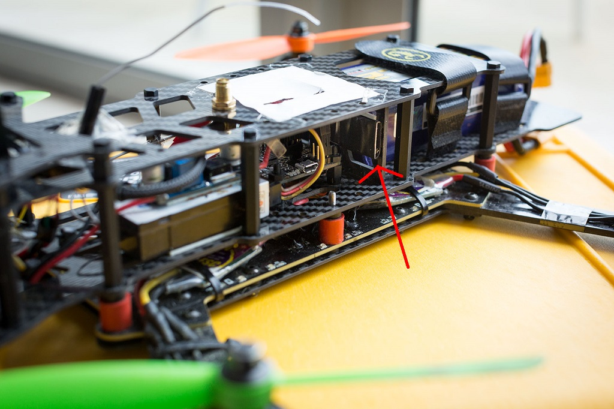
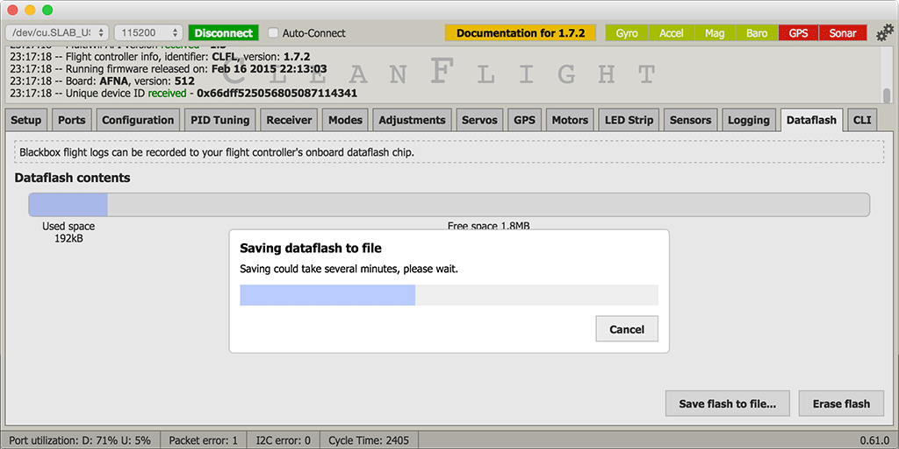

# Blackbox flight data recorder



## Introduction

This feature transmits your flight data information on every control loop iteration over a serial port to an external
logging device to be recorded, or to a dataflash chip which is present on some flight controllers.

After your flight, you can view the resulting logs using the interactive log viewer:

https://github.com/iNavFlight/blackbox-log-viewer

You can also use the `blackbox_decode` tool to turn the logs into CSV files for analysis, or render your flight log as a
video using the `blackbox_render` tool. Those tools can be found in this repository:

https://github.com/cleanflight/blackbox-tools

## Logged data
The blackbox records flight data on every iteration of the flight control loop. It records the current time in
microseconds, P, I and D corrections for each axis, your RC command stick positions (after applying expo curves),
gyroscope data, accelerometer data (after your configured low-pass filtering), barometer and rangefinder readings, 3-axis
magnetometer readings, raw VBAT and current measurements, RSSI, and the command being sent to each motor speed
controller. This is all stored without any approximation or loss of precision, so even quite subtle problems should be
detectable from the fight data log.

GPS data is logged whenever new GPS data is available. Although the CSV decoder will decode this data, the video
renderer does not yet show any of the GPS information (this will be added later).

## Supported configurations

The maximum data rate that can be recorded to the flight log is fairly restricted, so anything that increases the load
can cause the flight log to drop frames and contain errors.

The Blackbox is typically used on tricopters and quadcopters. Although it will work on hexacopters and octocopters,
because these craft have more motors to record, they must transmit more data to the flight log. This can increase the
number of dropped frames. Although the browser-based log viewer supports hexacopters and octocopters, the command-line
`blackbox_render` tool currently only supports tri- and quadcopters.

INAV's `looptime` setting decides how frequently an update is saved to the flight log. The default looptime on
INAV is 2000us. If you're using a looptime smaller than about 2400, you may experience some dropped frames due to
the high required data rate. In that case you will need to reduce the sampling rate in the Blackbox settings, or
increase your logger's baudrate to 250000. See the later section on configuring the Blackbox feature for details.

## Setting up logging

First, you must enable the Blackbox feature. In the [INAV Configurator][] enter the Configuration tab,
tick the "BLACKBOX" feature at the bottom of the page, and click "Save and reboot"

Now you must decide which device to store your flight logs on. You can either transmit the log data over a serial port
to an external logging device like the [OpenLog serial data logger][] to be recorded to a microSDHC card, or if you have
a compatible flight controller you can store the logs on the onboard dataflash storage instead.

### OpenLog serial data logger

The OpenLog is a small logging device which attaches to your flight controller using a serial port and logs your
flights to a MicroSD card.

The OpenLog ships from SparkFun with standard "OpenLog 3" firmware installed. Although this original OpenLog firmware
will work with the Blackbox, in order to reduce the number of dropped frames it should be reflashed with the
higher performance [OpenLog Blackbox firmware][]. The special Blackbox variant of the OpenLog firmware also ensures that
the OpenLog is using INAV compatible settings, and defaults to 115200 baud.

You can find the Blackbox version of the OpenLog firmware [here](https://github.com/cleanflight/blackbox-firmware),
along with instructions for installing it onto your OpenLog.

[OpenLog serial data logger]: https://www.sparkfun.com/products/9530
[OpenLog Blackbox firmware]: https://github.com/cleanflight/blackbox-firmware

#### microSDHC

Your choice of microSDHC card is very important to the performance of the system. The OpenLog relies on being able to
make many small writes to the card with minimal delay, which not every card is good at. A faster SD-card speed rating is
not a guarantee of better performance.

##### microSDHC cards known to have poor performance

 - Generic 4GB Class 4 microSDHC card - the rate of missing frames is about 1%, and is concentrated around the most
   interesting parts of the log!
 - Sandisk Ultra 32GB (unlike the smaller 16GB version, this version has poor write latency)

##### microSDHC cards known to have good performance

 - Transcend 16GB Class 10 UHS-I microSDHC (typical error rate < 0.1%)
 - Sandisk Extreme 16GB Class 10 UHS-I microSDHC (typical error rate < 0.1%)
 - Sandisk Ultra 16GB (it performs only half as well as the Extreme in theory, but still very good)

You should format any card you use with the [SD Association's special formatting tool][] , as it will give the OpenLog
the best chance of writing at high speed. You must format it with either FAT, or with FAT32 (recommended).

[SD Association's special formatting tool]: https://www.sdcard.org/downloads/formatter_4/

### Choosing a serial port for the OpenLog
First, tell the Blackbox to log using a serial port (rather than to an onboard dataflash chip). Go to the
Configurator's CLI tab, enter `set blackbox_device=SERIAL` to switch logging to serial, and
save.

You need to let INAV know which of [your serial ports][] you connect your OpenLog to (i.e. the Blackbox port),
which you can do on the Configurator's Ports tab.

You should use a hardware serial port (such as UART1 on the Naze32, the two-pin Tx/Rx header in the center of the
board). SoftSerial ports can be used for the Blackbox. However, because they are limited to 19200 baud, your logging
rate will need to be severely reduced to compensate. Therefore the use of SoftSerial is not recommended.

When using a hardware serial port, Blackbox should be set to at least 115200 baud on that port. When using fast
looptimes (<2500), a baud rate of 250000 should be used instead in order to reduce dropped frames.

The serial port used for Blackbox cannot be shared with any other function (e.g. GPS, telemetry) except the MSP
protocol. If MSP is used on the same port as Blackbox, then MSP will be active when the board is disarmed, and Blackbox
will be active when the board is armed. This will mean that you can't use the Configurator or any other function that
requires MSP, such as an OSD or a Bluetooth wireless configuration app, while the board is armed.

Connect the "TX" pin of the serial port you've chosen to the OpenLog's "RXI" pin. Don't connect the serial port's RX
pin to the OpenLog, as this will cause the OpenLog to interfere with any shared functions on the serial port while
disarmed.

#### Naze32 serial port choices

On the Naze32, the TX/RX pins on top of the board are connected to UART1, and are shared with the USB connector.
Therefore, MSP must be enabled on UART1 in order to use the Configurator over USB. If Blackbox is connected to the pins
on top of the Naze32, the Configurator will stop working once the board is armed. This configuration is usually a good
choice if you don't already have an OSD installed which is using those pins while armed, and aren't using the FrSky
telemetry pins.

Pin RC3 on the side of the board is UART2's Tx pin. If Blackbox is configured on UART2, MSP can still be used on UART1
when the board is armed, which means that the Configurator will continue to work simultaneously with Blackbox logging.
Note that in `PARALLEL_PWM` mode this leaves the board with 6 input channels as RC3 and RC4 pins are used by UART2 as Tx and Rx. INAV automatically shifts logical channel mapping for you when UART2 is enabled in `Ports` tab so you'll have to shift receiver pins that are connected to Naze32 pins 3 to 6 by two.

The OpenLog tolerates a power supply of between 3.3V and 12V. If you are powering your Naze32 with a standard 5V BEC,
then you can use a spare motor header's +5V and GND pins to power the OpenLog with.

#### Other flight controller hardware
Boards other than the Naze32 may have more accessible hardware serial devices, in which case refer to their
documentation to decide how to wire up the logger. The key criteria are:

* Should be a hardware serial port rather than SoftSerial.
* Cannot be shared with any other function (GPS, telemetry) except MSP.
* If MSP is used on the same UART, MSP will stop working when the board is armed.

#### OpenLog configuration

Power up the OpenLog with a microSD card inside, wait 10 seconds or so, then power it down and plug the microSD card
into your computer. You should find a "CONFIG.TXT" file on the card, open it up in a text editor. You should see the
baud rate that the OpenLog has been configured for (usually 115200 or 9600 from the factory). Set the baud rate to match
the rate you entered for the Blackbox in the Configurator's Port tab (typically 115200 or 250000).

Save the file and put the card back into your OpenLog, it will use those settings from now on.

If your OpenLog didn't write a CONFIG.TXT file, create a CONFIG.TXT file with these contents and store it in the root
of the MicroSD card:

```
115200
baud
```

If you are using the original OpenLog firmware, use this configuration instead:

```
115200,26,0,0,1,0,1
baud,escape,esc#,mode,verb,echo,ignoreRX
```

#### OpenLog protection

The OpenLog can be wrapped in black electrical tape or heat-shrink in order to insulate it from conductive frames (like
carbon fiber), but this makes its status LEDs impossible to see. I recommend wrapping it with some clear heatshrink
tubing instead.



### Onboard dataflash storage
Some flight controllers have an onboard SPI NOR dataflash chip which can be used to store flight logs instead of using
an OpenLog.

The full version of the Naze32 and the CC3D have an onboard "m25p16" 2 megabyte dataflash storage chip. This is a small
chip with 8 fat legs, which can be found at the base of the Naze32's direction arrow. This chip is not present on the
"Acro" version of the Naze32.

The SPRacingF3 has a larger 8 megabyte dataflash chip onboard which allows for longer recording times.

These chips are also supported:

* Micron/ST M25P16 - 16 Mbit / 2 MByte
* Micron N25Q064 - 64 Mbit / 8 MByte
* Winbond W25Q64 - 64 Mbit / 8 MByte
* Micron N25Q0128 - 128 Mbit / 16 MByte
* Winbond W25Q128 - 128 Mbit / 16 MByte

#### Enable recording to dataflash
On the Configurator's CLI tab, you must enter `set blackbox_device=SPIFLASH` to switch to logging to an onboard dataflash chip,
then save.

[your serial ports]: https://github.com/iNavFlight/inav/blob/master/docs/Serial.md
[INAV Configurator]: https://chrome.google.com/webstore/detail/inav-configurator/fmaidjmgkdkpafmbnmigkpdnpdhopgel

## Configuring the Blackbox

The Blackbox currently provides two settings (`blackbox_rate_num` and `blackbox_rate_denom`) that allow you to control
the rate at which data is logged. These two together form a fraction (`blackbox_rate_num / blackbox_rate_denom`) which
decides what portion of the flight controller's control loop iterations should be logged. The default is 1/1 which logs
every iteration.

If you're using a slower MicroSD card, you may need to reduce your logging rate to reduce the number of corrupted
logged frames that `blackbox_decode` complains about. A rate of 1/2 is likely to work for most craft.

You can change the logging rate settings by entering the CLI tab in the [INAV Configurator][] and using the `set`
command, like so:

```
set blackbox_rate_num = 1
set blackbox_rate_denom = 2
```

The data rate for my quadcopter using a looptime of 2400 and a rate of 1/1 is about 10.25kB/s. This allows about 18
days of flight logs to fit on my OpenLog's 16GB MicroSD card, which ought to be enough for anybody :).

If you are logging using SoftSerial, you will almost certainly need to reduce your logging rate to 1/32. Even at that
logging rate, looptimes faster than about 1000 cannot be successfully logged.

If you're logging to an onboard dataflash chip instead of an OpenLog, be aware that the 2MB of storage space it offers
is pretty small. At the default 1/1 logging rate, and a 2400 looptime, this is only enough for about 3 minutes of
flight. This could be long enough for you to investigate some flying problem with your craft, but you may want to reduce
the logging rate in order to extend your recording time.

To maximize your recording time, you could drop the rate all the way down to 1/32 (the smallest possible rate) which
would result in a logging rate of about 10-20Hz and about 650 bytes/second of data. At that logging rate, a 2MB
dataflash chip can store around 50 minutes of flight data, though the level of detail is severely reduced and you could
not diagnose flight problems like vibration or PID setting issues.

## Usage

The Blackbox starts recording data as soon as you arm your craft, and stops when you disarm.

If your craft has a buzzer attached, you can use INAV's arming beep to synchronize your Blackbox log with your
flight video. INAV's arming beep is a "long, short" pattern. The beginning of the first long beep will be shown
as a blue line in the flight data log, which you can sync against your recorded audio track.

You should wait a few seconds after disarming your craft to allow the Blackbox to finish saving its data.

### Usage - OpenLog
Each time the OpenLog is power-cycled, it begins a fresh new log file. If you arm and disarm several times without
cycling the power (recording several flights), those logs will be combined together into one file. The command line
tools will ask you to pick which one of these flights you want to display/decode.

Don't insert or remove the SD card while the OpenLog is powered up.

### Usage - Dataflash chip
After your flights, you can use the [INAV Configurator][] to download the contents of the dataflash to your
computer. Go to the "dataflash" tab and click the "save flash to file..." button. Saving the log can take 2 or 3
minutes.



After downloading the log, be sure to erase the chip to make it ready for reuse by clicking the "erase flash" button.

If you try to start recording a new flight when the dataflash is already full, Blackbox logging will be disabled and
nothing will be recorded.

### Usage - Logging switch
If you're recording to an onboard flash chip, you probably want to disable Blackbox recording when not required in order
to save storage space. To do this, you can add a Blackbox flight mode to one of your AUX channels on the Configurator's
modes tab. Once you've added a mode, Blackbox will only log flight data when the mode is active.

A log header will always be recorded at arming time, even if logging is paused. You can freely pause and resume logging
while in flight.

## Viewing recorded logs
After your flights, you'll have a series of flight log files with a .TXT extension.

You can view these .TXT flight log files interactively using your web browser with the INAV Blackbox Explorer:

https://github.com/iNavFlight/blackbox-log-viewer

This allows you to scroll around a graphed version of your log and examine your log in detail. You can also export a
video of your log to share it with others!

You can decode your logs with the `blackbox_decode` tool to create CSV (comma-separated values) files for analysis,
or render them into a series of PNG frames with `blackbox_render` tool, which you could then convert into a video using
another software package.

You'll find those tools along with instructions for using them in this repository:

https://github.com/iNavFlight/blackbox-log-viewer
