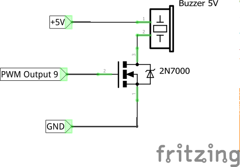

# AnyFC-F7

* The first F7 board flown with betaflight and inavflight, made by [@sambas](https://github.com/sambas)
* OSHW CC BY-SA 3.0
* Source: https://github.com/sambas/hw/tree/master/AnyFCF7
* 1st betaflight: https://www.youtube.com/watch?v=tv7k3A0FG80
* 1st inavflight: https://www.youtube.com/watch?v=kJvlZAzprBs

## HW info

* STM32F745VGT6 100lqfp 216MHz
* MPU6000 SPI
* MS5611 baro
* All 8 uarts available + VCP
* 10 pwm outputs + 6 inputs
* external I2C
* external SPI (shared with U4/5)
* support for CAN
* SD card logging (SPI)
* 3 AD channels, one with 10k/1k divider, two with 1k series resistor

## Pinout

## Outout mapping

Multirotors
-----------

| Output number | No *LED Strip* | With *LED Strip* |
|---------------|----------------|------------------|
| 1             | Motor 4        | Motor 4          |
| 2             | Motor 5        | LED Strip        |
| 3             | Motor 6        | Motor 5          |
| 4             | Motor 7        | Motor 6          |
| 5             | Motor 3        | Motor 3          |
| 6             | Motor 2        | Motor 2          |
| 7             | Motor 8        | -                |
| 8             | -              | Motor 7          |
| 9             | Buzzer         | Buzzer           |
| 10            | Motor 1        | Motor 1          |

| Input | Function |
|-------|----------|
| 1     | PPM      |
| 2     | -        |
| 3     | Servo 1  |
| 4     | Servo 2  |
| 5     | Servo 3  |
| 6     | Servo 4  |

Airplanes
---------

| Output number | Function |
|---------------|----------|
| 1             | Motor 1  |
| 2             | Motor 2  |
| 3             | Servo 4  |
| 4             | Servo 5  |
| 5             | Servo 3  |
| 6             | Servo 2  |
| 7             | Servo 6  |
| 8             | Servo 7  |
| 9             | Servo 8  |
| 10            | Servo 1  |

## Buzzer

Buzzer is supported with additional switching MOSFET transistor when connected to PWM Output #9. 

## SD Card Detection

**Any Fc F7** clones can come with different SD card slot: with inverted or _not_ inverted detection pin. If board is not able to detect SD card, try changing `sdcard_detect_inverted` CLI setting. It accepts `ON` and `OFF` values. 

## Barometer

**AnyFC F7** clones comes without MS5611 barometer installed. If you want to use external barometer of any kind (BMP280, BMP085, MS5611) you have to use target `ANYFCF7_EXTERNAL_BARO`. This target enables barometer detection on external I2C bus.

# AnyFC F7 Pro from Banggood

This board is not yet officially supported. It _should_ work but INAV devs did not tested it yet. Use on your own responsibility