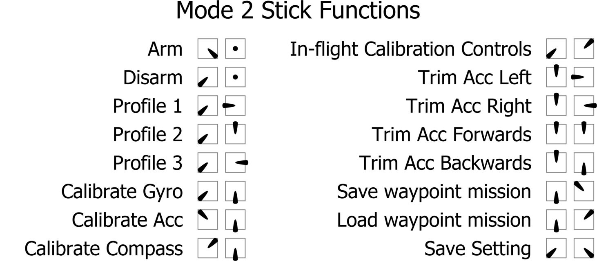

# Controls

## Arming

When armed, the aircraft is ready to fly and the motors will spin when throttle is applied.  The motors will
spin at a slow speed when armed (this feature may be disabled by setting MOTOR_STOP, but for safety reasons,
that is not recommended).

By default, arming and disarming is done using stick positions.  (NOTE: this feature is disabled when using a
switch to arm.)

## Stick Positions

The three stick positions are:

|Position        | Approx. Channel Input|
|----------------|----------------------|
|LOW             | 1000                 |
|CENTER          | 1500                 |
|HIGH            | 2000                 |

The stick positions are combined to activate different functions:

| Function                      | Throttle | Yaw     | Pitch  | Roll   |
| ----------------------------- | -------- | ------- | ------ | ------ |
| ARM                           | LOW      | HIGH    | CENTER | CENTER |
| DISARM                        | LOW      | LOW     | CENTER | CENTER |
| Profile 1                     | LOW      | LOW     | CENTER | LOW    |
| Profile 2                     | LOW      | LOW     | HIGH   | CENTER |
| Profile 3                     | LOW      | LOW     | CENTER | HIGH   |
| Calibrate Gyro                | LOW      | LOW     | LOW    | CENTER |
| Calibrate Acc                 | HIGH     | LOW     | LOW    | CENTER |
| Calibrate Mag/Compass         | HIGH     | HIGH    | LOW    | CENTER |
| Trim Acc Left                 | HIGH     | CENTER  | CENTER | LOW    |
| Trim Acc Right                | HIGH     | CENTER  | CENTER | HIGH   |
| Trim Acc Forwards             | HIGH     | CENTER  | HIGH   | CENTER |
| Trim Acc Backwards            | HIGH     | CENTER  | LOW    | CENTER |
| Save current waypoint mission | LOW      | CENTER  | HIGH   | LOW    |
| Load current waypoint mission | LOW      | CENTER  | HIGH   | HIGH   |
| Save setting                  | LOW      | LOW     | LOW    | HIGH   |

## Yaw control

While arming/disarming with sticks, your yaw stick will be moving to extreme values. In order to prevent your craft
from trying to yaw during arming/disarming while on the ground, your yaw input will not cause the craft to yaw when the
throttle is LOW (i.e. below the `min_check` setting).

For tricopters, you may want to retain the ability to yaw while on the ground, so that you can verify that your tail
servo is working correctly before takeoff. You can do this by setting `tri_unarmed_servo` to `1` on the CLI (this is the
default). If you are having issues with your tail rotor contacting the ground during arm/disarm, you can set this to
`0` instead. Check this table to decide which setting will suit you:

<table>
    <tr>
        <th colspan="5">Is yaw control of the tricopter allowed?</th>
    </tr>
    <tr>
        <th></th><th colspan="2">Disarmed</th><th colspan="2">Armed</th>
    </tr>
    <tr>
        <th></th><th>Throttle low</th><th>Throttle normal</th><th>Throttle low</th><th>Throttle normal</th>
    </tr>
    <tr>
        <td rowspan="2">tri_unarmed_servo = 0</td><td>No</td><td>No</td><td>No</td><td>Yes</td>
    </tr>
    <tr>
        <td>No</td><td>No</td><td>No</td><td>Yes</td>
    </tr>
    <tr>
        <td rowspan="2">tri_unarmed_servo = 1</td><td>Yes</td><td>Yes</td><td>Yes</td><td>Yes</td>
    </tr>
    <tr>
        <td>Yes</td><td>Yes</td><td>Yes</td><td>Yes</td>
    </tr>
</table>

## Throttle settings and their interaction

`min_command` -
With motor stop enabled this is the command sent to the esc's when the throttle is below min_check or disarmed. With motor stop disabled, this is the command sent only when the copter is disarmed. This must be set well below motors spinning for safety. 

`min_check` - 
With switch arming mode is in use, lowering your throttle below min_check will result in motors spinning at min_throttle. When using the default stick arming, lowering your throttle below min_check will result in motors spinning at min_throttle and yaw being disabled so that you may arm/disarm. With motor stop enabled, lowering your throttle below min_check will also result in motors off and the esc's being sent min_command. Min_check must be set to a level that is 100% reliably met by the throttle throw. A setting too low may result in a dangerous condition where the copter can’t be disarmed. It is ok to set this below min_throttle because the FC will automaticly scale the output to the esc's

`min_throttle` -
Typically set to just above reliable spin up of all motors. Sometimes this is set slightly higher for prop stall prevention during advanced maneuvers or sometimes considerably higher to produce a desired result. When armed with motor stop off, your motors will spin at this command so keep that in mind from a safety stand point.  

`max_check` -
Throttle positions above this level will send max_command to the esc's. 

`max_throttle` -
This is the max command to the esc's from the flight controller. 

In depth videos explaining these terms are available from Joshua Bardwell here:

https://www.youtube.com/watch?v=WFU3VewGbbA

https://www.youtube.com/watch?v=YNRl0OTKRGA
