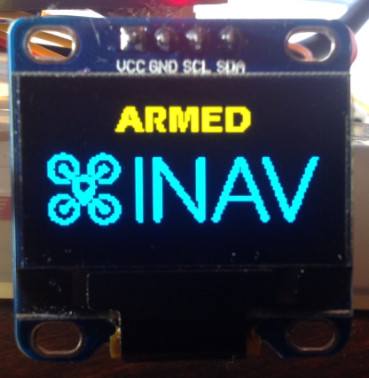
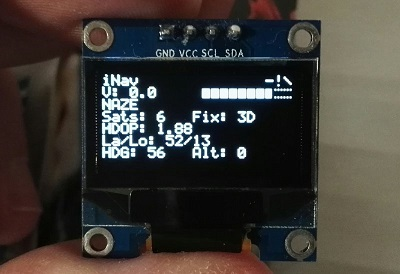
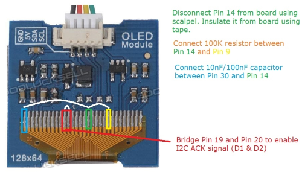
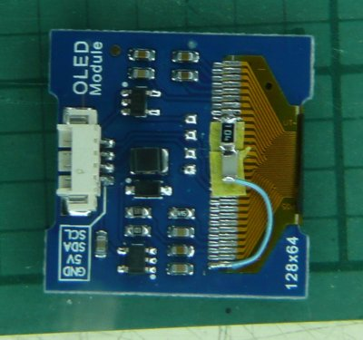

# Display

INAV supports displays to provide information to you about your aircraft and iNav state.

When the aircraft is armed, an "Armed" message is displayed. When it is disarmed, a summary page is displayed. Page cycling has been removed and no other information is currently available





There is currently no way to change the information on the display

## Supported Hardware
I2c IIC Serial Oled LCD LED Module 12864 (<a href="http://a.co/5hxXEvZ">http://a.co/5hxXEvZ</a> used in status image above)

SSD1306

UG-2864HSWEG01

## Configuration

From the CLI enable the `DISPLAY` feature

```
feature DISPLAY
```


### SSD1306 OLED displays

The SSD1306 display is a 128x64 OLED display that is visible in full sunlight, small and consumes very little current.  
This makes it ideal for aircraft use.

There are various models of SSD1306 boards out there, they are not all equal and some require addtional modifications
before they work.  Choose wisely!

Links to displays:

 * [banggood.com](http://www.banggood.com/0_96-Inch-4Pin-White-IIC-I2C-OLED-Display-Module-12864-LED-For-Arduino-p-958196.html) 0.96 Inch 4Pin White IIC I2C OLED Display Module 12864 LED For Arduino
 * [banggood.com](http://www.banggood.com/0_96-Inch-4Pin-IIC-I2C-Blue-OLED-Display-Module-For-Arduino-p-969147.html) 0.96 Inch 4Pin IIC I2C Blue OLED Display Module For Arduino
 * [wide.hk](http://www.wide.hk/products.php?product=I2C-0.96%22-OLED-display-module-%28-compatible-Arduino-%29) I2C 0.96" OLED display module
 * [witespyquad.gostorego.com](http://witespyquad.gostorego.com/accessories/readytofly-1-oled-128x64-pid-tuning-display-i2c.html) ReadyToFlyQuads 1" OLED Display
 * [multiwiicopter.com](http://www.multiwiicopter.com/products/1-oled) PARIS 1" OLED 128x64 PID tuning screen AIR

The banggood.com display is the cheapest at the time fo writing and will correctly send I2C ACK signals.

#### Crius CO-16

This display is best avoided but will work if you modify it.

Step 1

As supplied the I2C ack signal is not sent because the manufacturer did not bridge D1 and D2 together.  To fix this solder
the two pins together as they enter the screen.  Failure to do this will result is a screen that doesn't display anything.

Step 2

Pin 14 must be disconnected from the main board using a scalpel. Then connect a 10nF or 100nF capacitor between pins 30 and the
lifted pin 14.

Step 3

Connect a 100K resistor between Pin 9 and the lifted Pin 14.

Failure to perform steps 2 and 3 will result in a display that only works on power up some of the time any may display random dots
or other display corruption.

More can be read about this procedure here: http://www.multiwii.com/forum/viewtopic.php?f=6&t=2705&start=10




## Connections

Connect +5v, Ground, I2C SDA and I2C SCL from the flight controller to the display.

On Naze32 rev 5 boards the SDA and SCL pads are underneath the board.
