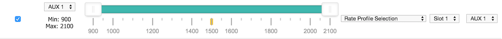
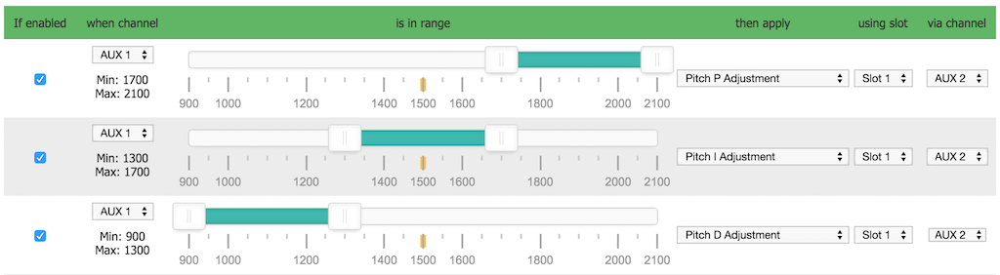
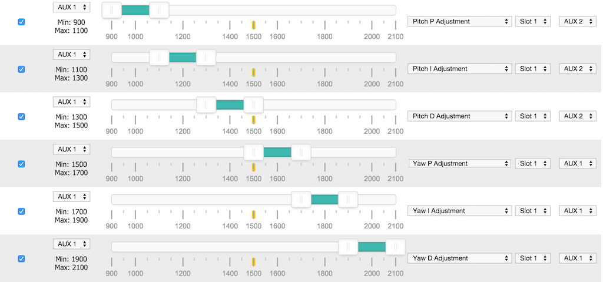
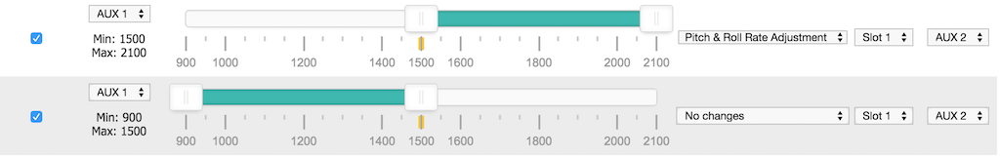
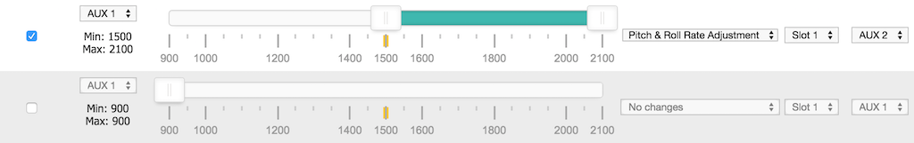
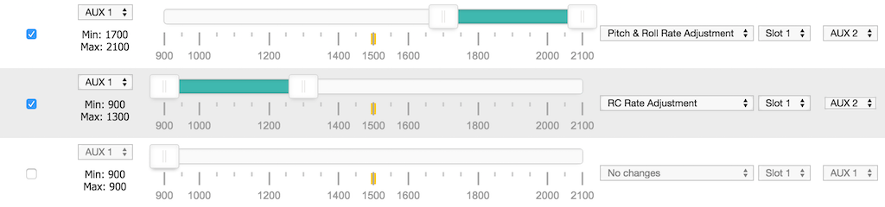
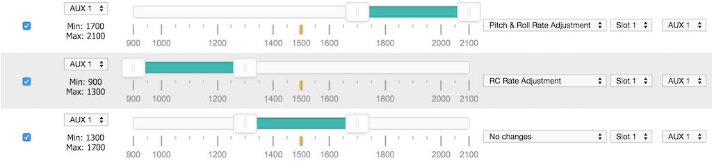

# In-flight Adjustments

With INAV it's possible to make adjustments to various settings by using AUX channels from your transmitter while the aircraft is flying.

## Warning

Changing settings during flight can make your aircraft unstable and crash if you are not careful.

## Recommendations

* Always make adjustments while flying in a large open area.
* Make small adjustments and fly carefully to test your adjustment.
* Give yourself enough flying space and time to adjust to how your changes affect the behaviour of the aircraft.
* Remember to set adjustment channel switches/pots to the center position before powering on your TX and your aircraft.
* If possible configure switch warnings on your transitter for dedicated adjustment switches.
* A momentary 3 position switch is the best choice of switch for this - i.e. one that re-centers itself when you let go of it.

## Overview

Up to 4 RX channels can be used to make different adjustments at the same time.

The adjustment a channel makes can be controlled by another channel.

The following adjustments can be made, in flight, as well as on the ground.

* RC Rate
* RC Expo
* Throttle Expo
* Roll & Pitch Rate
* Yaw Rate
* Pitch+Roll P I and D
* Yaw P I and D

Example scenarios:
Up to 4 3-position switches or pots can be used to adjust 4 different settings at the same time.
A single 2/3/4/5/6/x position switch can be used to make one 3 position switch adjust one setting at a time.

Any combination of switches and pots can be used. So you could have 6 POS switch.

Settings are not saved automatically, connect a GUI, refresh and save or save using stick position when disarmed.
Powering off without saving will discard the adjustments.

Settings can be saved when disarmed using stick positions: Throttle Low, Yaw Left, Pitch Low, Roll Right.

## Adjustment switches

The switch can be a ON-OFF-ON, POT or momentary ON-OFF-ON switch.  The latter is recommended.

When the switch is returned to the center position the value will not be increased/decreased.

Each time you can press the switch high/low and then return it to the middle the value will change at least once, you do not have to wait before pressing the switch again if you want to increase/decrease at a faster rate.  While the adjustment switch held is high/low, the adjustment function applies and increases/decreases the value being adjusted twice a second and the flight controller will beep shorter/longer, respectively. The system works similar to how a keyboard repeat delay works.

Hint: With OpenTX transmitters you can combine two momentary OFF-ON switches to control a single channel.  You could make it so that a momentary switch on the left of your transmitter decreases the value and a momentary switch on the right increases the value.  Experiment with your mixer!


## Configuration

The CLI command `adjrange` is used to configure adjustment ranges.

12 adjustment ranges can be defined.
4 adjustments can be made at the same time, each simultaneous adjustment requires an adjustment slot.

Show the current ranges using:

`adjrange`

Configure a range using:

`adjrange <index> <slot> <range channel> <range start> <range end> <adjustment function> <adjustment channel>`


| Argument | Value | Meaning |
| -------- | ----- |-------- |
| Index | 0 - 11 | Select the adjustment range to configure |
| Slot | 0 - 3 | Select the adjustment slot to use |
| Range Channel | 0 based index, AUX1 = 0, AUX2 = 1 | The AUX channel to use to select an adjustment for a switch/pot |
| Range Start | 900 - 2100. Steps of 25, e.g. 900, 925, 950... | Start of range |
| Range End | 900 - 2100 | End of range |
| Adjustment function | 0 - 11 | See Adjustment function table |
| Adjustment channel | 0 based index, AUX1 = 0, AUX2 = 1 | The channel that is controlled by a 3 Position switch/Pot |

Range Start/End values should match the values sent by your receiver.

Normally Range Channel and Slot values are grouped together over multiple adjustment ranges.

The Range Channel and the Adjustment Channel can be the same channel.  This is useful when you want a single 3 Position switch to be dedicated
to a single adjustment function regardless of other switch positions.

The adjustment function is applied to the adjustment channel when range channel is between the range values.
The adjustment is made when the adjustment channel is in the high or low position.  high = mid_rc + 200, low = mid_rc - 200.  by default this is 1700 and 1300 respectively.

When the Range Channel does not fall into Start/End range the assigned slot will retain it's state and will continue to apply the adjustment. For
this reason ensure that you define enough ranges to cover the range channel's usable range.

### Adjustment function

| Value | Adjustment | Notes |
| ----- | ---------- |------ |
| 0     | None |
| 1     | RC RATE |
| 2     | RC_EXPO |
| 3     | THROTTLE_EXPO |
| 4     | PITCH_ROLL_RATE |
| 5     | YAW_RATE |
| 6     | PITCH_ROLL_P |
| 7     | PITCH_ROLL_I |
| 8     | PITCH_ROLL_D |
| 9     | YAW_P |
| 10    | YAW_I |
| 11    | YAW_D |
| 12    | RATE_PROFILE | Switch between 3 rate profiles using a 3 position switch. |
| 13    | PITCH_RATE |
| 14    | ROLL_RATE |
| 15    | PITCH_P |
| 16    | PITCH_I |
| 17    | PITCH_D |
| 18    | ROLL_P |
| 19    | ROLL_I |
| 20    | ROLL_D |

## Examples

### Example 1 - 3 Position switch used to adjust pitch/roll rate

```
adjrange 0 0 3 900 2100 4 3
```

explained:

* configure adjrange 0 to use adjustment slot 1 (0) so that when aux4
(3) in the range 900-2100 then use adjustment 4 (pitch/roll rate) when aux 4 (3)
is in the appropriate position.


### Example 2 - 2 Position switch used to enable adjustment of RC rate via a 3 position switch

```
adjrange 1 1 0 900 1700 0 2
adjrange 2 1 0 1700 2100 1 2
```
explained:

* configure adjrange 1 to use adjustment slot 2 (1) so that when aux1
(0) in the range 900-1700 then do nothing (0) when aux 3 (2) is in any
position.
* configure adjrange 2 to use adjustment slot 2 (1) so that when aux1
(0) in the range 1700-2100 then use adjustment rc rate (1) when aux 3
(2) is in the appropriate position.

Without the entire range of aux1 being defined there is nothing that
would stop aux 3 adjusting the pitch/roll rate once aux 1 wasn't in the higher
range.

### Example 3 - 6 Position switch used to select PID tuning adjustments via a 3 position switch

```
adjrange 3 2 1 900 1150 6 3
adjrange 4 2 1 1150 1300 7 3
adjrange 5 2 1 1300 1500 8 3
adjrange 6 2 1 1500 1700 9 3
adjrange 7 2 1 1700 1850 10 3
adjrange 8 2 1 1850 2100 11 3
```

explained:

* configure adjrange 3 to use adjustment slot 3 (2) so that when aux2
(1) in the range 900-1150 then use adjustment Pitch/Roll P (6) when aux 4
(3) is in the appropriate position.
* configure adjrange 4 to use adjustment slot 3 (2) so that when aux2
(1) in the range 1150-1300 then use adjustment Pitch/Roll I (7) when aux 4
(3) is in the appropriate position.
* configure adjrange 5 to use adjustment slot 3 (2) so that when aux2
(1) in the range 1300-1500 then use adjustment Pitch/Roll D (8) when aux 4
(3) is in the appropriate position.
* configure adjrange 6 to use adjustment slot 3 (2) so that when aux2
(1) in the range 1500-1700 then use adjustment Yaw P (9) when aux 4
(3) is in the appropriate position.
* configure adjrange 7 to use adjustment slot 3 (2) so that when aux2
(1) in the range 1700-1850 then use adjustment Yaw I (10) when aux 4
(3) is in the appropriate position.
* configure adjrange 8 to use adjustment slot 3 (2) so that when aux2
(1) in the range 1850-2100 then use adjustment Yaw D (11) when aux 4
(3) is in the appropriate position.

### Example 4 - Use a single 3 position switch to change between 3 different rate profiles

adjrange 11 3 3 900 2100 12 3

explained:

* configure adjrange 11 to use adjustment slot 4 (3) so that when aux4
(3) in the range 900-2100 then use adjustment Rate Profile (12) when aux 4
(3) is in the appropriate position.

When the switch is low, rate profile 0 is selcted.
When the switch is medium, rate profile 1 is selcted.
When the switch is high, rate profile 2 is selcted.


### Configurator examples

The following 5 images show valid configurations.  In all cales the enture usable range for the Range Channel is used.



---


---



---



---



The following examples shows __incorrect__ configurations - the entire usable range for the Range Channel is not used in both cases.




In the following example, the incorrect configuraton (above) has been corrected by adding a range that makes 'No changes'.


