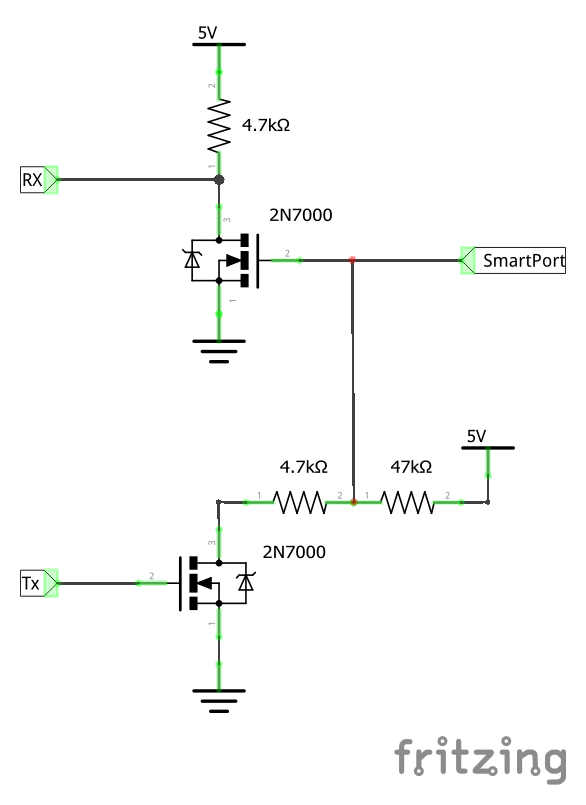

# Telemetry

Telemetry allows you to know what is happening on your aircraft while you are flying it.  Among other things you can receive battery voltages and GPS positions on your transmitter.

Telemetry can be either always on, or enabled when armed.  If a serial port for telemetry is shared with other functionality then then telemetry will only be enabled when armed on that port.

Telemetry is enabled using the 'TELEMETRY' feature.

```
feature TELEMETRY
```

Multiple telemetry providers are currently supported, FrSky, Graupner
HoTT V4, SmartPort (S.Port) and LightTelemetry (LTM)

All telemetry systems use serial ports, configure serial ports to use the telemetry system required.

## SmartPort (S.Port) telemetry

Smartport is a telemetry system used by newer FrSky transmitters and receivers such as the Taranis/XJR, QX7, X8R, X6R and X4R(SB).

More information about the implementation can be found here: https://github.com/frank26080115/cleanflight/wiki/Using-Smart-Port

Smartport devices can be connected directly to STM32F3 boards such as the SPRacingF3 and Sparky, with a single straight through cable without the need for any hardware modifications on the FC or the receiver.

For Smartport on F3 based boards, enable the telemetry inversion setting.

```
set telemetry_inversion = ON
```

### SmartPort (S.Port) with external hardware inverter

It is possible to use DIY UART inverter to connect SmartPort receivers to F1 and F4 based flight controllers. This method does not require hardware hack of S.Port receiver.

#### SmartPort inverter using bipolar transistors


#### SmartPort inverter using unipolar transistors


**Warning** Chosen UART has to be 5V tolerant. If not, use 3.3V power supply instead (not tested)

When external inverter is used, following configuration has to be applied:

```
set smartport_uart_unidir = ON
set telemetry_inversion = OFF
```

This has been tested with Flip32 F4 / Airbot F4 and FrSky X4R-SB receiver.

### Available SmartPort (S.Port) sensors

The following sensors are transmitted

* **GSpd** : current horizontal ground speed, calculated by GPS.
* **VFAS** : actual vbat value.
* **Curr** : actual current comsuption, in amps.
* **Alt** : barometer based altitude, relative to home location.
* **Fuel** : if `battery_capacity` variable set and variable `smartport_fuel_percent = ON` remaining battery percentage, mAh drawn otherwise.
* **GPS** : GPS coordinates.
* **VSpd** : vertical speed, unit is cm/s.
* **Hdg** : heading, North is 0°, South is 180°.
* **AccX,Y,Z** : accelerometer values.
* **Tmp1** : flight mode, sent as 5 digits. Number is sent as **ABCDE** detailed below. The numbers are additives (for example: if digit C is 6, it means both position hold and altitude hold are active) :
  * **A** : 1 = placeholder so flight mode is always 5 digits long, 4 = failsafe mode
  * **B** : 1 = return to home, 2 = waypoint mode, 4 = headfree mode
  * **C** : 1 = heading hold, 2 = altitude hold, 4 = position hold
  * **D** : 1 = angle mode, 2 = horizon mode, 4 = auto tune mode, 4 = passthru mode
  * **E** : 1 = ok to arm, 2 = arming is prevented, 4 = armed
* **Tmp2** : GPS lock status, accuracy, and number of satellites. Additive number is sent as **ABCD** detailed below. Typical minimum GPS 3D lock value is 3906 (GPS locked and home fixed, HDOP highest accuracy, 6 satellites).
  * **A** : 1 = GPS fix, 2 = GPS home fix (numbers are additive)
  * **B** : GPS accuracy based on HDOP (0 = lowest to 9 = highest accuracy)
  * **C** : number of satellites locked (digit C & D are the number of locked satellites)
  * **D** : number of satellites locked (if 14 satellites are locked, C = 1 & D = 4)
* **GAlt** : GPS altitude, sea level is zero.
* **ASpd** : true air speed, from pitot sensor.
* **A4** : average cell value. Warning : unlike FLVSS and MLVSS sensors, you do not get actual lowest value of a cell, but an average : (total lipo voltage) / (number of cells)
* **0420** : distance to GPS home fix, in meters

## FrSky telemetry

FrSky telemetry is for older FrSky transmitters and receivers.  For newer Taranis/XJR, QX7, X8R, X6R and X4R(SB) see SmartPort (S.Port) telemetry above.

FrSky telemetry is transmit only and just requires a single connection from the TX pin of a serial port to the RX pin on an FrSky telemetry receiver.

FrSky telemetry signals are inverted.  To connect a INAV capable board to an FrSKy receiver you have some options.

1. A hardware inverter - Built in to some flight controllers.
2. Use software serial and enable frsky_inversion.
3. Use a flight controller that has software configurable hardware inversion (e.g. STM32F30x).

For 1, just connect your inverter to a usart or software serial port.

For 2 and 3 use the CLI command as follows:

```
set telemetry_inversion = ON
```

### Precision setting for VFAS

INAV can send VFAS (FrSky Ampere Sensor Voltage) in two ways:

```
set frsky_vfas_precision  = 0
```
This is default setting which supports VFAS resolution of 0.2 volts and is supported on all FrSky hardware.

```
set frsky_vfas_precision  = 1
```
This is new setting which supports VFAS resolution of 0.1 volts and is supported by OpenTX and er9x/ersky9x firmware (this method uses custom ID 0x39).


### Notes

RPM shows throttle output when armed.
RPM shows when disarmed.
TEMP2 shows Satellite Signal Quality when GPS is enabled.

RPM requires that the 'blades' setting is set to 12 on your receiver/display - tested with Taranis/OpenTX.

## HoTT telemetry

Only Electric Air Modules and GPS Modules are emulated.

Use the latest Graupner firmware for your transmitter and receiver.

Older HoTT transmitters required the EAM and GPS modules to be enabled in the telemetry menu of the transmitter. (e.g. on MX-20)

Serial ports use two wires but HoTT uses a single wire so some electronics are required so that the signals don't get mixed up.  The TX and RX pins of
a serial port should be connected using a diode and a single wire to the `T` port on a HoTT receiver.

Connect as follows:

* HoTT TX/RX `T` -> Serial RX (connect directly)
* HoTT TX/RX `T` -> Diode `-(  |)-` > Serial TX (connect via diode)

The diode should be arranged to allow the data signals to flow the right way

```
-(  |)- == Diode, | indicates cathode marker.
```

1N4148 diodes have been tested and work with the GR-24.

As noticed by Skrebber the GR-12 (and probably GR-16/24, too) are based on a PIC 24FJ64GA-002, which has 5V tolerant digital pins.

Note: The SoftSerial ports may not be 5V tolerant on your board.  Verify if you require a 5v/3.3v level shifters.

## LightTelemetry (LTM)

LTM is a lightweight streaming telemetry protocol supported by a
number of OSDs, ground stations and antenna trackers.

The INAV implementation of LTM implements the following frames:

* G-FRAME: GPS information (lat, long, ground speed, altitude, sat
  info)
* A-FRAME: Attitude (pitch, roll, heading)
* S-FRAME: Status (voltage, current+, RSSI, airspeed+, status). Item
  suffixed '+' not implemented in INAV.
* O-FRAME: Origin (home position, lat, long, altitude, fix)

In addition, in  iNav:

* N-FRAME: Navigation information (GPS mode, Nav mode, Nav action,
  Waypoint number, Nav Error, Nav Flags).
* X-FRAME: Extra information. Currently HDOP is reported.

LTM is transmit only, and can work at any supported baud rate. It is
designed to operate over 2400 baud (9600 in INAV) and does not
benefit from higher rates. It is thus usable on soft serial.

A CLI variable `ltm_update_rate` may be used to configure the update
rate and hence band-width used by LTM, with the following enumerations:

* NORMAL: Legacy rate, currently 303 bytes/second (requires 4800 bps)
* MEDIUM: 164 bytes/second (requires 2400 bps)
* SLOW: 105 bytes/second (requires 1200 bps)

For many telemetry devices, there is direction correlation between the
air-speed of the radio link and range; thus a lower value may
facilitate longer range links.

More information about the fields, encoding and enumerations may be
found at https://github.com/iNavFlight/inav/wiki/Lightweight-Telemetry-(LTM).


## MAVLink telemetry

MAVLink is a very lightweight, header-only message marshalling library for micro air vehicles.
INAV supports MAVLink for compatibility with ground stations, OSDs and antenna trackers built
for PX4, PIXHAWK, APM and Parrot AR.Drone platforms.

MAVLink implementation in INAV is transmit-only and usable on low baud rates and can be used over soft serial.

## Ibus telemetry

Ibus telemetry requires a single connection from the TX pin of a bidirectional serial port to the Ibus sens pin on an FlySky telemetry receiver. (tested with fs-iA6B receiver, iA10 should work)

It shares 1 line for both TX and RX, the rx pin cannot be used for other serial port stuff.
It runs at a fixed baud rate of 115200, so it need hardware uart (softserial is limit to 19200).
```
     _______
    /       \                                              /-------------\
    | STM32 |-->UART TX-->[Bi-directional @ 115200 baud]-->| Flysky RX   |
    |  uC   |-  UART RX--x[not connected]                  | IBUS-Sensor |
    \_______/                                              \-------------/
```
It is possible to daisy chain multiple sensors with ibus, but telemetry sensor will be overwrite by value sensor.
In this case sensor should be connected to RX and FC to sensor.
```
     _______
    /       \                                              /---------\   /-------------\   /-------------\
    | STM32 |-->UART TX-->[Bi-directional @ 115200 baud]-->| CVT-01  |-->|others sensor|-->| Flysky RX   |
    |  uC   |-  UART RX--x[not connected]                  \---------/   \-------------/   | IBUS-Sensor |
    \_______/                                                                              \-------------/
```

### Configuration

Ibus telemetry is default enabled in the all firmware.
IBUS telemetry is disabled on ALIENWIIF3, RMDO at build time using defines in target.h.
```
#undef TELEMETRY_IBUS
```
### Available sensors

The following sensors are transmitted :

Sensors number:

1.Internal voltage in volts (not usable).

2.Valtage sensor in volts (Voltage type).

3.If baro sensor is avaliable then return temperature from baro sensor in °C else return temperature from gyro sensor in °C (Temperatyre type).

4.Status (Rpm type).

5.Course in degree (Rpm type).

6.Current in ampers (Voltage type).

7.Altitude in meters (Voltage type).

8.Direction to home in degree (Rpm type).

9.Distance to home in meters(Rpm type).

10.GPS course in degree (Rpm type).

11.GPS altitude in meters (Rpm type).

12.Second part of Lattitude (Rpm type), for example 5678 (-12.3456789 N).

13.Second part of Longitude (Rpm type), for example 6789 (-123.4567891 E).

14.First part of Lattitude (Voltage type), for example -12.45 (-12.3456789 N).

15.First part of Longitude (Voltage type), for example -123.45 (-123.4567890 E).

16.GPS speed in km/h (Rpm type).

1.Transmitter voltage in volts (not usable).

1.Error percent in % (not usable).

Sensors from 8 to 16 are avaliable only if GPS is at built time.

STATUS (number of satelites AS #0, FIX AS 0, HDOP AS 0, Mode AS 0)

FIX: 1 is No, 2 is 2D, 3 is 3D, 6 is No+FixHome, 7 is 2D+FixHome, 8 is 3D+FixHome

HDOP: 0 is 0-9m, 8 is 80-90m, 9 is >90m

Mode: 0 - Passthrough, 1-Armed(rate), 2-Horizon, 3-Angle, 4-Waypoint, 5-AltHold, 6-PosHold, 7-Rth, 8-Launch, 9-Failsafe

Example: 12803 is 12 satelites, Fix3D, FixHome, 0-9m HDOP, Angle Mode

### CLI command

ibus_telemetry_type

0.Standard sensor type are used (Temp,Rpm,ExtV). Each transmitter should support this. (FS-i6, FS-i6S)

1.This same as 0, but GPS ground speed (sensor 16) is of type Speed in km/h. (FS-i6 10ch_MOD_i6_Programmer_V1_5.exe from https://github.com/benb0jangles/FlySky-i6-Mod-)

2.This same as 1, but GPS altitude (sensor 11) is of type ALT in m. (FS-i6 10ch_Timer_MOD_i6_Programmer_V1_4.exe from https://github.com/benb0jangles/FlySky-i6-Mod-)

### RX hardware

These receivers are reported to work with i-bus telemetry:

- FlySky/Turnigy FS-iA6B 6-Channel Receiver (http://www.flysky-cn.com/products_detail/&productId=51.html)
- FlySky/Turnigy FS-iA10B 10-Channel Receiver (http://www.flysky-cn.com/products_detail/productId=52.html)

Note that the FlySky/Turnigy FS-iA4B 4-Channel Receiver (http://www.flysky-cn.com/products_detail/productId=46.html) seems to work but has a bug that might lose the binding, DO NOT FLY the FS-iA4B!

### Use ibus RX and ibus telemetry on only one port.

Case:

A. For use only IBUS RX connect directly Flysky IBUS-SERVO to FC-UART-TX.
In configurator set RX on selected port, set receiver mode to RX_SERIAL and Receiver provider to IBUS.

B. For use only IBUS telemetry connect directly Flysky IBUS-SENS to FC-UART-TX.
In configurator set IBUS telemetry on selected port and enable telemetry feature.

C. For use RX IBUS and telemetry IBUS together connect Flysky IBUS-SERVO and IBUS-SENS to FC-UART-TX using schematic:
```
+---------+
| FS-iA6B |
|         |
| Servo   |---|<---\       +------------+
|         |        |       | FC         |
| Sensor  |---[R]--*-------| Serial TX  |
+---------+                +------------+
```
R = 10Kohm, Diode 1N4148 (connect cathode to IBUS-Servo of Flysky receiver).

In configurator set IBUS telemetry and RX on this same port, enable telemetry feature, set receiver mode to RX_SERIAL and Receiver provider to IBUS.

Warning:
Schematic above work also for connect telemetry only, but not work for connect rx only - will stop FC.
