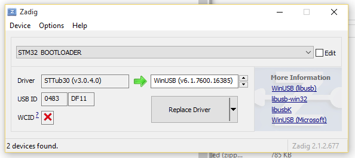

# USB Flashing
Some newer boards with full USB support must be flashed in USB DFU mode. This is a straightforward process in Configurator versions 0.67 and newer. The standard flashing procedure should work successfully with the caveat of some platform specific problems as noted below. The "No reboot sequence" checkbox has no effect as the device will automatically be detected when already in bootloader mode (a DFU device will appear in the connect dropdown if this is the case). The Full chip erase checkbox operates as normal. The baudrate checkbox is ignored as it has no relevance to USB.

## Platform Specific: Linux
Linux requires udev rules to allow write access to USB devices for users. An example shell command to acheive this on Ubuntu is shown here:
```
(echo '# DFU (Internal bootloader for STM32 MCUs)'
 echo 'SUBSYSTEM=="usb", ATTRS{idVendor}=="0483", ATTRS{idProduct}=="df11", MODE="0664", GROUP="plugdev"') | sudo tee /etc/udev/rules.d/45-stdfu-permissions.rules > /dev/null
```

This assigns the device to the plugdev group(a standard group in Ubuntu). To check that your account is in the plugdev group type `groups` in the shell and ensure plugdev is listed. If not you can add yourself as shown (replacing `<username>` with your username):
```
sudo usermod -a -G plugdev <username>
```

## Platform Specific: Windows
Chrome can have problems accessing USB devices on Windows. A driver should be automatically installed by Windows for the ST Device in DFU Mode but this doesn't always allow access for Chrome. The solution is to replace the ST driver with a libusb driver. The easiest way to do that is to download [Zadig](http://zadig.akeo.ie/). 
With the board connected and in bootloader mode (reset it by sending the character R via serial, or simply attempt to flash it with the correct serial port selected in Configurator): 
* Open Zadig
* Choose Options > List All Devices
* Select `STM32 BOOTLOADER` in the device list
* Choose `WinUSB (v6.x.x.x)` in the right hand box

* Click Replace Driver
* Restart Chrome (make sure it is completely closed, logout and login if unsure)
* Now the DFU device should be seen by Configurator
