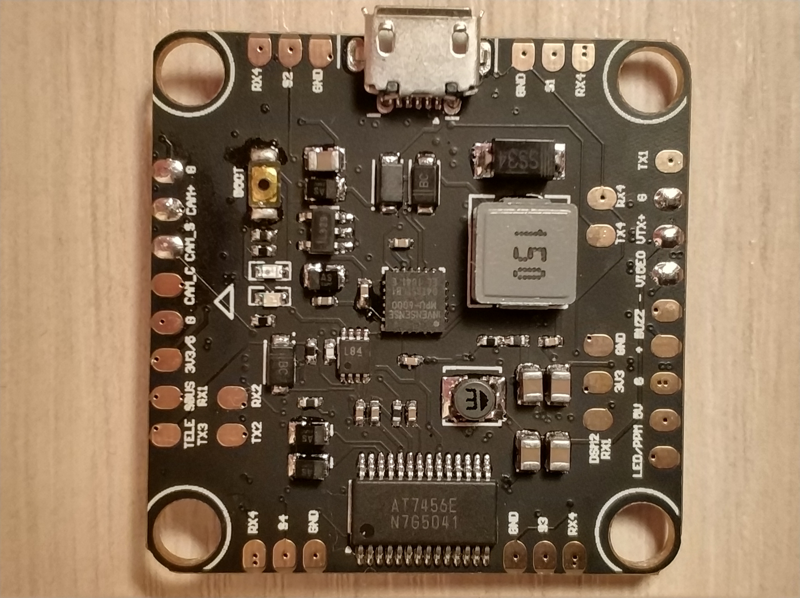
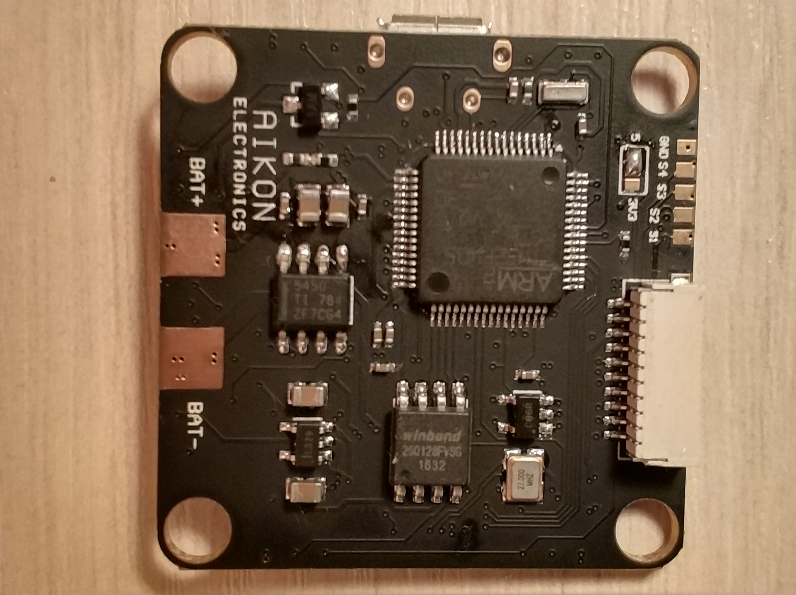

# Aikon F4

## Description
FC with no PDB aimed at multi-rotor and fixed wing use, Aikon F4 features a carefully-chosen timer design which allowed to run 4-6 motors with burst DSHOT with maximum efficiency. On board are dedicated pads for ESC telemetry, VTX and camera control. Board also features an 11-pin connector for plug-and-play connection with Aikon AK32 4in1 ESC, providing voltage, current and ESC telemetry reading with no additional wires.

## MCU, Sensors and Features

### Hardware
  - MCU: STM32F405
  - IMU: ICM-20602
  - Motor outputs: 4-6
  - IMU Interrupt: Yes
  - BARO: Optionally
  - VCP: Yes
  - Hardware UARTS: UART1 for SerialRX, UART3 for Inverted SmartPort, UART2 and UART4 available for general use
  - Software serial: SOFTSERIAL1 for VTX control (shared with UART1TX), SOFTSERIAL2 for ESC telemetry (shared with UART4RX)
  - OSD: Yes
  - Blackbox: SPI 16MB
  - PPM/LED_STRIP Shared: Yes
  - Battery Voltage Sensor: Yes
  - Integrated Voltage Regulator: Yes
  - Buttons: Boot

### Features
UART3 inverter is controllable by software, you can use the SBUS pad for any unidirectional protocol by setting `serialrx_inverted` accordingly. There's also a solder-jumper to bypass the inverter and connecto UART3_RX to `DSMX` pad directly.

Software serial is preconfigured by default, all you have to do is enable SOFTSERIAL1 for VTX control and SOFTSERIAL2 for ESC sensor on the Ports tab in Configurator.

## Manufacturers and Distributors

https://www.aikon-electronics.com/

## Designers

AIKON Electronics
Avi Jang

## Maintainers

Andrey Mironov (@DieHertz)

## FAQ & Known Issues
* First revision has no diode protecting the 5V input on the 11-pin ESC connector, make sure to pull the 5V wire coming from our ESC in order to avoid two regulators fighting against each other
* First revision has RX4 (ESC Telemetry) and GND pad silkscreen swapped near motor outputs

