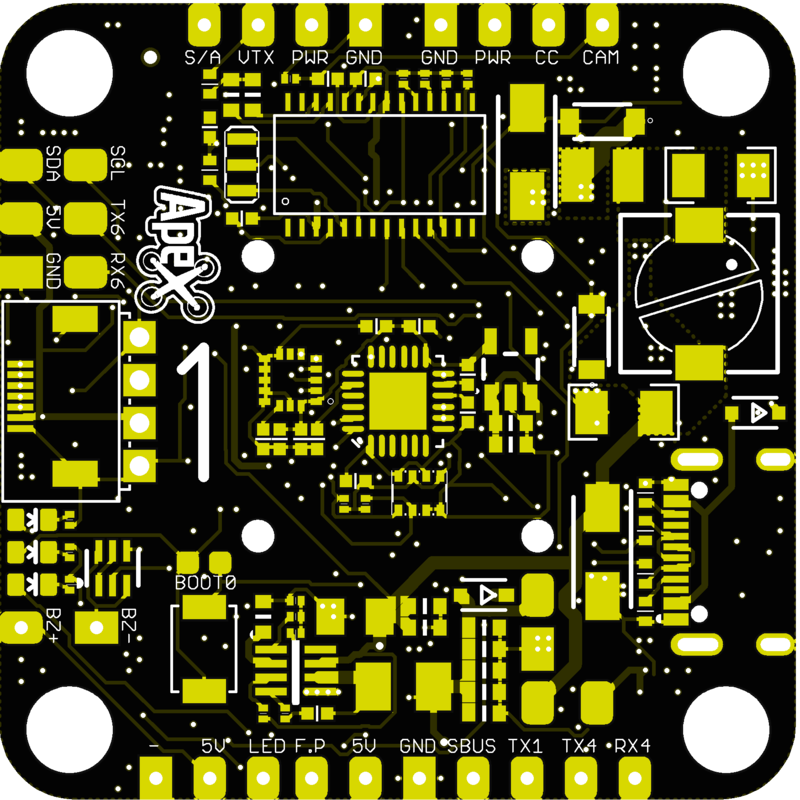

# ApexF7

### Features

- STM32F722

- 16 MB of Flash

- USB-C  

- Dual Gyro via SPI (MPU6000 + ICM20602)

- Barometer BMP280 via I2C

- VTX Power Switch

- 10V BEC for VTX and Camera

- CamControl

- OSD

- Bluetooth Connectivity via soldered module (active, when board isnt armed)

- WS2812 LED Output

- SmartAudio/Tramp

- Up to 6s Input

### Connections

| Function      | SolderPad/SilkScreen | Rescource | MCU Pin      | Notes                                  |
|:-------------:|:--------------------:|:---------:|:------------:|:--------------------------------------:|
| SBUS          | SBUS                 | RX1       | PA10         | No Inverter                            |
| DSM2          | TX1                  | TX1       | PA9          | CLI serial_halfduplex = ON             |
| SmartAudio    | S/A                  | TX5       | PC12         |                                        |
| F.PORT/S.PORT | F.P                  | TX3       | PC10         | No Inverter                            |
| ESC Telemetry | TLM                  | TX2       | PA2          | Halfduplex by default / on bottom side |
| Cam Control   | CC                   |           | PA8          |                                        |
| Video Output  | VTX                  | -         | -            |                                        |
| Cam Input     | CAM                  | -         | -            |                                        |
| WS2812        | LED                  | LED_STRIP | PA15         |                                        |
| BUZZER        | BZ-/BZ+              | BEEPER    | PB0          |                                        |
| S1-S4         | M1-M4                |           | PC8/B6/C9/B7 | Motor Outputs on bottom                |
| UART4         | TX4/RX4              | TX4/RX4   | PA0/PA1      |                                        |
| UART6         | TX6/RX6              | TX6/RX6   | PC6/PC7      |                                        |
| VBAT in       | BAT                  | -         | -            | 3S-6S input                            |
| Current       | CURR                 | -         | PC1          | on bottom                              |
| SDA           | SDA                  | I2C1_SDA  | PB9          |                                        |
| SCL           | SCL                  | I2C1_SCL  | PB8          |                                        |

### Picture

