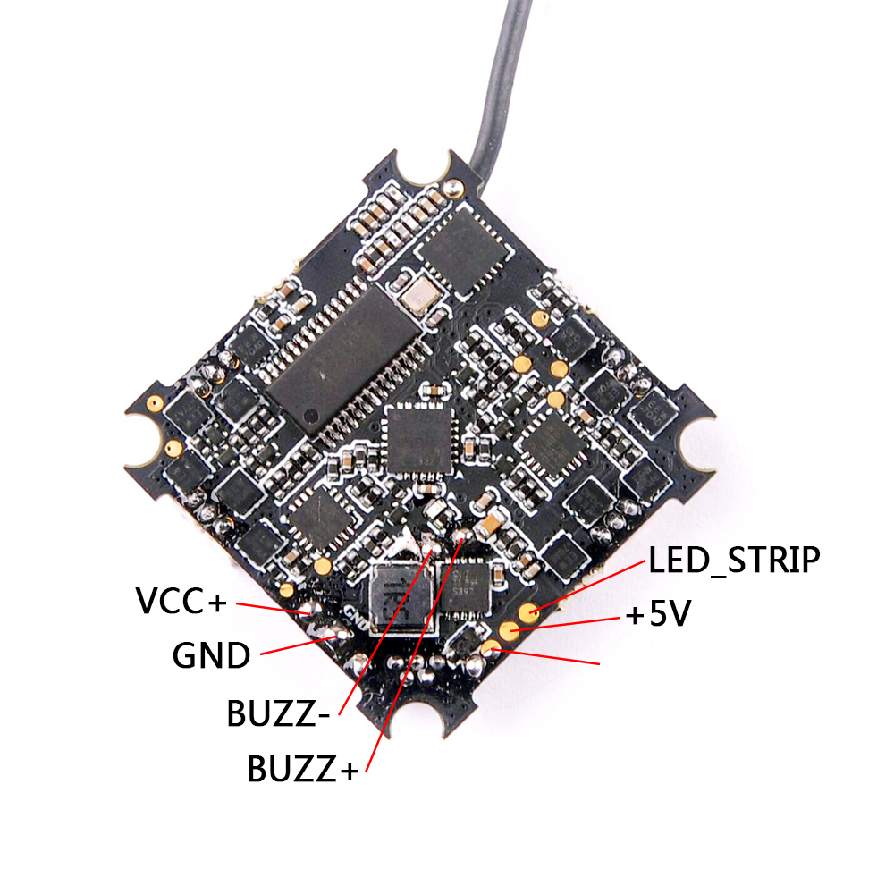

# CrazyBee F4 FS Pro

## Description
CrazyBee F4 FS Pro flight controller is a Highly integrated board(Receiver/4in1 ESC/OSD/Current Sensor) for 1~2S Whoop brushless racing drone.

## MCU, Sensors and Features

### Hardware and Features
  - MCU: STM32F411CEU6 (100MHZ, 512K FLASH)
  - IMU: MPU6000 (SPI) 
  - OSD: Betaflight OSD
  - Battery Voltage Sensor: yes
  - Power supply: 1-2S battery input (DC 3.5-8.7V)
  - Built-in 5V 1A Buck / Boost with LC filter
  - Integrated Current sensor：Max 28A,Current meter scale set to 1175
  - Built-in SPI Flysky receiver with telemetry(AFHDS/AFHDS2A switchable)
  - Integrated inverter for sbus(when use external rx) in UART1 RX
  - Integrated 4x Blheli_s ESC: Max 5A per ESC(EMF8BB21F16G)
  - ESC Connector: 3-pin, PicoBlade 1.25mm pitch
  - Beeper output: 2-pin, soldering pad
  - 4 Rx Indicating LEDs: 2 x red  and  2 x white
  - Board size: 28.5 * 28.5mm

## Resource mapping

| Label                      | Pin | Timer  | DMA | Default     | Note                             |
|----------------------------|------|-------|-----|-------------|----------------------------------|
| MPU6000_INT_EXTI           | PA1  |       |     |             |                                  |
| MPU6000_CS_PIN             | PA4  |       |     |             |    SPI1                          |
| MPU6000_SCK_PIN            | PA5  |       |     |             |    SPI1                          |
| MPU6000_MISO_PIN           | PA6  |       |     |             |    SPI1                          |
| MPU6000_MOSI_PIN           | PA7  |       |     |             |    SPI1                          |
| OSD_CS_PIN                 | PB12 |       |     |             |    SPI2                          |
| OSD_SCK_PIN                | PB13 |       |     |             |    SPI2                          |
| OSD_MISO_PIN               | PB14 |       |     |             |    SPI2                          |
| OSD_MOSI_PIN               | PB15 |       |     |             |    SPI2                          |
| RX_CS_PIN                  | PA15 |       |     |             |    SPI3                          |
| RX_SCK_PIN                 | PB3  |       |     |             |    SPI3                          |
| RX_MISO_PIN                | PB4  |       |     |             |    SPI3                          |
| RX_MOSI_PIN                | PB5  |       |     |             |    SPI3                          |
| RX_IRQ_PIN                 | PA14 |       |     |             |                                  |
| BIND_PLUG_PIN              | PB2  |       |     |             |                                  |
| RX_LED_PIN                 | PB9  |       |     |             |                                  |
| PWM1                       | PB8  | TIM2, CH3 | |             |                                  |
| PWM2                       | PB9  | TIM4, CH1 | |             |                                  |
| PWM3                       | PA3  | TIM4, CH2 | |             |                                  |
| PWM4                       | PA2  | TIM4, CH3 | |             |                                  |
| VBAT_ADC_PIN               | PB0  |       |     |             |      ADC1                        |
| CURRENT_ADC_PIN            | PB1  |       |     |             |      ADC1                        |
| BEEPER                     | PC15 |       |     |             |                                  |
| UART1 TX                   | PA9  |       |     |             |      						       |
| UART1 RX                   | PA10 |       |     |             |            					   |
| UART2 TX                   | PA2  |       |     |             |      						       |
| UART2 RX                   | PA3  |       |     |             |            					   |

## Manufacturers and Distributors

- Manufacturers: http://www.happymodel.cn/
- Distributors: Will add soon...

## Designers

## Maintainers

## FAQ & Known Issues

## Other Resources

- User Manual: Will add soon...

