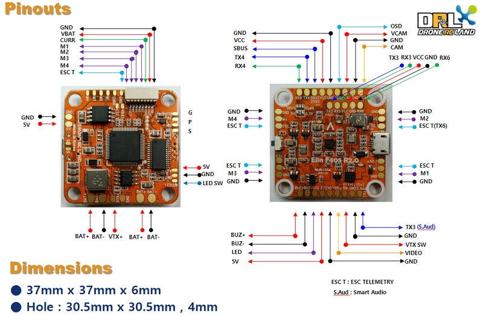

# Board - Elin F405

## Hardware Features
* MCU
    - STM32F405
* IMU
    - ICM-20602
* Motor Outputs
    - 4 outputs
* OSD
* VCP
* Hardware UARTS :
    - UART1 - Serial RX,
    - UART3 - Inverted Smart Port,
    - UART4 - General use
    - UART6 - General use
    - Soft Serial 1 - Smart Port
    - Soft Serial 2 - ESC Telemetry
* Black box
    - SPI 16MB
* LED Strip
* Integrated Voltage Regulator
    - 5V , 3A
* Include Load Switch (VTX Real Pit Mode)
    - -30V , -30A (VTX or LED On / Off)
* Include Low Pass LC filter
* Buttons
    - Boot

## Pinouts

