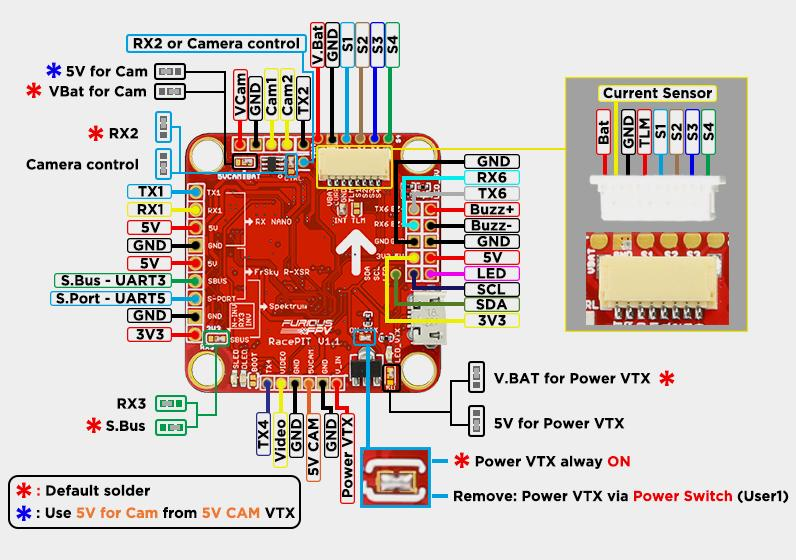
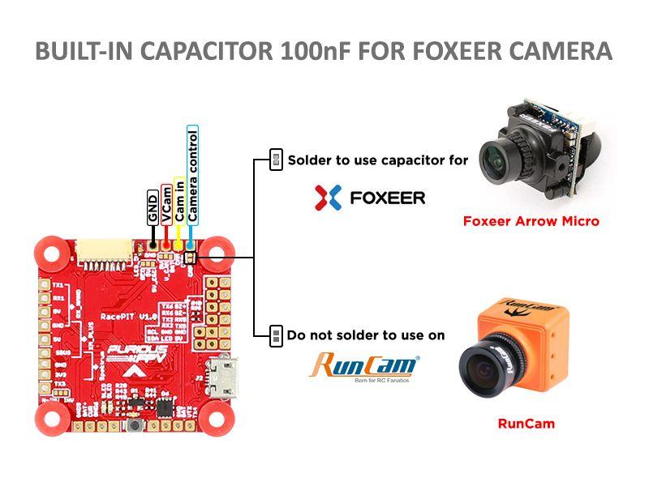
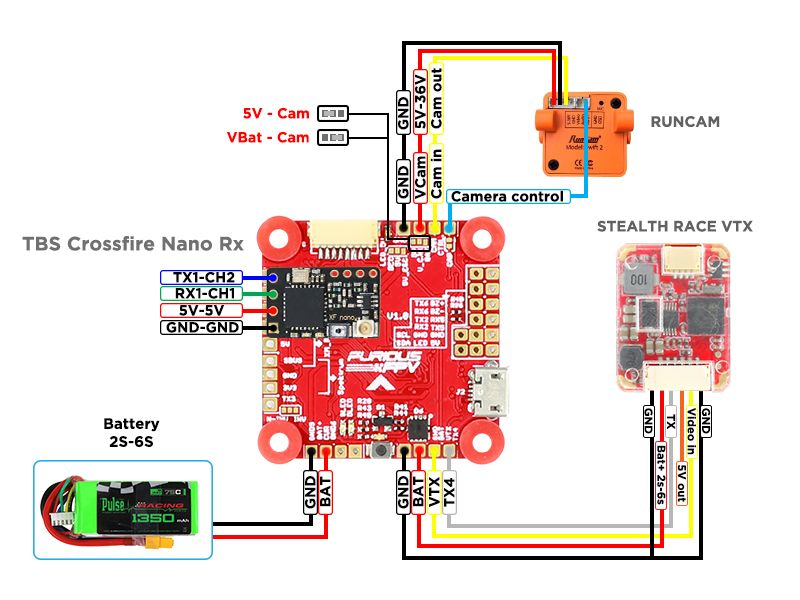

# FuriusFPV RacePIT V1.0

## Features
- Built-in RealPIT for VTX power.
- More UARTS (Full 6 Uart) for Simultaneous Connections of USB, Runcam Device, GPS, CRFS Rx, Black-box, Bluetooth
- Selecting Internal 5V or External 5V ESC
- 2 Port Camera Control and LED Strip for Simultaneous Connections
- Built-in ESC connector - Clean and Easy to Connect 4-in-1 ESC
- Use MPU6000 accelerometers and gyroscopes
- Ultra Simplified OSD Interface w/ No PC Necessary
- UARTS Connection Options for TBS Smart Audio or Immersion RC Tramp
- Integrated Soft Mount Silicone Damping for Maximum FC Functionality
- Inrush Voltage Protection Input & Output via Transient Voltage Suppressor
- High Quality 5V 1.5A BEC w/ 2S - 6S Voltage Input Range
- Built In Driver Inverter for SBUS Connection
- Separate Power Supply for Gyro w/ LDO for Low Noise & High Accuracy
- Clean and easy to connect VTX have telemetry (Stealth race, Tramp, Unify)

## Hardware
- STM32F405 main chip
- Built-in REALPIT for VTX power supply
- 6 UARTs 
- Camera control, support foxxer (built-in capacitor) and another camera (without capacitor)
- LED strip control
- MPU6000 
- BEC 5V 1.5A 2-6S 
- Sbus inverter signal 
- Built-in OSD AT7456
- Current sensor support
- 4 ESCs signal

## BoardLayout

## Camera Connections

## Connections

