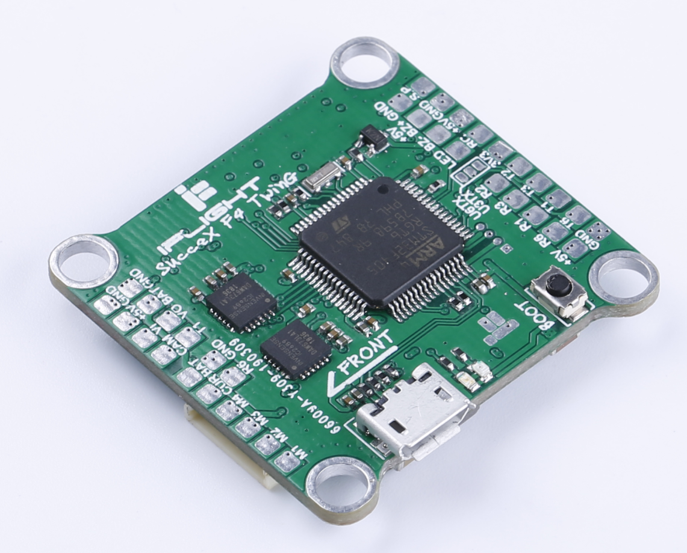
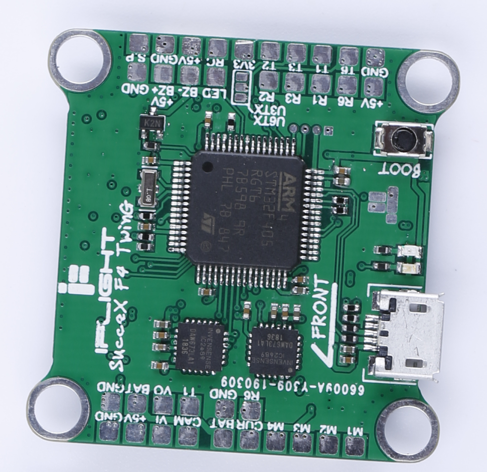

# Board - IFlightF4_TWIN_G

> **IFlightF4_TWIN_G : Real Twin Gyroscopes.** 
>
> **This Flight Controller can operate simultaneously with real dual gyroscopes to provide better flight performance for FPV player.**

## Features

* Processors and Sensors
  * *MCU:* STM32F405RGT6
  * IMU_1: ICM20689(0 deg)
  * IMU_2: ICM20689(90 deg)
  * *OSD:* BetaFlight OSD (AT7456E connected via SPI2)
  * Blackbox: FLASH M25Q256 (connected via SPI3)

* 4 Dshot outputs

* USB VCP and boot select button on board (for DFU) 

* Serial LED interface(LED_STRIP)

* VBAT / CURR sensors input

* Suppose IRC Tramp / Smart audio / FPV Camera Control / FPORT/telemetry

* Supports SBus, Spektrum1024/2048, PPM. No external inverters required (built-in).

## Photos

## Pinout

### All uarts have pad on board 

| Value | Identifier |  RX  |  TX  |  Notes   |
| :---: | :--------: | :--: | :--: | :------: |
|   1   |   USART1   | PA10 | PA9  |          |
|   2   |   USART2   | PA3  | PA2  | Rx input |
|   3   |   USART3   | PB11 | PB10 |          |
|   6   |   USART6   | PC7  | PC6  |          |

### Buzzer/LED output 

| Value | Identifier | function | pin  | Notes |
| :---: | :--------: | :------: | :--: | :---: |
|   1   |    LED0    |   LED    | PB5  |       |
|   2   |   BEEPER   |   BEEP   | PB4  |       |

### VBAT input, Current input, Analog RSSI input

| Value | Identifier | function | pin  | Notes |
| :---: | :--------: | :------: | :--: | :---: |
|   1   |    ADC1    |   VBAT   | PC2  |       |
|   2   |    ADC1    | CURRENT  | PC1  |       |

### PWM Input & PWM Output 

| Value | Identifier |  function   | pin  | Notes |
| :---: | :--------: | :---------: | :--: | :---: |
|   1   |  TIM9_CH2  |     PPM     | PA3  |       |
|   2   |  TIM3_CH3  |   Motor1    | PB0  |       |
|   3   |  TIM3_CH4  |   Motor2    | PB1  |       |
|   4   |  TIM8_CH4  |   Motor5    | PC9  |       |
|   5   |  TIM8_CH3  |   Motor6    | PC8  |       |
|   6   |  TIM4_CH1  |  LED STRIP  | PB6  |       |
|   7   |  TIM5_CH1  | CAM Control | PA0  |       |

### Gyro & ACC  ICM20689

| Value | Identifier | function | pin  |     Notes      |
| :---: | :--------: | :------: | :--: | :------------: |
|   1   |    SPI1    |   SCK    | PA5  |    ICM20689    |
|   2   |    SPI1    |   MISO   | PA6  |    ICM20689    |
|   3   |    SPI1    |   MOSI   | PA7  |    ICM20689    |
|   4   |     IO     |   CS1    | PA4  | ICM20689_A_CS  |
|   5   |     IO     |   CS2    | PC3  | ICM20689_B_CS  |
|   6   |     IO     |   INT1   | PC4  | ICM20689_A_INT |
|   7   |     IO     |   INT2   | PA8  | ICM20689_B_INT |

### OSD MAX7456

| Value | Identifier | function | pin  | Notes |
| :---: | :--------: | :------: | :--: | :---: |
|   1   |    SPI2    |   SCK    | PB13 |       |
|   2   |    SPI2    |   MISO   | PB14 |       |
|   3   |    SPI2    |   MOSI   | PB15 |       |
|   4   |    SPI2    |    CS    | PB12 |       |

### FLash Blackbox

| Value | Identifier | function | pin  | Notes |
| :---: | :--------: | :------: | :--: | :---: |
|   1   |    SPI3    |   SCK    | PC10 |       |
|   2   |    SPI3    |   MISO   | PC11 |       |
|   3   |    SPI3    |   MOSI   | PC12 |       |
|   4   |    SPI3    |    CS    | PA15 |       |

### SWD

| Pin  | Function | Notes |
| :--: | :------: | :---: |
|  1   |  SWCLK   |  PAD  |
|  2   |  Ground  |  PAD  |
|  3   |  SWDIO   |  PAD  |
|  4   |   3V3    |  PAD  |

