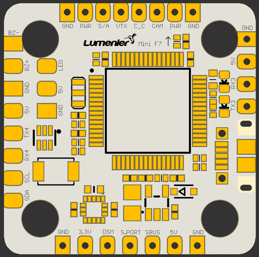

# Lux Mini F7

## Features
* ICM20602 Gyro connected via SPI
* STM32F722
* 3-6s Lipo capable
* AB7456 chip for Betaflight OSD
* 20x20mm mounting holes
* PowerSwitch via PinIO (User1)

## Resources
|    Function   | SolderPad/SilkScreen | Resource | MCU Pin |            Notes            |
|:-------------:|:--------------------:|:--------:|:-------:|:---------------------------:|
|      SBUS     |         SBUS         |    RX1   |   PA10  |       No Inverter           |
|      DSM2     |          DSM         |    TX1   |   PA9   | CLI serialrx_halduplex = ON |
|   SmartAudio  |          S/A         |    TX5   |   PC12  |                             |
|   Smartport   |         S.PORT       |    TX6   |   PC6   |       No Inverter           |
| ESC Telemetry |          TLM         |    RX2   |   PA3   |       on bottom             |
|   CamControl  |          CC          |          |   PA8   |                             |
|      SDA      |          SDA         | I2C1_SDA |   PB9   |                             |
|      SCL      |          SCL         | I2C1_SCL |   PB8   |                             |
|     UART4     |        RX4/TX4       |   UART4  |  PA1/0  |                             |
|  WS2812B LED  |          LED         |          |   PA15  |                             |
|     Buzzer    |        BZ-/BZ+       |          |   PB0   |                             |
|     UART3     |        RX3/TX3       |          | PC11/10 |                             |
|  PowerSwitch  |          PWR         |   USER1  |   PB10  |                             |
|    S1 - S4    |         S1-S4        |   M1-M4  |PB6/C8/B7/C9|Motor Outputs on bottom   |
|    Current    |          CRNT        |          |   PC1   |       on bottom             |

## Picture
