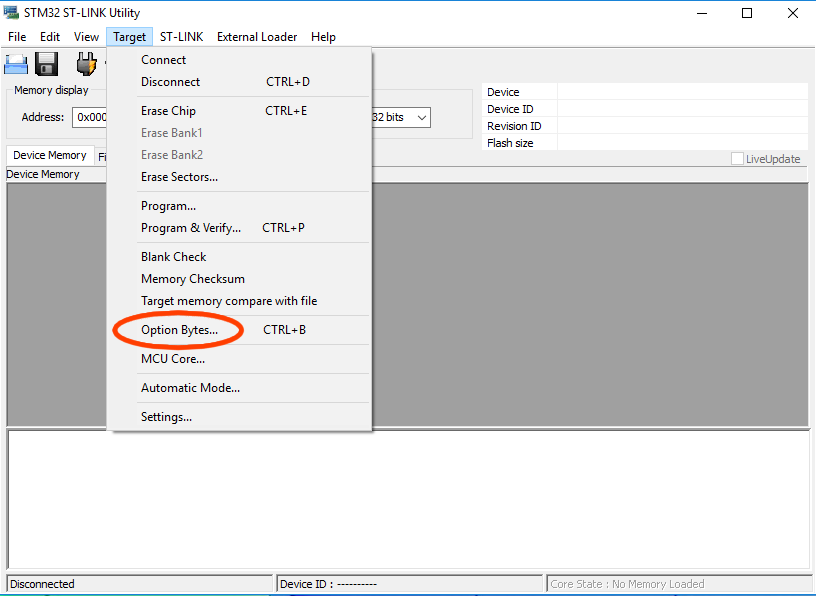
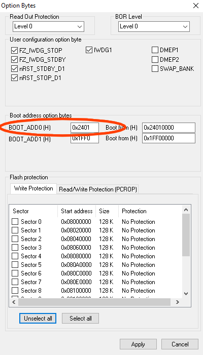
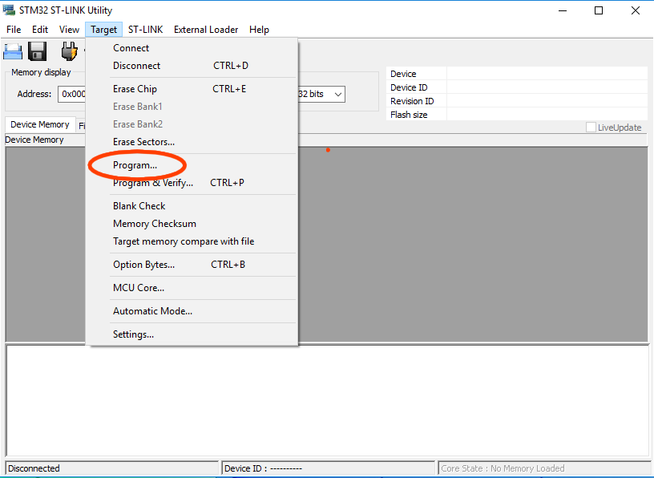
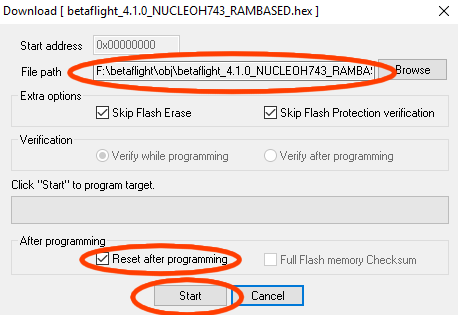

# Board - Nucleo H743 - RAM based image

This target for the Nucleo H743 is loaded entirely into the MCU RAM, thus facilitating quick turnaround development testing, without subjecting the flash storage to wear.

In order to flash / run it, the ST-Link tool available from ST Microelectronics has to be used.

## Board preparation

For the MCU to run the firmware from RAM after a reset, the boot address has to be changed:

- open the 'Option Bytes' dialog:

- set the high word of BOOT\_ADD0 to `0x2401`:

- click 'Apply'.

## Installation

Since the firmware image is only stored in RAM, this has to be done after every power cycle of the board.

- open the 'Program' dialog:

- click 'Browse', select the 'NUCLEOH743\_RAMBASED' hex image;
- make sure 'Reset after programming' is checked;
- click 'Start' to start programming:

- After programming has completed the firmware will be run.
