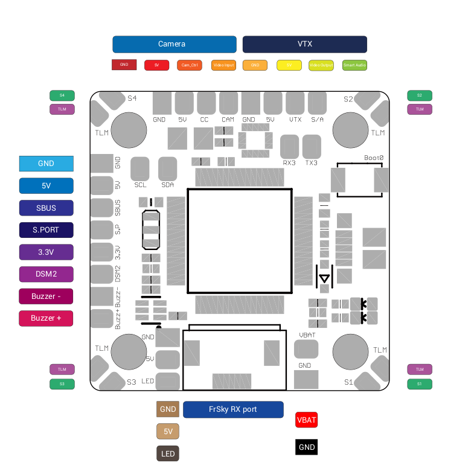
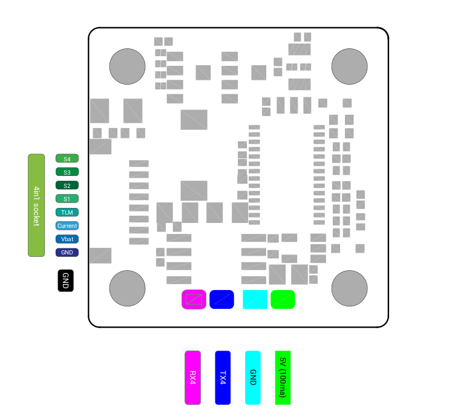

# Board Omnibus F4 Nano V7

This is the new Nano FC from Airbot! With added features in comparison to the predecessor.

## Features
* ICM20602 Gyro connected via SPI
* FPC port for Frsky RX
* STM32F405
* 16MByte of Flash connected via SPI
* 3-6s Lipo capable
* AB7456 chip for Betaflight OSD
* 20x20mm mounting holes
* 5V 3A BEC
* Solderpads for SmartAudio and CamControl
* Motor outputs at each corner of the board

## Resources
|    Function   | SolderPad/SilkScreen | Resource | MCU Pin |            Notes            |
|:-------------:|:--------------------:|:--------:|:-------:|:---------------------------:|
|      SBUS     |         SBUS         |    RX1   |   PA10  |       Buildin-Inverter      |
|      DSM2     |          TX1         |    TX1   |   PA9   | CLI serialrx_halduplex = ON |
|   SmartAudio  |          S/A         |    TX5   |   PC12  |                             |
|   Smartport   |          S.P         |   UART6  |  PC6/7  |      Buildin-Inverters      |
| ESC Telemetry |          TLM         |    RX2   |   PA3   |                             |
|   CamControl  |          CC          |          |   PA8   |                             |
|      SDA      |          SDA         | I2C1_SDA |   PB9   |                             |
|      SCL      |          SCL         | I2C1_SCL |   PB8   |                             |
|      GPS      |        RX4/TX4       |   UART4  |  PA0/1  |        on Bottom side       |
|  WS2812B LED  |          LED         |          |   PA15  |                             |
|     Buzzer    |        BZ-/BZ+       |          |   PC5   |                             |
|     UART4     |        RX3/TX3       |          | PC11/10 |                             |

## Pinmap

