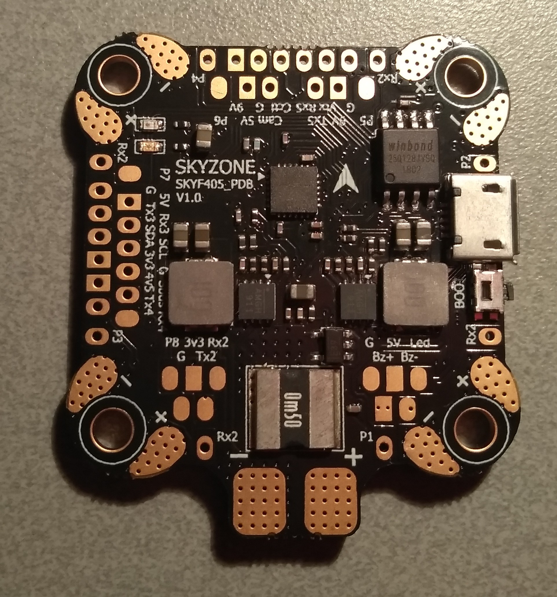
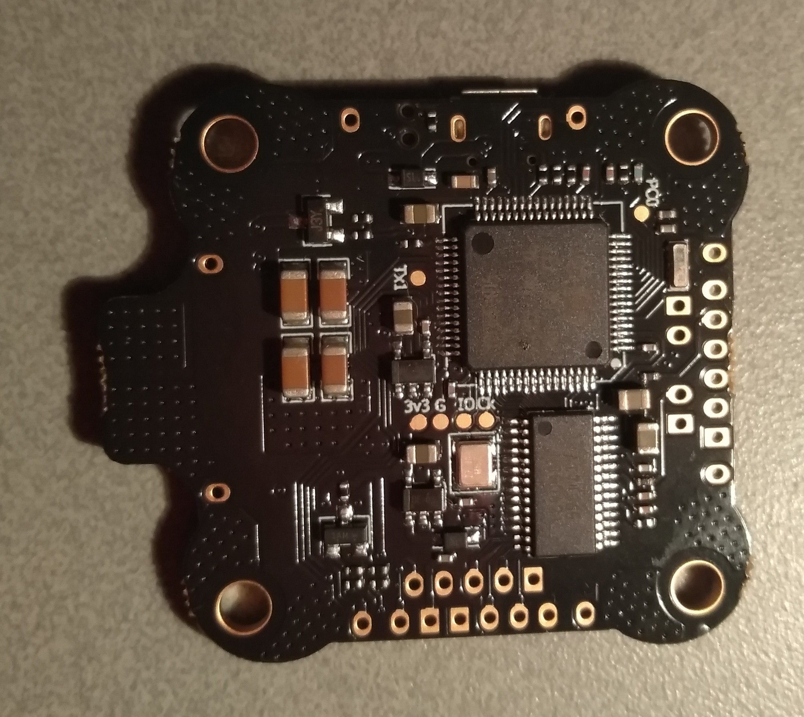

# SKYF405

## Description

The SKYF405 has been designed as a versatile flight controller, to allow efficient control of craft with 4, 6 or 8 motors.

It is available in 2 variants:

### SKYF405\_STD

Standard 30 * 30 mm size

### SKYF405\_PDB

30 x 30 mm 'extended corners' design with integrated PDB / current sensing shunt.

## Hardware

Type|Description
---|---
MCU|STM32F405
IMU|ICM-20689
IMU Interrupt|yes
Motor outputs|up to 8
Barometer|optional
Magnetometer|optional
VCP (supporting joystick emulation)|yes
Hardware serial|5 (1 with inverter for SBus)
Software serial|2
OSD|yes
Blackbox|16 MB onboard flash
PPM in|yes
Camera control output|yes
LED strip (WS2811) output|yes
Battery voltage sensor|yes
Current sensor|yes (SKYF405\_PDB only)
Integrated voltage regulator|yes
Buttons|boot
LEDs|power, activity

## Features

Plenty of connectivity options, including 5 UARTs, most of them with through-hole solder points, minimising the risk of ripped off solder pads.

ESC signal / telemetry solder points next to the corners for motors 1 - 4 (SKYF405\_PDB only).

## Manufacturers and Distributors

skyzone Hobbies

## Designers

skyzone Hobbies

## Maintainers

[Daniel Zhou](mailto:daniel@skyzonehobbies.com)
