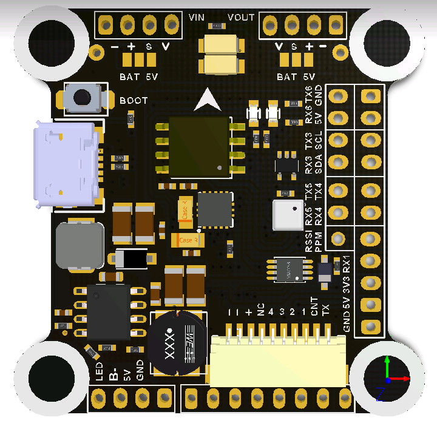

# SPEDIX F4

## Description
One of the main considerations while designing the SPEDIX F4 was to provide users the maximum amount of UARTs, as well as motor outputs, while retaining maximum efficiency, a careful choice of pinmap allowed to run 6-8 DSHOT motors off just 2 timers, while breaking out all the 6 UARTs that the STM32F405 provides.
Timer design favors running multirotor and fixed wing alike.
Plug & play connectivity to SPEDIX and AIKON 4in1 ESCs,

## MCU, Sensors and Features

### Hardware
  - MCU: STM32F405
  - IMU: ICM-20602 or MPU-6000
  - 6 DSHOT motors outputs, 8 by remapping UART6 as M7 & 8, using just 2 timers
  - BMP280 SPI
  - 6 hardware UARTs, UART5 with a controllable inverter for SBUS, USART1 with bidirectional inverter for FPORT/SPORT
  - Onboard regulator supports up to 6S
  - Dataflash blackbox
  - External I2C port
  - JST-SH 10 pin 4in1 ESC plug

## Designers
Kyle Lee (SPEDIX)
Andrey Mironov (@DieHertz)

## Maintainers
Andrey Mironov (@DieHertz)

