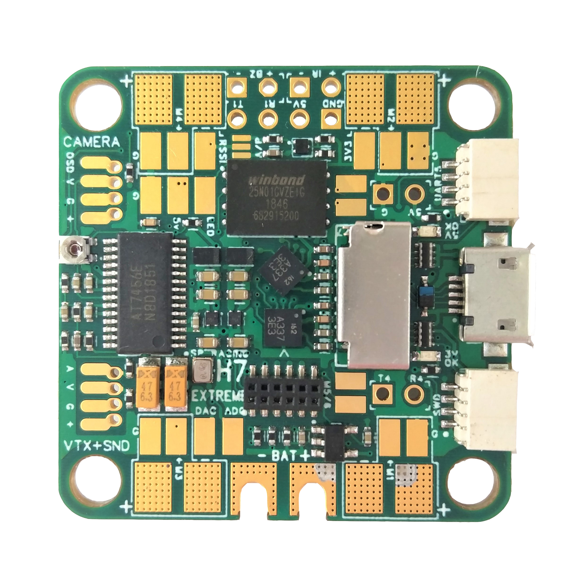
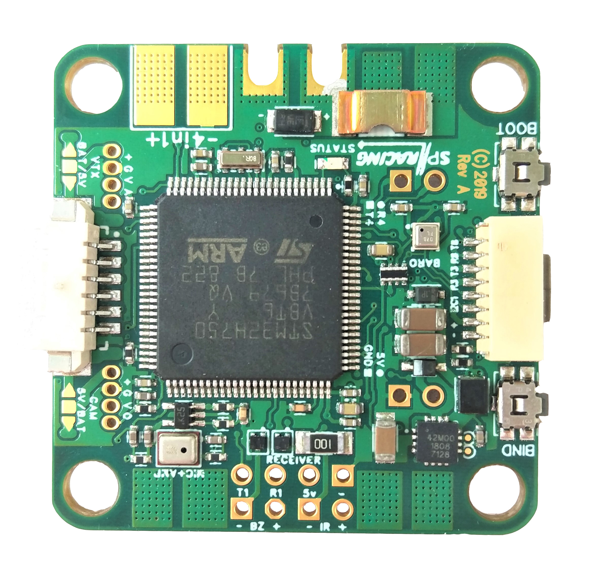
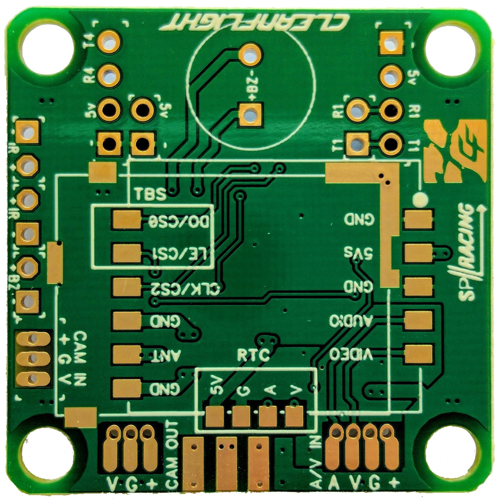
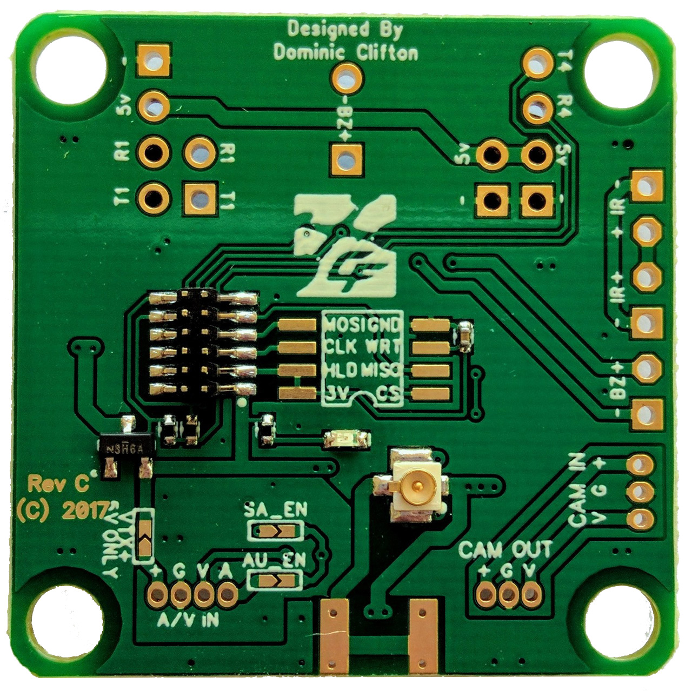
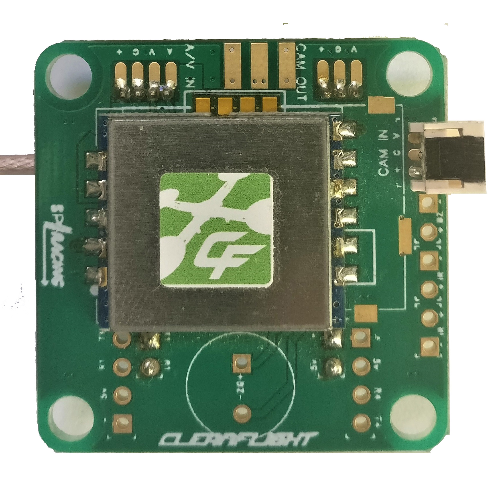
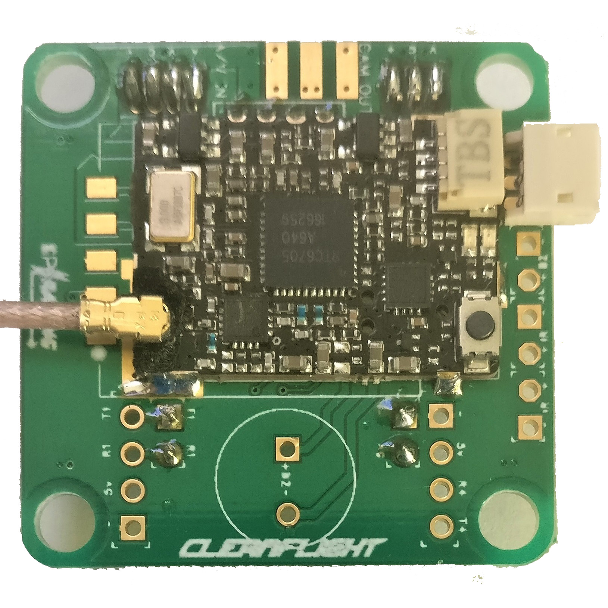

# Board - Seriously Pro SP Racing H7 EXTREME

The SPRacingH7EXTREME flight controller features a 400Mhz H7 CPU that runs twice as fast as the previous generation F7 boards.
A fast control-loop is what you need for perfect flight performance, the H7 at 400Mhz gives you all the processing power you need.

The SPRacingH7EXTREME has integrated OSD (on-screen-display) and PDB (power distribution board) and features all the latest technologies available.

Full details available on the website, here:

http://seriouslypro.com/spracingh7extreme

Purchasing boards directly from SeriouslyPro / SP Racing and official retailers helps fund software development.

Shop here: https://shop.seriouslypro.com/sp-racing-h7-extreme

## Background

The SPRacingH7EXTREME FC is the first STM32H750 based FC to ship with Betaflight.  It is unique among Cleanflight/Betaflight based FCs as it is the first
to use the External Storage (EXST) build system which allows a bootloader to load the flight-controller firmware from either external flash or via SD card.

See the EXST documentation for more details on the EXST system.

## Hardware Features

The SPRacingH7EXTREME can be stand-alone or be turned into a stack that allows fitting of TBS Unify Pro or FX578-2-SPI VTX modules.

1. SPRacingH7EXTREME FC/PDB - https://shop.seriouslypro.com/sp-racing-h7-extreme
2. SPRacingStackingVTX      - https://shop.seriouslypro.com/sp-racing-f7-vtx-board-without-vtx-module

### SPRacingH7EXTREME FC/PDB board.

* STM32H750 CPU, 400MHz inc FPU
* 128MByte 1GBit NAND flash via QuadSPI
* 2x Low-noise ICM20602 accelerometer/gyro with dedicated VREG (connected via SPI)
* BMP388 Barometer - bottom mounted for wind isolation (I2C + interrupt)
* OSD with customisable layout, profiles and configuration menu system
* On-board MEMS microphone
* PID-Audio with CPU audio out and audio mixer
* MicroSD card slot (SD/SDHC, upto 32GB) connected via 4-Bit SDIO
* Durable 1.6mm thick 6-layer copper gold-plated PCB with cutouts for battery wires
* Current sensor/Amperage meter (110A)
* 2-6S BEC 5V Switching regulator, 1A
* TVS protection diode
* Dedicated 500mA VREG for gyros with extra filter capacitors
* Second 500mA VREG for CPU, and other peripherals
* Transponder circuitry (LED and code available separately)
* Buzzer circuitry
* RSSI Analog and PWM circuit
* 12 motor outputs (4 by motor pads, 4 in the middle, and 4 on stacking connector)
* 1x SPI breakout onto stacking connector
* 6 Serial Ports (5x TX+RX + 1x TX only bi-directional)
* 3 LEDs for 5V, 3V and STATUS (Green, Blue, Red)
* 37x37mm PCB with 30.5mm mounting hole pattern
* 4mm mounting holes for soft-mount grommets and M3 bolts
* FPV stack weight of FC/PDB + OSD/VTX ~16 grams
* MicroUSB socket for configuration and ESC programming
* Bootable from SD Card or External flash.
* Supplied with 4x soft-mount grommets.
* Optionally supplied with 2x Audio/Video cables. (Camera Input, VTX Output)
* Optionally supplied with 2x Audio/Video PicoBlade connectors. (for Camera Input, for VTX Output)
* Optional receiver cables for FrSky XSR receivers and 3-pin style receivers available
* 4x pairs of solder pads for ESC Signal/GND connections (Bi-Directional DSHOT compatible)
* 4x pairs of solder pads for ESC Power/GND connections
* 4x special solder pads with through-holes for Camera In + Camera OSD
* 4x special solder pads with through-holes for Audio+Video Out (VTX)
* 1x solder pad for PWM RSSI
* 1x solder pad for LED Strip
* 1x solder pad for DAC out
* 1x solder pad for ADC in (for 4in1 current sensor output, etc)
* 2x solder pads for 5V/GND power
* 2x large solder pads with cut-outs for battery wires
* 2x large solder pads for 4in1 ESC power connection
* 1x 2pin though-holes for pin headers for UART4 RX/TX
* 1x 2pin though-holes for pin headers for BUZZER
* 1x 2pin though-holes for pin headers for 5V/GND
* 1x 2pin though-holes for pin headers for IR Transponder LED
* 1x 4pin though-holes for pin headers for Receiver (GND/5V/UART1 RX+TX)
* 1x 8pin bottom mounted, JST-SH socket for GND/5V/I2C/UART3/UART8 (IO port, e.g. for external GPS module)
* 1x 6pin bottom mounted, PicoBlade receiver socket for UART1(PPM/SerialRX)/UART2 TX(Telemetry)/RSSI/GND/5V
* 1x 4pin top mounted JST-SH socket for SWD debugging
* 1x 4pin top mounted JST-SH socket for UART5 RX+TX/GPIO/GND
* 1x 12pin stacking connector (SPI, UART8, DSHOT/PWM 9-12/TIM3-CH1-4, 5V BEC, 3.3V, etc)
* 1x Side-press BOOT button (top mounted)
* 1x Side-press VTX/Settings button (top mounted)
* 1x Mixer control (top mounted, near Camera input/output)
* 2x 5V/BATTERY voltage selectors for Camera and VTX outputs
* 1x Analog/Digital RSSI selector
* Cleanflight and Betaflight logos - they're on there, you just have to find them
* SP Racing logo
* 2x Additional easter eggs!

### SPRacingStackingVTX board.

* Fits Optional RTC6705 VTX 25/200mw output (SPI modules only)
* Fits Optional TBS Unify Pro VTX with no-wire SmartAudio connectivity
* Fits Optional FrSKy XM+ Full Range Diversity Receiver
* Remote VTX ON/OFF circuitry (for RTC6705 modules)
* 36.8x36.8mm PCB with 30.5mm mounting hole pattern
* Supplied with 4x soft-mount grommets.
* Supplied with very low profile stacking I/O connectors (2x 2pin male + 2x 2pin female)
* Supplied with very low profile stacking A/V connectors (1x 4pin male + 1x 4pin female)
* Cleanflight logos
* SPRacing logo
* 1x U.FL socket for antenna connection, gold plated. (For RTC6705 module)
* 1x set of solder pad for edge mount coax jack socket. (For RTC6705 module)
* 1x 4pin though-holes for pin headers for UART1 Receiver/Bluetooth/etc (RX/TX/5V/GND)
* 1x 4pin though-holes for pin headers for UART4 Bluetooth/Wifi/GPS/etc (RX/TX/5V/GND)
* 4x 2pin though-holes for stacking onto H7 EXTREME (5V/GND/UART 4 RX+TX)
* 1x 2pin though-holes for pin headers for BUZZER Out
* 1x 3pin though-holes for pin headers for JST-ZH camera socket
* 1x 6pin though-holes for pin headers for IR in/out + Buzzer In
* 1x 3pin though-holes for JST-ZH connector for CAMERA-through connections
* 1x set of SOIC-8 209mil pads for user-installable SPI Flash Chip (e.g. 25Q064A
* 2x SmartAudio enable jumpers (UART8 TX when using TBS Unify)

## Connection Diagrams

Connection diagrams can be found on the website, here:

http://seriouslypro.com/spracingh7extreme#diagrams

## Manual

The manual can be downloaded from the website, here:

http://seriouslypro.com/files/SPRacingH7EXTREME-Manual-latest.pdf

