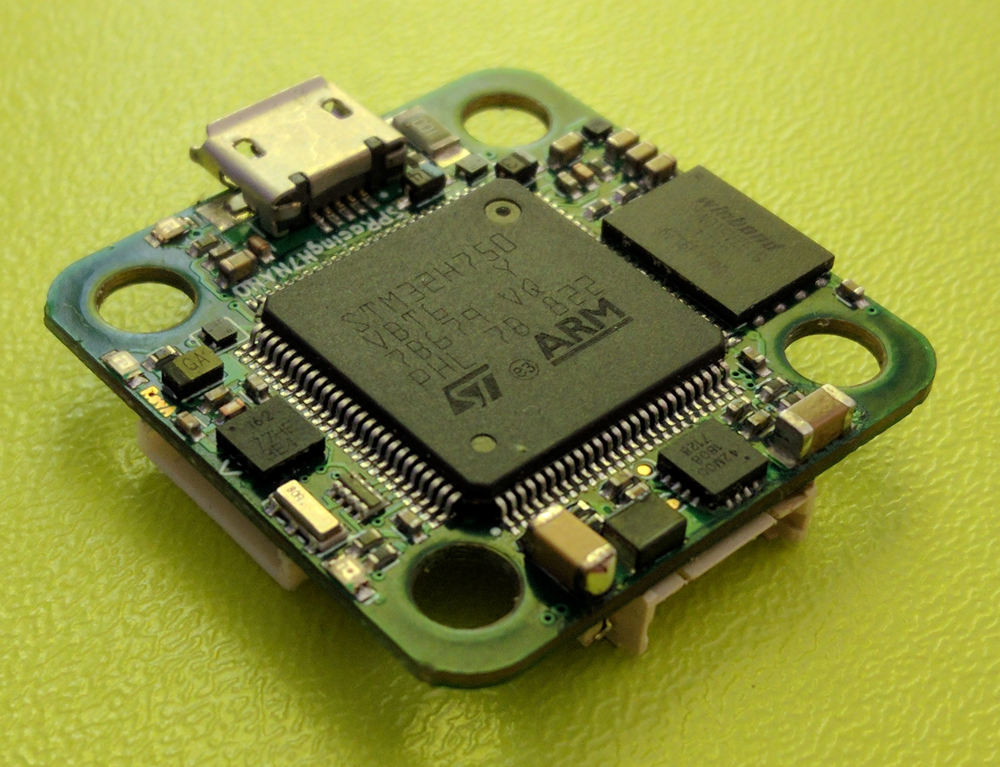
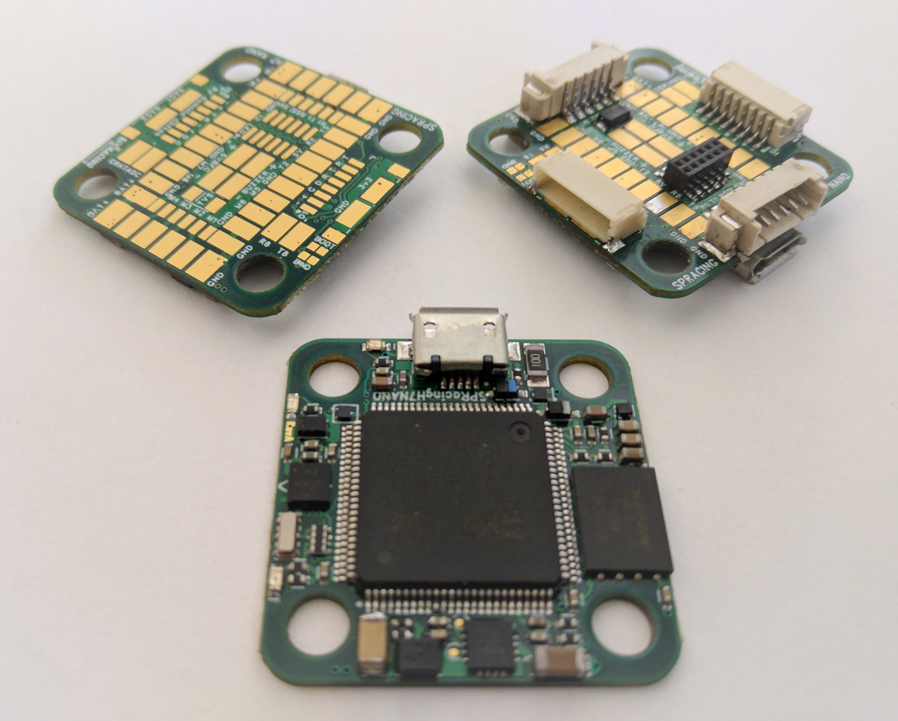
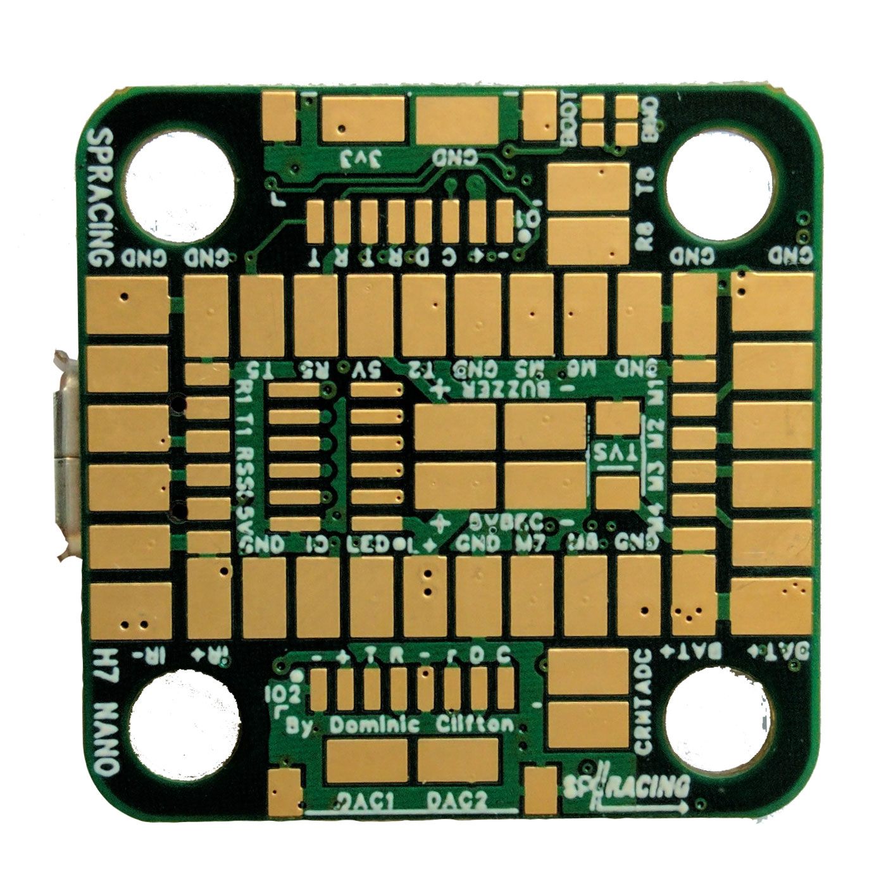
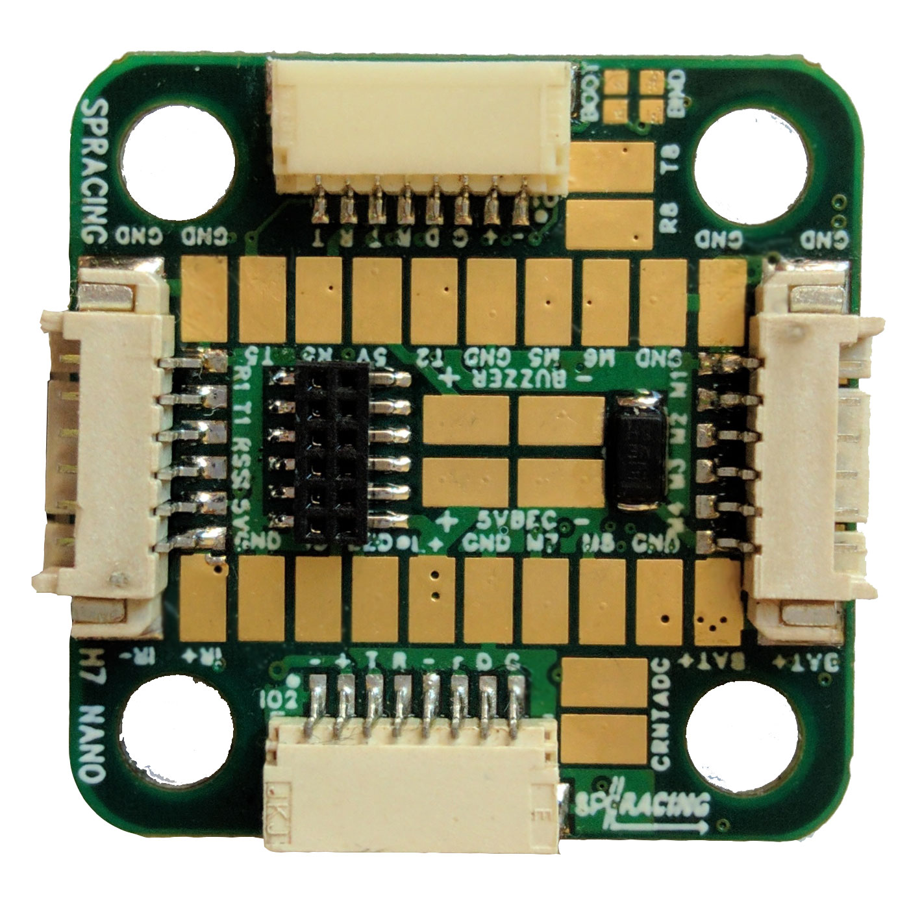

# Board - Seriously Pro SP Racing H7 NANO

The SPRacingH7NANO flight controller features a 400Mhz H7 CPU that runs twice as fast as the previous generation F7 boards.
A fast control-loop is what you need for perfect flight performance, the H7 at 400Mhz gives you all the processing power you need.

The SPRacingH7NANO is features a 20x20 mounting pattern, has integrated 5V BEC and 128MB BlackBox logging and has support for
external OSDs (e.g. via RunCam Camera or CrossFire/CRSF VTX's like the TBS Unify Evo OSD/VTX.)

Full details available on the website, here:

http://seriouslypro.com/spracingh7nano

Purchasing boards directly from SeriouslyPro / SP Racing and official retailers helps fund software development.

Shop here: https://shop.seriouslypro.com/sp-racing-h7-nano

## Background

The SPRacingH7NANO FC is the second STM32H750 based FC to ship with Betaflight.  Like the SPRacingH7EXTREME before it, it too uses
the External Storage (EXST) build system which allows a bootloader to load the flight-controller firmware from external flash.

See the EXST documentation for more details on the EXST system.

## Hardware Features

The SPRacingH7NANO is available in two versions, the NANO-S (solder-pads only) or NANO-E (with connectors for 4in1 ESC + RX + IO)

### SPRacingH7NANO FC board.

* STM32H750 CPU, 400MHz inc FPU
* 128MByte 1GBit NAND flash via QuadSPI
* Low-noise ICM20602 accelerometer/gyro with dedicated filtering(connected via SPI)
* 1.0mm thick 4-layer copper gold-plated PCB
* 2-6S BEC 5V Switching regulator, 1A
* TVS protection diode (NANO-E: Fitted, NANO-S: optional extra)
* Transponder circuitry (LED and code available separately)
* Buzzer circuitry
* RSSI Analog input
* 8 motor outputs (NANO-S: 8 on pads, NANO-E: 4 on 4in1 connector, 4 on pads)
* 1x Dual SPI + GPIO breakout onto stacking connector (NANO-E only)
* 6 Serial Ports (5x TX+RX + 1x TX only bi-directional)
* 3 LEDs for 5V, 3V and STATUS (Green, Blue, Red)
* 26.5x26.5mm PCB with 20mm mounting hole pattern
* 4mm mounting holes for soft-mount grommets and M3 bolts
* MicroUSB socket for configuration and ESC programming
* Bootable from External flash.
* Supplied with 4x soft-mount grommets.
* Optionally supplied with 2x JST-SH 8-way IO cables. (NANO-E only)
* Optionally supplied with 2x PicoBlade 6-way IO cables. (NANO-E only)

* 1x solder pad for LED Strip
* 2x solder pad for DAC out (NANO-S only)
* 2x solder pad for ADC in (for 4in1 current sensor output, etc)
* 2x solder pads for UART8 RX/TX
* 2x solder pads for 5V/GND power
* 2x solder pads for Buzzer
* 2x solder pads for TVS Diode
* 1x Row of pads for Motor 1-4 + Battery wires (NANO-S only)
* 1x Row of pads for RX connections (UART1 RX+TX, RSSI, 5V, GND, IR) (NANO-S only)
* 2x Rows of pads for additional IO (UART2,UART5,IR,LED-Strip,etc)
* 2x 8pin JST-SH socket for GND/5V/I2C/UART4/UART5 (IO port, e.g. for external GPS module)
* 2x 8pin JST-SH socket for GND/5V/SWD/UART3 (IO port, e.g. for debugging, etc)
* 1x 6pin PicoBlade socket for RX (NANO-E only)
* 1x 6pin PicoBlade socket for 4in1 ESC (NANO-E only)
* 1x solder pads for BOOT
* 1x solder pads for BIND
* Cleanflight and Betaflight logos - they're on there, you just have to find them
* SP Racing logo
* 1x Additional easter egg!

## Connection Diagrams

Connection diagrams can be found on the website, here:

http://seriouslypro.com/spracingh7nano#diagrams

## Manual

The manual can be downloaded from the website, here:

http://seriouslypro.com/files/SPRacingH7NANO-Manual-latest.pdf

