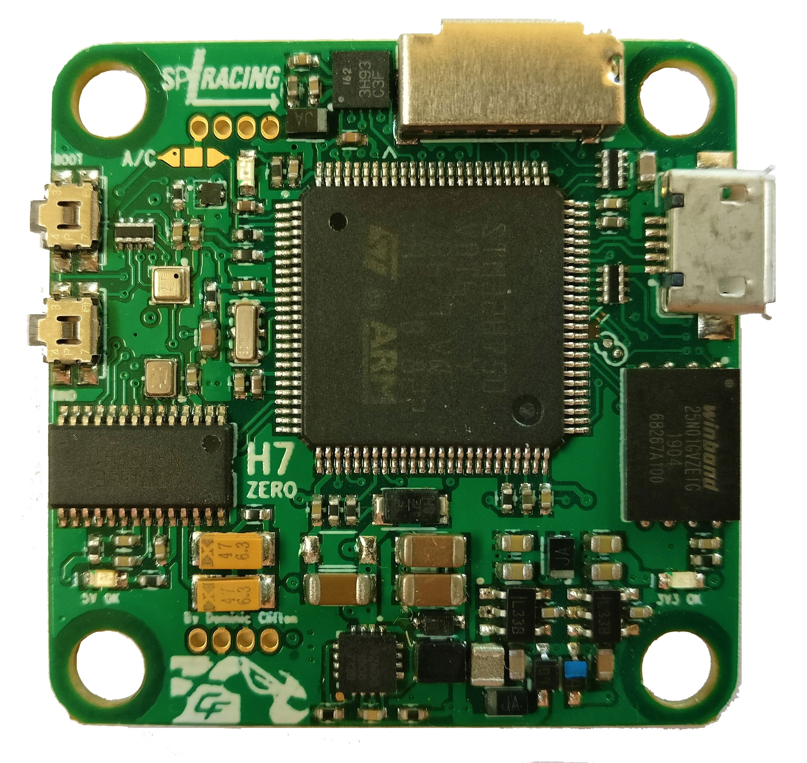
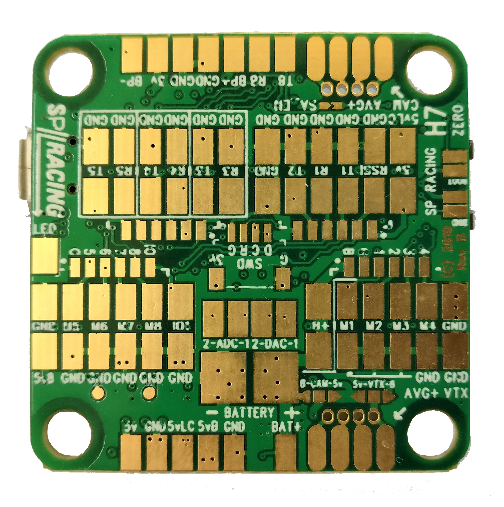

# Board - Seriously Pro SP Racing H7 ZERO

The SPRacingH7ZERO flight controller features a 400Mhz H7 CPU that runs twice as fast as the previous generation F7 boards.
A fast control-loop is what you need for perfect flight performance, the H7 at 400Mhz gives you all the processing power you need.

The SPRacingH7ZERO has integrated OSD (on-screen-display) and single gyro, BMP388 barometer and 2-6SBEC.

Easy to solder! - One entire side of the PCB is dedicated to solder pads.
 
Full details available on the website, here:

http://seriouslypro.com/spracingh7zero

Purchasing boards directly from SeriouslyPro / SP Racing and official retailers helps fund software development.

Shop here: https://shop.seriouslypro.com/sp-racing-h7-zero

## Background

The SPRacingH7ZERO FC is the third STM32H750 based FC to ship with Betaflight.  Like the SPRacingH7NANO and SPRacingH7EXTREME before it, it too uses
the External Storage (EXST) build system which allows a bootloader to load the flight-controller firmware from external flash.

See the EXST documentation for more details on the EXST system.

## Design Goals

* Easy connection for 2 * 4in1 ESCs for 8 motor outputs.
* No premium hardware features like Microphone, Audio Mixer, Transponder Circuit, Current Sensor or Dual Gyro - See SPRacingH7EXTREME
* Cheaper than SPRacingH7EXTREME.
* No integrated PDB.
* Single sided PCB. 

## Hardware Features

* STM32H750 CPU, 400MHz inc FPU
* 128MByte 1GBit NAND flash via QuadSPI
* Low-noise ICM20602 accelerometer/gyro (connected via SPI)
* BMP388 Barometer (I2C + interrupt)
* OSD with customisable layout, profiles and configuration menu system
* MicroSD card slot (SD/SDHC, upto 32GB) connected via 4-Bit SDIO
* 2-6S BEC 5V Switching regulator, 1A
* TVS protection diode
* Dedicated 500mA VREG for sensors and SD card, with extra filter capacitors
* Second 500mA VREG for CPU, and other peripherals
* Buzzer circuitry
* 8 motor outputs.  All in a row, with signal ground connections.
* RSSI Analog input.
* 6 Serial Ports (5x TX+RX + 1x TX only bi-directional)
* 3 LEDs for 5V, 3V and STATUS (Green, Blue, Red)
* 37x37mm PCB with 30.5mm mounting hole pattern
* 4mm mounting holes for soft-mount grommets and M3 bolts
* MicroUSB socket for configuration and ESC programming
* Bootable from SD Card or External flash.
* Supplied with 4x soft-mount grommets.
* Optionally supplied with 2x Audio/Video cables. (Camera Input, VTX Output)
* 1x Side-press BOOT button (top mounted)
* 1x Side-press VTX/Settings button (top mounted)
* 2x 5V/BATTERY voltage selectors for Camera and VTX outputs
* Cleanflight and Betaflight logos
* SP Racing logo
* Additional easter-eggs!

## Connection Diagrams

Connection diagrams can be found on the website, here:

http://seriouslypro.com/spracingh7zero#diagrams

## Manual

The manual can be downloaded from the website, here:

http://seriouslypro.com/files/SPRacingH7ZERO-Manual-latest.pdf

