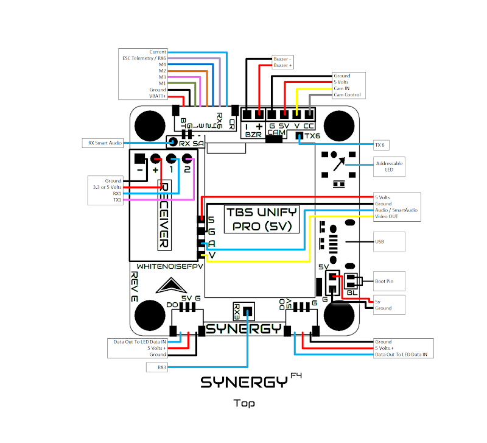
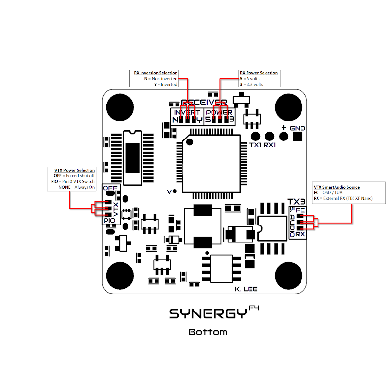
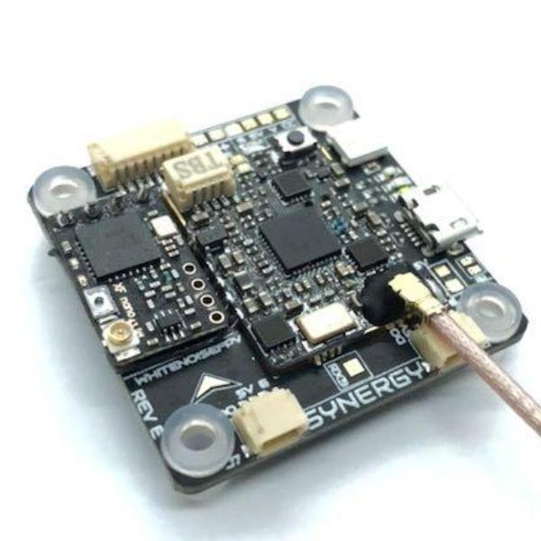

### Specifications
- Processor: STM32F405 (F4 processor)
- Gyro: MPU6000
- Loop: 8k/8k
- Input: 2-6S (Max 28V)
- Regulator: Filtered 5V 3A
- Receiver: 3.3V or 5V selectable. Inverted and non-inverted selectable receiver input
- Connectors: 8 pin JST-SH main connector.  2x 3 pin JST-SH Addressable LED connectors (mirrored output)
- Telemetry: Current Sensor and ESC Telemetry Input
- Blackbox: 128Mbit flash (16Megabytes)
- Motor: 4 pwm motor outputs with D-Shot and Multishot support
- Mounting: M3 30.5x30.5mm holes with soft mounting
- Dimensions: 37x37mm
- Weight: 7.5g
- Camera: Filtered 5V output

### Features
- Direct mounting for Unify Pro (5V), Unify Nano, Unify Pro Nano32  (Nano VTXs use adapter board included)
- Direct mounting for TBS CrossFire Nano RX, TBS CrossFire Nano Diversity  RX, FR Sky XM+, and FR Sky R9m Mini (R9m Mini Adapter Included From Tiny's LEDs)
- Header holes for direct receiver installation.
- Built in camera control via single wire (analog only)
- Built in BetaFlight OSD
- Buzzer: Dedicated pads for 5V (100mA max) buzzers
- Onboard addressable LED
- Built in Tiny’s LEDs RealPit VTX power switch (selectable between ON-OFF-Remote)
- Receiver can be powered on via USB (VTX stays off)
- SmartAudio: Selectable between internal (FC controlled) and external (receiver).

### UART info
- UART1: Receiver (FrSky, Spektrum, Crossfire, etc)
- UART3: SmartAudio (or any other desired output if SmartAudio is selected to pull signal from the “external” pad, designated RX SA on the top of the FC)
- UART6: ESC Telemetry (if applicable).

### Top

### Bottom

### Photo

`*** The flight controller does not include a receiver or VTX. The picture is for illustration only!`
### Installation
- Video: https://www.facebook.com/kevinslee106/videos/10156338569116234

### Where to get
- WhitenoiseFPV: https://whitenoisefpv.com/products/synergyf4
- Tiny's LEDs: https://tinysleds.com/products/synergy-f4-flight-controller
