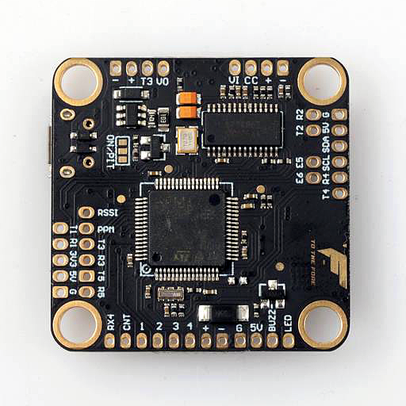

# TMOTOR F7

## Description
An evolution of TMOTOR F4, solves the inability to run bidir DSHOT on first 4 motors without remapping.
Plug & play connectivity with most popular 4in1 ESCs.

## MCU, Sensors and Features

### Hardware
  - MCU: STM32F722
  - IMU: MPU-6000
  - 6 DSHOT motors outputs
  - BMP280 SPI
  - 5 hardware UARTs
  - Onboard regulator supports up to 6S
  - Dataflash blackbox
  - External I2C port
  - JST-SH 10 pin 4in1 ESC plug

## Designers & Maintainers
T-Motor FPV (https://www.facebook.com/rctigermotor/)

