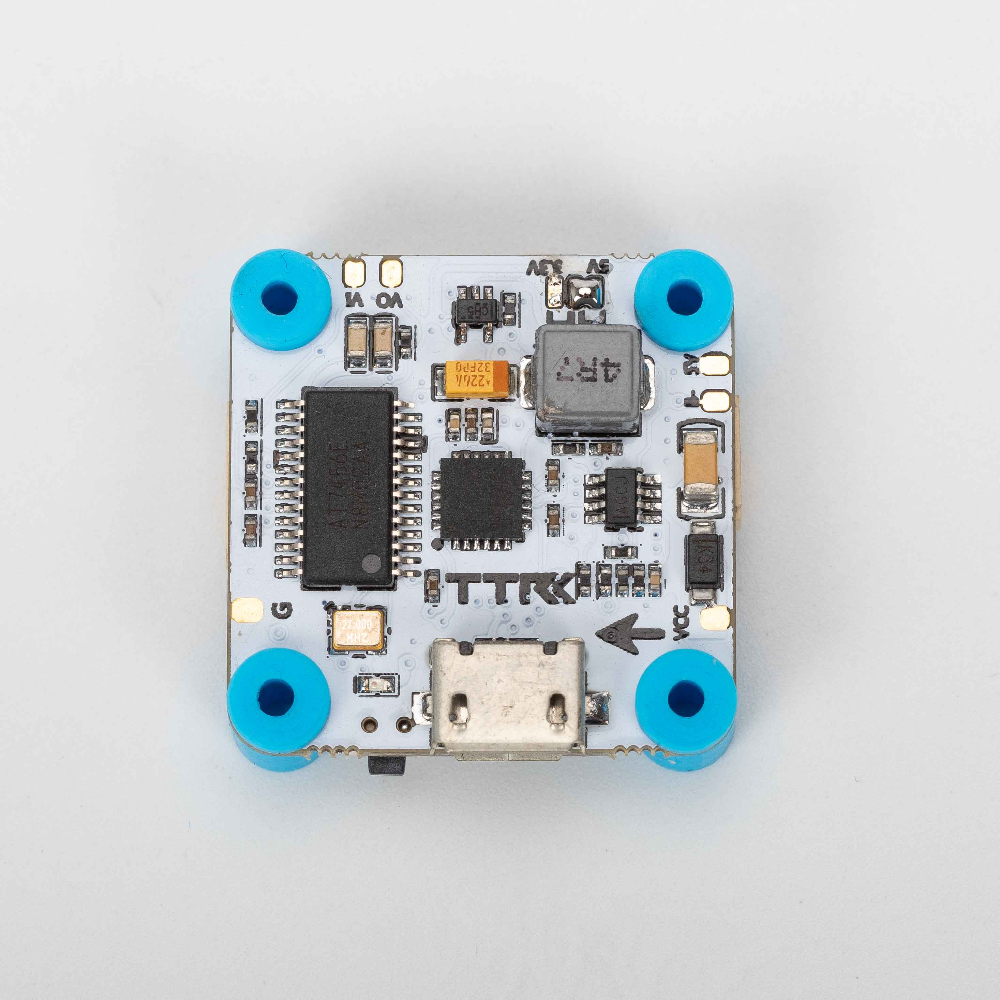
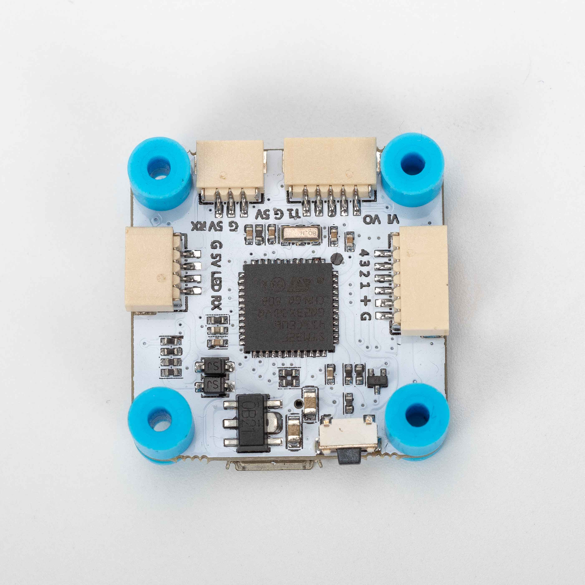

# Board - TRANSTEC F411 Series

## Description
TransTECF411 was designed for easily use. 
There will have three version of TRANSTECF411  30x30(Normal) / 20x20(Normal) / 20x20(HD).

## MCU, Sensors and Features

### Hardware
  - MCU: STM32F411
  - IMU: MPU-6000
  - 4 DSHOT motors outputs
  - 2 hardware UARTs
  - Onboard regulator supports up to 6S(30x30) 4S(20x20)
  - 5V 3A BEC
  - JST-SH 6 pin 4in1 ESC plug
  - JST-SH 5 pin plug for Cam and Vtx (Normal Version)
  - GH-1.25 6 pin HD plug for Dji FPV System (HD Version)

### Feature
  - Easy connect for peripherals(CAM/Vtx/Receiver)
  - Built in inverter for SBUS
  - Rubber damping ring
  - Vtx power switch support

## Designers & Maintainers
TransTEC Hobby (https://www.transtechobby.com)
TransTEC Facebook (https://www.facebook.com/TransTechobby/)
TransTEC Instagram (https://www.instagram.com/transtechobby/)

