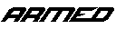
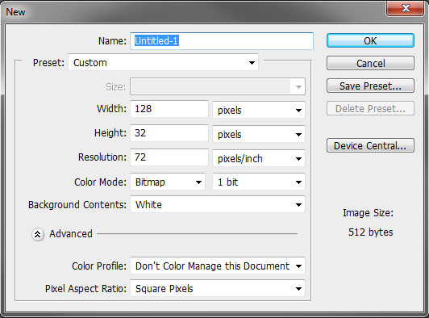
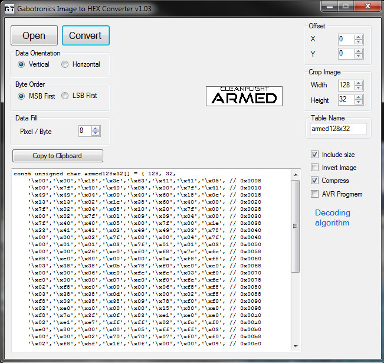

# Bitmaps

The bitmapDecompress function in INAV is currently designed to work with RLE compressed monochrome bitmaps.

## Image format

Images supported by this function are required to be 128 pixels wide, with the exception being an image only 8 pixels in height. The image height should be divisible by 8, but not be larger than the display height of 64.  The bitmap image should be monochrome, 1-bit.

Example Photoshop new image settings:

## Compression and HEX conversion

Your new bitmap file will need to be converted to run-length encoding compressed hexidecimal. The [Gabotronics Image to HEX Converter v1.03](http://www.gabotronics.com/download/resources/bmp-converter.zip) works very nicely for this.
The proper settings are shown in the screenshot below:

