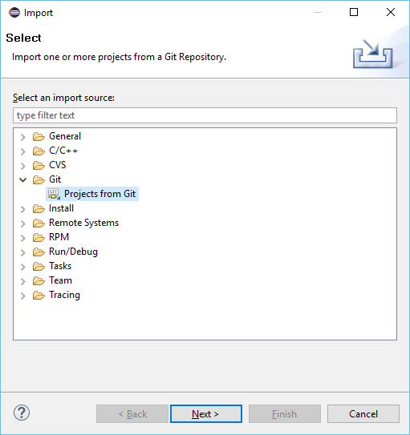
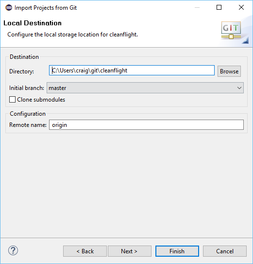
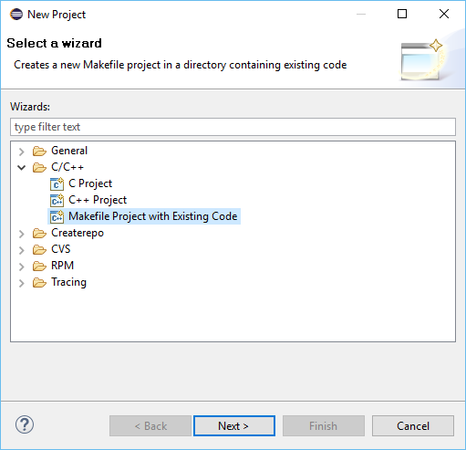
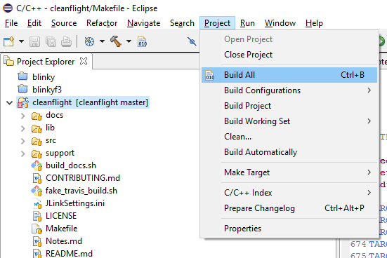
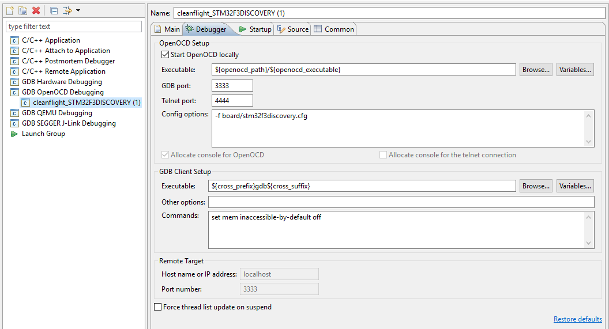
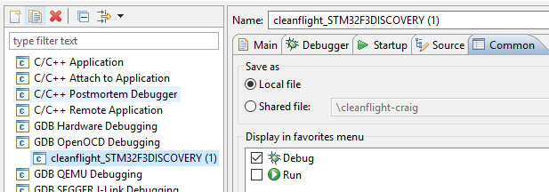

# Building in Eclipse

How to build, test & debug Betaflight in Eclipse on Linux, Windows & MacOS.

## Checklist

Use this checklist to make sure you didn't miss a step. Versions mandated below are current and correct as of January 2016.

- [ ] [Download and Install](http://www.oracle.com/technetwork/java/javase/downloads/jdk8-downloads-2133151.html) the latest (currently 1.8) 64bit Oracle JDK [read more](#install-the-jdk)
- [ ] [Download and Install](https://eclipse.org/downloads/packages/eclipse-ide-cc-developers/lunasr2) Eclipse Luna (4.4) 64bit CDT edition, **NB:** not Mars or Neon [read more](#install-eclipse)
- [ ] [Download and Install](https://launchpad.net/gcc-arm-embedded/4.9/4.9-2015-q3-update) the GCC ARM Embedded toolchain 4.9-2015-q3-update [read more](#install-arm-toolchain)
 - [ ] *Windows platform only:* [Download and Install](https://github.com/gnuarmeclipse/windows-build-tools/releases) the latest GNU ARM Eclipse Windows Build Tools
 - [ ] *Windows platform only:* Download and Install either [Cygwin](http://cygwin.com/install.html) or [MinGW MSYS](http://sourceforge.net/projects/mingw/files/latest/download)
- [ ] Optionally [Download and Install](https://github.com/gnuarmeclipse/openocd/releases) the latest GNU ARM Eclipse OpenOCD [read more](#install-openocd)
 - [ ] *Linux platform only:* [Configure UDEV](http://gnuarmeclipse.github.io/openocd/install/#udev) to recognise USB JTAG probes
 - [ ] *Windows platform only:* [Download and Install](http://www.st.com/web/en/catalog/tools/FM147/SC1887/PF260219) the ST-Link / ST-LinkV2 drivers. These drivers do work on Windows 10 even if not yet mentioned by ST.
- [ ] Optionally [Download and Install](https://github.com/gnuarmeclipse/qemu/releases) the latest GNU ARM Eclipse QEMU [read more](#install-qemu)
- [ ] Add a new update site to Eclipse named "GNU ARM Eclipse Plugins" with the URL "http://gnuarmeclipse.sourceforge.net/updates" and install all the features offered
- [ ] Configure [the recommended workspace settings](http://gnuarmeclipse.github.io/eclipse/workspace/preferences/)
- [ ] Checkout the betaflight source code [read more](#checkout-betaflight)
 - [ ] *Windows platform only:* Add the msys or cygwin bin directory to the project path
- [ ] Build the code by going to *Project menu -> Build All* [read more](#build)
- [ ] Run the tests by creating and running a make target named "test"
- [ ] Configure debugging [read more](#configure-debugging)

## Extended Notes

### Install the JDK

The [minimum JDK version](http://gnuarmeclipse.github.io/plugins/install/#java) supported by GNU Arm Eclipse is 1.7 but the current latest, 1.8, is recommended instead. While Oracle JDK is the recommended version, [they do also support](http://gnuarmeclipse.github.io/plugins/install/#java) the OpenJDK.

### Install Eclipse

Eclipse Luna v4.4 is the preferred version for GNU Arm Tools currently. The minimum Eclipse version is Kepler 4.3. The maximum is Mars 4.5 although it is not tested by GNU Arm Eclipse and some things are [known to be broken](http://gnuarmeclipse.github.io/plugins/install/#eclipse--cdt). Eclipse Neon is currently not released.

CDT v8.6.0, as shipped in the Eclipse Luna CDT download, is recommended. The minimum CDT version is 8.3.

The 64bit Eclipse is preferred but a 32bit Eclipse can be used; ensure you run it on a 32bit JDK.

### Install ARM Toolchain

The minimum version is 4.8-2014-q2. The maximum, and currently recommended version, is 4_9-2015q3.

GNU ARM Tools recommends that you don't add the toolchain to your path environment variable. This means you can install multiple versions of the toolchain without conflict. If you'll install only one version, it can make life easier when working outside Eclipse to add it to your path.

Retain the default installation directories so that the GNU ARM Plugins can locate the toolchain.

### Install OpenOCD

You should install OpenOCD If you will be debugging on real hardware, such as the STM32F3DISCOVERY dev board. It is not required to simply build Betaflight or run the tests.

### Install QEMU

No tests currently run on the QEMU emulator therefore this install is entirely optional. It is useful to test your installation, since you can compile and run a blinky demo.

### Checkout Betaflight

If you'll be submitting changes to betaflight, [fork the repository](https://help.github.com/articles/fork-a-repo/) on GitHub and checkout your copy.

In Eclipse go to *File -> Import* choose *Git -> Projects from Git*

Choose *Clone URI*

Enter the URI https://github.com/betaflight/betaflight or if you've forked the repo, enter your URI instead. With a fork, you will need to specify your authentication details

On the branch selection dialog, de-select all branches and select only *master*

Select the default destination directory

When the download completes, choose *Use the New Project wizard* and click Finish

Choose *C/C++ -> Makefile Project with Existing Code*

Enter betaflight as the project name and browse to your home directory -> git -> betaflight for the existing code location. Ensure the C (betaflight) and C++ (tests) languages are checked. Choose the Cross ARM GCC toolchain for the Indexer Settings. Click finish.

Set your build and debug targets by going to project properties -> C/C++ Build and choose the Behaviour tab. Replace "all" in the build box with "TARGET=xxx DEBUG=GDB" where xxx is your platform such as NAZE

On Windows only, add msys or cygwin bin directory to the project's path by right clicking the project and choosing properties

Edit the path variable in *C/C++ Build -> Environment*

Append the full path to the relevant bin dir

### Build

Choose project -> build all

### Configure Debugging

Choose debug -> debug configurations

Create a new OpenOCD configuration for the obj\main\betaflight_XXX.elf application (this file is generated by the build step above)

Add the appropriate openocd board configuration parameter for your dev platform

Add the target to your debug menu favourites

