# Building in windows light
no cygwin and no path changes

##Install Git for windows
download https://github.com/git-for-windows/git/releases/download/v2.10.1.windows.1/Git-2.10.1-32-bit.exe

Recommended install location is C:\Git (no spaces or special characters in path)

Follow images as not all are at default settings.

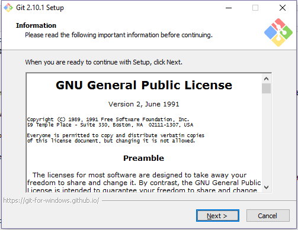

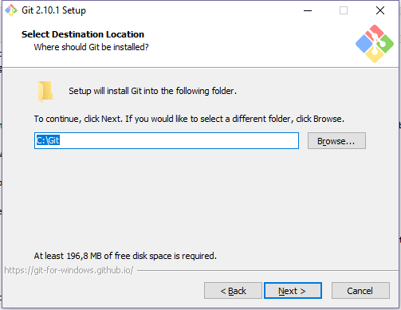

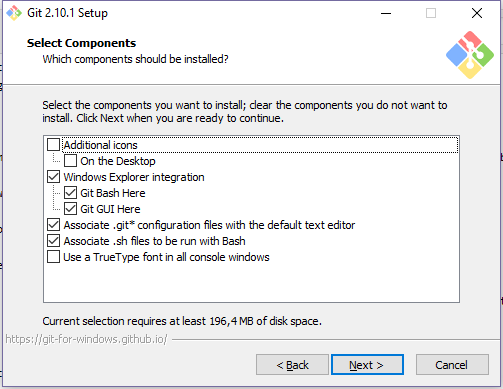

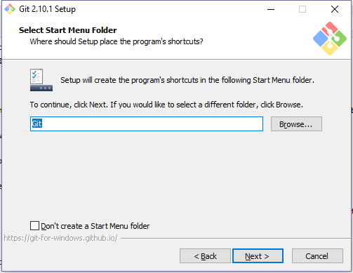

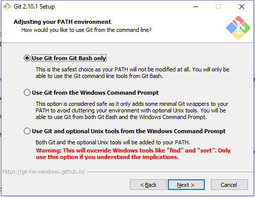

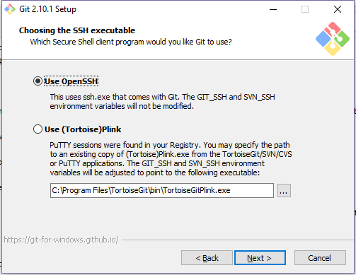

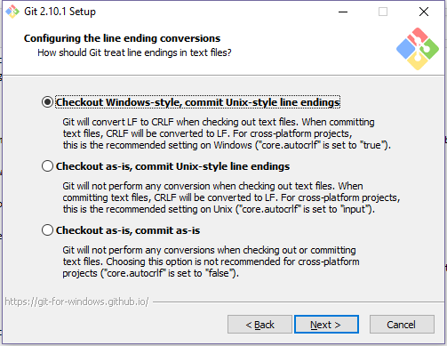

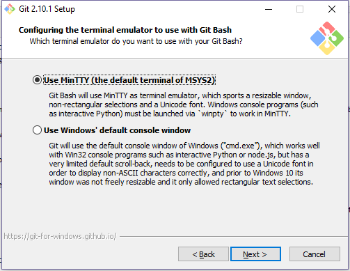

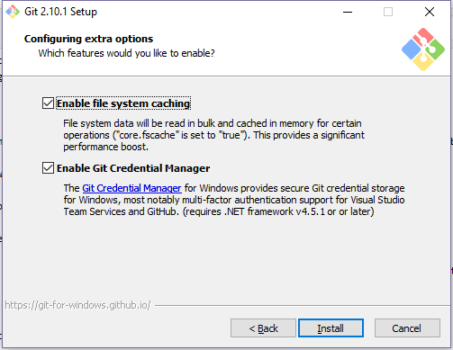

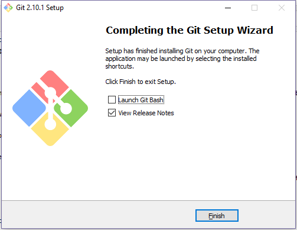

##Install toolset scripts
download https://www.dropbox.com/s/hhlr16h657y4l5u/devtools.zip?dl=0

extract it into C:\ it creates devtools folder

##Install arm toolchain
download https://launchpad.net/gcc-arm-embedded/4.9/4.9-2015-q2-update/+download/gcc-arm-none-eabi-4_9-2015q2-20150609-win32.zip

extract it into C:\devtools\gcc-arm-none-eabi-4_9-2015q2-20150609-win32 (folder already there)

##Install Ruby

Install the latest Ruby version using [Ruby Installer](https://rubyinstaller.org).

##Test
Run C:\devtools\shF4.cmd

If everything went according the manual you should be in mingw console window. (if not we need to update this manual)

Try command "arm-none-eabi-gcc --version" and output should be like in screenshot. (tab complete works here)

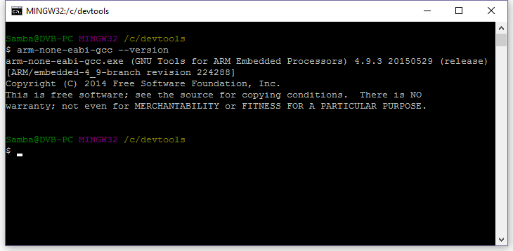

Note1: Advanced users can edit shF4.cmd for paths if they don't want to use defaults. You might want to change TOOLS_DIR and PATH_DIRS variables.

Note2: You can copy shF4.cmd anywhere you want and run it from there. It will open console window in that folder.

Note3: Included example batch-scripts (make_REVO.bat) that you can use to build target just by double clicking it.

## Checkout and compile INAV

Head over to the INAV Github page and grab the URL of the GIT Repository: "https://github.com/iNavFlight/inav"

Run shF4.cmd and use the git commandline to checkout the repository:

```bash
git clone https://github.com/iNavFlight/inav
```
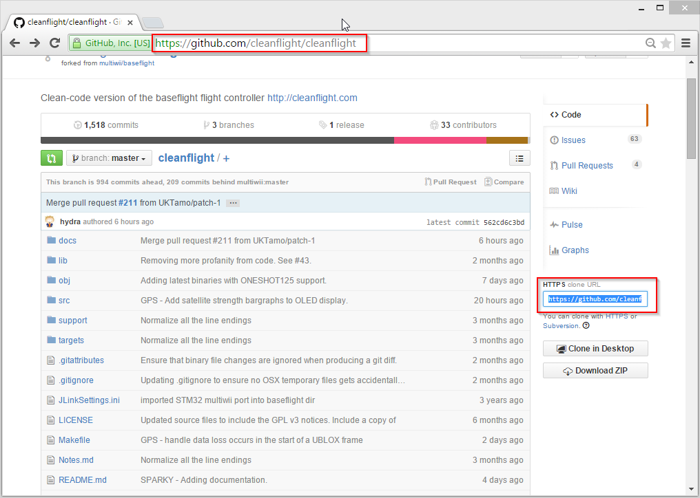

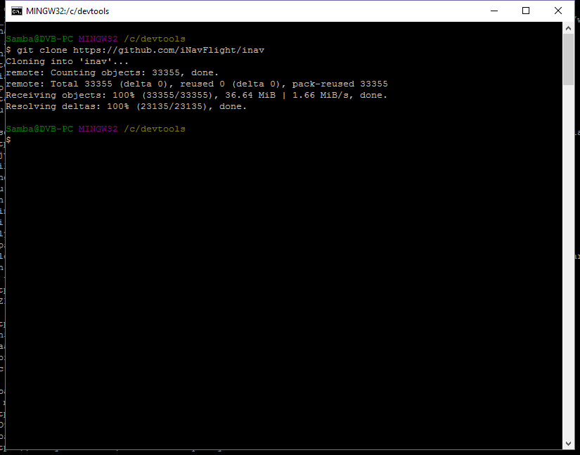

To compile your INAV binaries, enter the inav directory and build the project using the make command. You can append TARGET=[HARDWARE] if you want to build anything other than the default NAZE target:

```bash
cd inav
make TARGET=NAZE
```

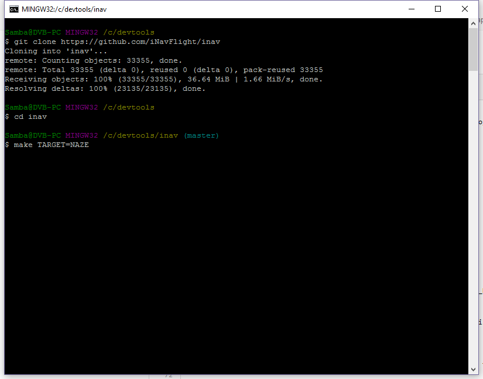

within few moments you should have your binary ready:

```bash
(...)
arm-none-eabi-size ./obj/main/inav_NAZE.elf
   text    data     bss     dec     hex filename
 127468     916   16932  145316   237a4 ./obj/main/inav_NAZE.elf
arm-none-eabi-objcopy -O ihex --set-start 0x8000000 obj/main/inav_NAZE.elf obj/inav_1.2.1_NAZE.hex
```

You can use the INAV-Configurator to flash the ```obj/inav_1.2.1_NAZE.hex``` file.

## Updating and rebuilding

Navigate to the local inavflight repository and use the following steps to pull the latest changes and rebuild your version of inavflight:

```bash
cd inav
git reset --hard
git pull
make clean TARGET=NAZE
make
```
