# Building in windows


##Setup Cygwin

download the Setup*.exe from https://www.cygwin.com/

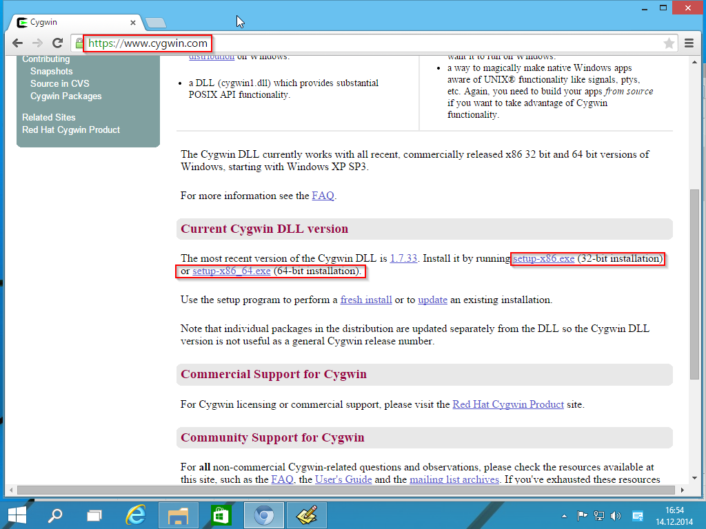

Execute the download Setup and step through the installation  wizard (no need to customize the settings here). Stop at the  "Select Packages" Screen and select the following Packages
for Installation:

- Devel/git
- Devel/git-completion (Optional)
- Devel/make
- Devel/binutils
- Editors/vim	 
- Editors/vim-common (Optional)
- Shells/mintty (should be already selected)

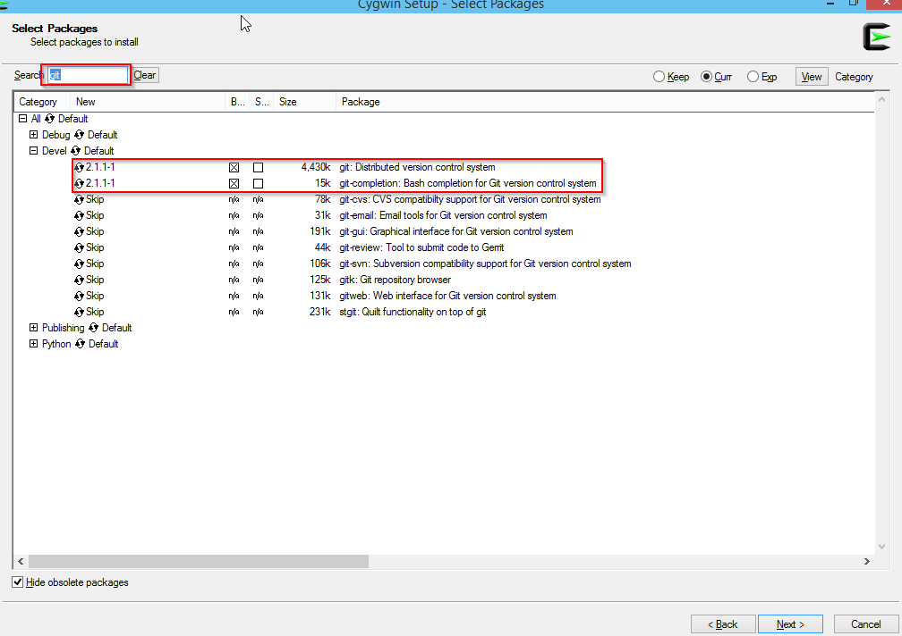

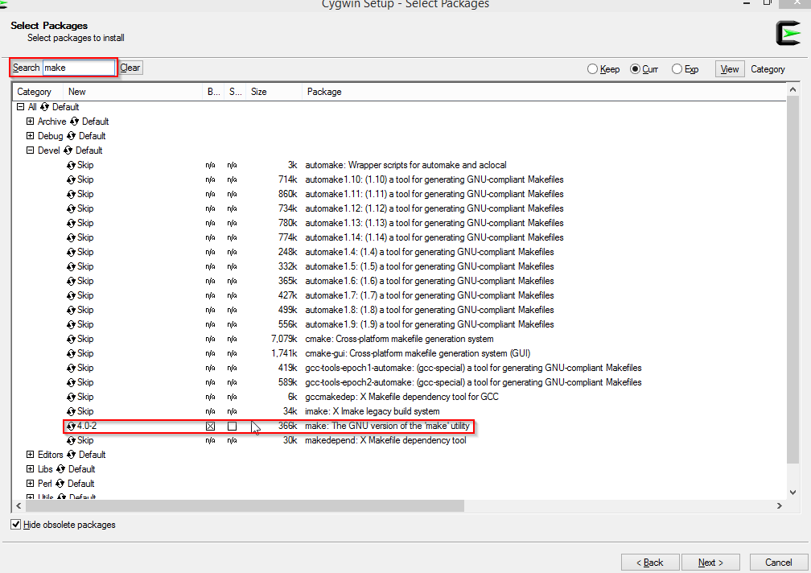

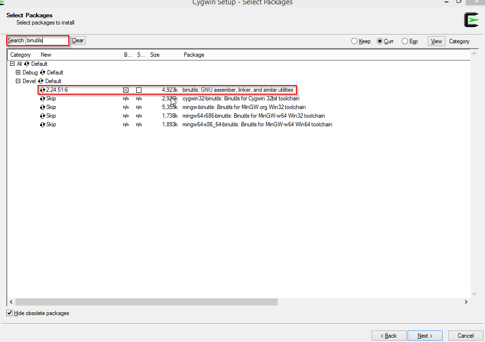

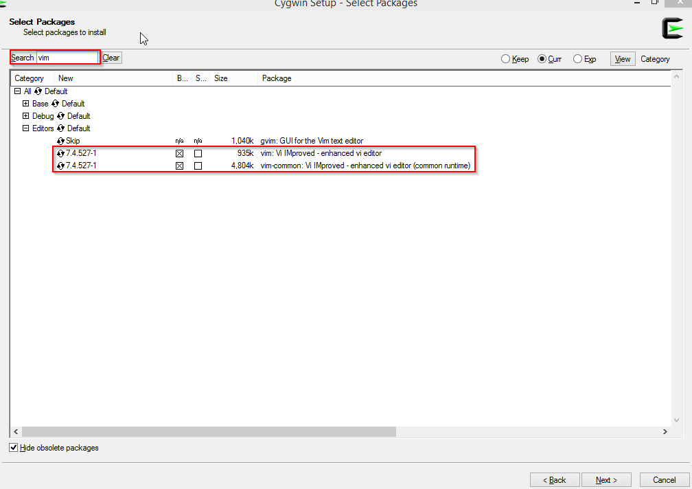

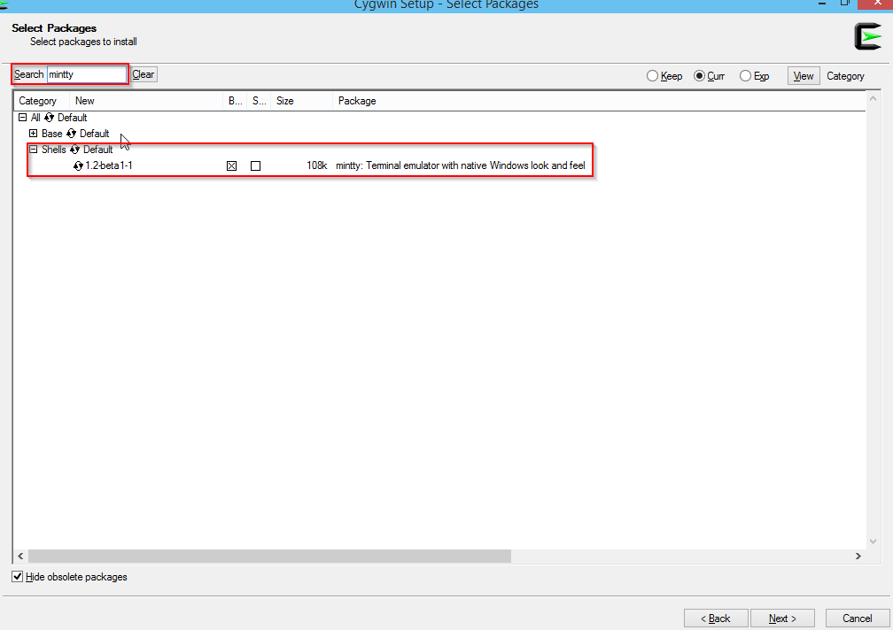


Continue with the Installation and accept all autodetected dependencies.

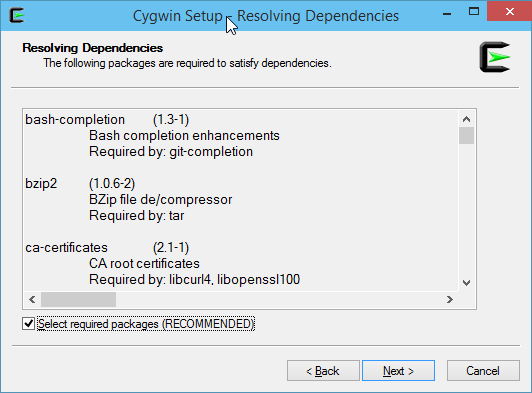


##Setup GNU ARM Toolchain

----------

versions do matter, 4.8-2014-q2 is known to work well. Download this version from https://launchpad.net/gcc-arm-embedded/+download - preferrebly as a ZIP-File. 


Extract the contents of this archive to any folder of your choice, for instance ```C:\dev\gcc-arm-none-eabi-4_8-2014q2```. 

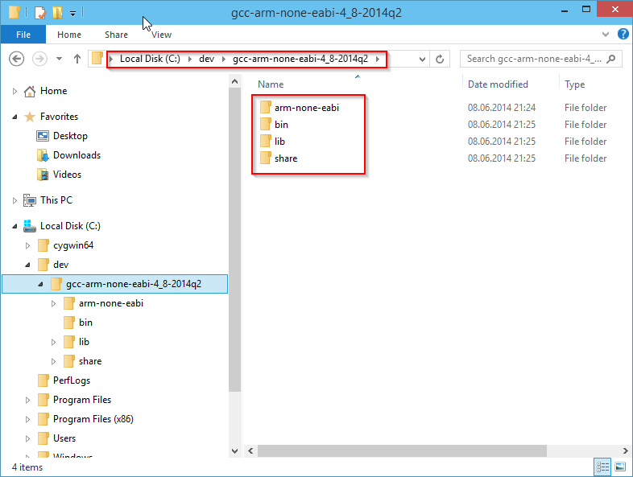

add the "bin" subdirectory to the PATH Windows environment variable: ```%PATH%;C:\dev\gcc-arm-none-eabi-4_8-2014q2\bin```

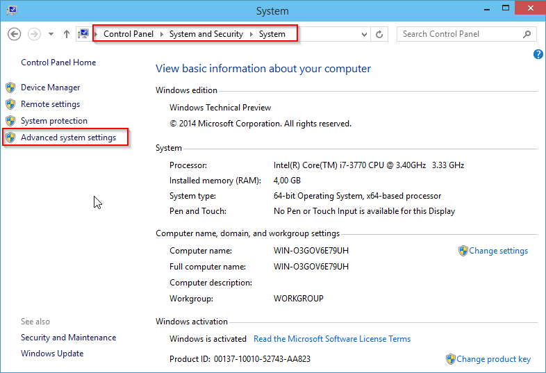

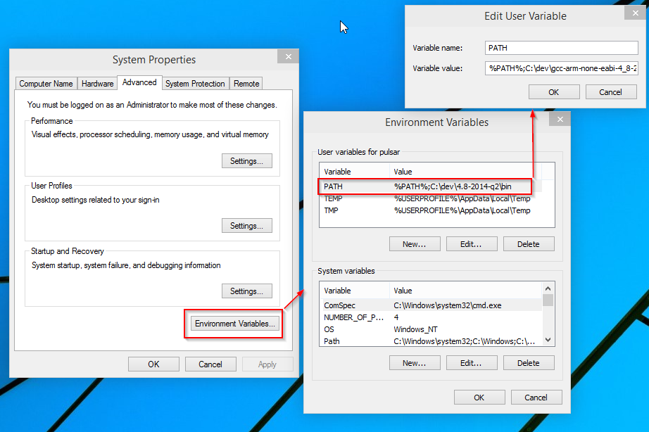

## Checkout and compile Cleanflight

Head over to the Cleanflight Github page and grab the URL of the GIT Repository: "https://github.com/cleanflight/cleanflight.git"

Open the Cygwin-Terminal, navigate to your development folder and use the git commandline to checkout the repository:

```bash
cd /cygdrive/c/dev
git clone https://github.com/cleanflight/cleanflight.git
```


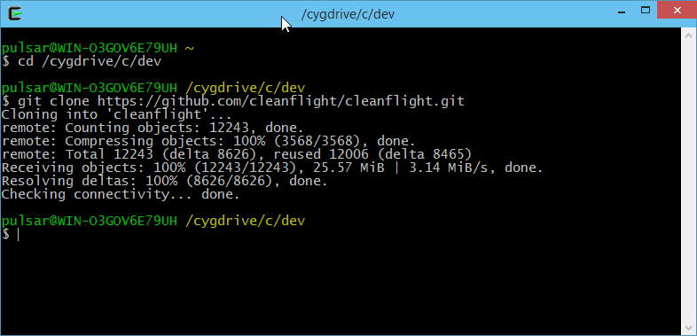

To compile your Cleanflight binaries, enter the cleanflight directory and build the project using the make command. You can append TARGET=[HARDWARE] if you want to build anything other than the default NAZE target:

```bash
cd cleanflight
make TARGET=NAZE
```

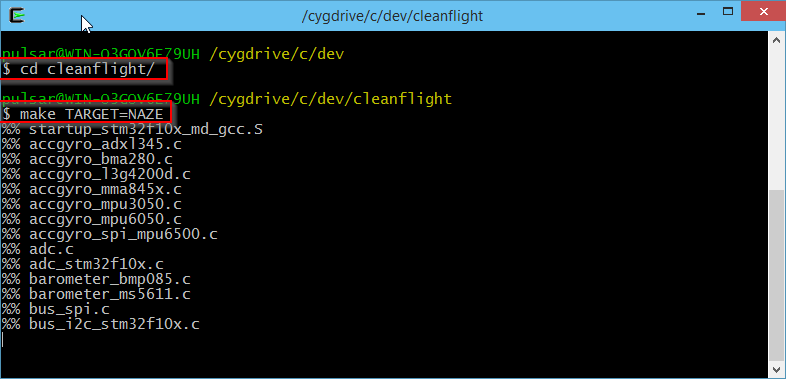

within few moments you should have your binary ready:

```bash
(...)
arm-none-eabi-size ./obj/main/cleanflight_NAZE.elf
   text    data     bss     dec     hex filename
  95388     308   10980  106676   1a0b4 ./obj/main/cleanflight_NAZE.elf
arm-none-eabi-objcopy -O ihex --set-start 0x8000000 obj/main/cleanflight_NAZE.elf obj/cleanflight_NAZE.hex
```

You can use the Cleanflight-Configurator to flash the ```obj/cleanflight_NAZE.hex``` file.

## Updating and rebuilding

Navigate to the local cleanflight repository and use the following steps to pull the latest changes and rebuild your version of cleanflight:

```bash
cd /cygdrive/c/dev/cleanflight
git reset --hard
git pull
make clean TARGET=NAZE
make
```
