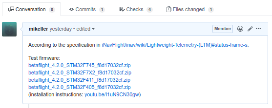

# Development

This document is primarily for developers.
If you plan to contribute to Betaflight by opening a pull request for a bugfix or feature, please read the following text carefully before you start. This will help you in submitting your contribution in a form that has a good chance of being accepted. Please also read up on the [coding style](/docs/development/CodingStyle.md).

## General principles

1. Name everything well.
2. Strike a balance between simplicity and not-repeating code.
3. Methods that start with the word 'find' can return a null, methods that start with 'get' should not.
4. Keep methods short - it makes it easier to test.
5. Don't be afraid of moving code to a new file - it helps to reduce test dependencies.
6. Avoid noise-words in variable names, like 'data' or 'info'.  Think about what you're naming and name it well.  Don't be afraid to rename anything.
7. Avoid comments that describe what the code is doing, the code should describe itself.  Comments are useful however for big-picture purposes and to document content of variables.
8. If you need to document a variable do it at the declaration, don't copy the comment to the `extern` usage since it will lead to comment rot.
9. Seek advice from other developers - know you can always learn more.
10. Be professional - attempts at humor or slating existing code in the codebase itself is not helpful when you have to change/fix it.
11. Know that there's always more than one way to do something and that code is never final - but it does have to work.

It is also advised to read about clean code, here are some useful links:

* http://cleancoders.com/
* http://en.wikipedia.org/wiki/SOLID_%28object-oriented_design%29
* http://en.wikipedia.org/wiki/Code_smell
* http://en.wikipedia.org/wiki/Code_refactoring
* http://www.amazon.co.uk/Working-Effectively-Legacy-Robert-Martin/dp/0131177052

## Unit testing

Ideally, there should be tests for any new code. However, since this is a legacy codebase which was not designed to be tested this might be a bit difficult.

If you want to make changes and want to make sure it's tested then focus on the minimal set of changes required to add a test.

Tests currently live in the `test` folder and they use the google test framework. 
The tests are compiled and run natively on your development machine and not on the target platform.
This allows you to develop tests and code and actually execute it to make sure it works without needing a development board or simulator.

This project could really do with some functional tests which test the behaviour of the application.

All pull requests to add/improve the testability of the code or testing methods are highly sought!

Note: Tests are written in C++ and linked with with firmware's C code. All code is also instrumented using gcov to make test coverage analysis possible.

### Running the tests.

The tests and test build system is very simple and based off the googletest example files, it will be improved in due course. From the root folder of the project simply do:

```
make test
```

You can also do:

```
make junittest
```

This will build a set of executable files in the `obj/test` folder, one for each `*_unittest.cc` file.
It will stop after first compile/build error. If you want it to continue with the next test module you can use `make -k test`.

After they have been executed by the make invocation, you can still run them on the command line to execute the tests and to see the test report. Test reports will also be produced in form of junit XML files, if tests are built and run with the "junittest" goal. Junit report files are saved in obj/test directory and has the following  naming pattern test\_name\_results.xml, for example: obj/test/battery\_unittest\_results.xml 

You can also step-debug the tests in eclipse and you can use the GoogleTest test runner to make building and re-running the tests simple.

The tests are currently always compiled with debugging information enabled, there may be additional warnings, if you see any warnings please attempt to fix them and submit pull requests with the fixes.

Tests are verified and working with GCC 4.9.3

## Using git and github

Ensure you understand the github workflow: https://guides.github.com/introduction/flow/index.html

Please keep pull requests focused on one thing only, since this makes it easier to merge and test in a timely manner.

If you need help with pull requests there are guides on github here:

https://help.github.com/articles/creating-a-pull-request/

The main flow for a contributing is as follows:

1. Login to github, go to the betaflight repository and press `fork`;
2. Then using the command line/terminal on your computer: `git clone <url to YOUR fork>`;
3. `cd betaflight`;
4. `git checkout master`;
5. `git checkout -b my-new-code`;
6. Make changes;
7. `git add <files that have changed>`;
8. `git commit`;
9. `git push origin my-new-code`;
10. Create pull request using github UI to merge your changes from your new branch into `betaflight/master`;
11. Repeat from step 4 for new other changes.

The primary thing to remember is that separate pull requests should be created for separate branches.  Never create a pull request from your `master` branch.

Once you have created the PR,
every new commit/push in your branch will propagate from your fork into the PR in the main github/betaflight repo.
Checkout another branch first if you want something else.

Push will often fail if you edit or squash commits in a branch already pushed. Never do such things after creating the PR.

Later, you can get the changes from the betaflight repo into your `master` branch by adding betaflight as a git remote and merging from it as follows:

1. `git remote add betaflight https://github.com/betaflight/betaflight.git`
2. `git checkout master`
3. `git fetch betaflight`
4. `git merge betaflight/master`
5. `git push origin master` is an optional step that will update your fork on github
 
You can also perform the git commands using the git client inside Eclipse.  Refer to the Eclipse git manual.

### Providing Test Targets for Pull Requests

If you open a pull request for the betaflight repository that contains a change that can be tested by other users, please build a set of test firmware files for all Unified Targets and attach them to the pull request. The required firmware files can be built in zipped form ready for upload to GitHub with `make unified_zip`. When attaching test firmware files, you can point users to this video for instructions on how to install the test firmware: https://youtu.be/I1uN9CN30gw

Example of a pull request with test firmware attached:



### IDEs and .gitignore

The projects [.gitignore](/.gitignore) already ignores certain artifacts from some IDEs, but if you'd like to use something else, you can set up git to ignore the necessary files at a global level (all git projects on the computer)

It is always good to check that you haven't done this already: `git config --global --get core.excludesfile`

For Linux/BSD/OSX: `git config --global core.excludesfile '~/.gitignore'`

For Windows: `git config --global core.excludesfile '%USERPROFILE%\.gitignore'`

When you `git config --global --get core.excludesfile` a second time, you should get a file location back.

### Custom Defaults - for developers

As all targets are now MCU based (and cloud built), this poses a problem for developers in flashing and running a fully baked "hex" using the standard debugger. The board scratch space (located at the /src/main/board directory) allows developers to setup their environment like they were running a fully baked unified target.

Once setup, you can simply execute make with `make BOARD=XXX` where XXX is the sub directory name under /src/main/board.

Example board.c (so that custom defaults are placed in the resultant build file):
```
#include "board.h"

const char __attribute__ ((section(".custom_defaults"), used, aligned(4))) customDefaults[] = 
    "# Betaflight\n"
    "board_name NERO\n"
    "\0";

```
board.h allows for any defines that you are working on as developers rather than specify via command line in EXTRA_FLAGS (as the cloud build system does).

board.mk allows for any additional source files, and to specify the target.

e.g. 
```
TARGET := STM32F7X2

```

