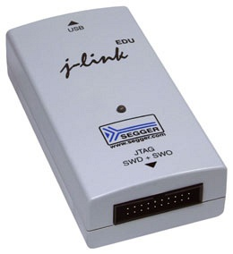
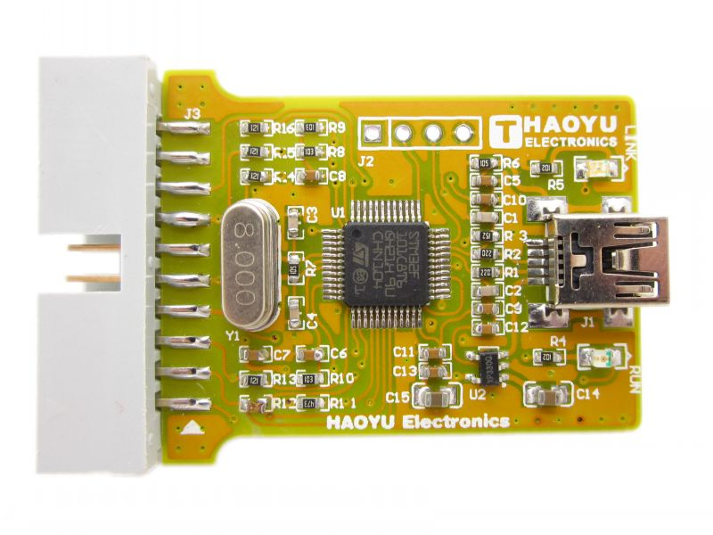
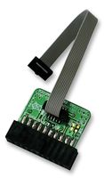
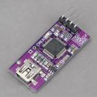
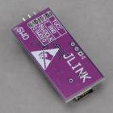
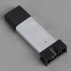

# Hardware debugging

The code can be compiled with debugging information, you can then upload a debug version to a board via a JLink/St-Link debug adapter and step through the code in your IDE.

More information about the necessary hardware and setting up the eclipse IDE can be found [here](Hardware Debugging in Eclipse.md)

A guide for visual studio can be found here:
http://visualgdb.com/tutorials/arm/st-link/

This video is also helpful in understanding the proces:
https://www.youtube.com/watch?v=kjvqySyNw20

## Hardware

Various debugging hardware solutions exist, the Segger J-Link clones are cheap and are known to work on Windows with both the Naze and Olimexino platforms.

### J-Link devices

Segger make excellent debuggers and debug software.

The Segger J-Link GDB server can be obtained from here.

http://www.segger.com/jlink-software.html

#### Segger J-Link EDU EDU version, for hobbyists and educational use.

https://www.segger.com/j-link-edu.html

#### USB-MiniJTAG J-Link JTAG/SWD Debugger/Emulator

http://www.hotmcu.com/usbminijtag-jlink-jtagswd-debuggeremula%E2%80%8Btor-p-29.html?cPath=3_25&zenid=fdefvpnod186umrhsek225dc10

##### ARM-JTAG-20-10 adapter

https://www.olimex.com/Products/ARM/JTAG/ARM-JTAG-20-10/
http://uk.farnell.com/jsp/search/productdetail.jsp?sku=2144328

#### CJMCU-STM32 Singlechip Development Board Jlink Downloader Jlink ARM Programmer

http://www.goodluckbuy.com/cjmcu-stm32-singlechip-development-board-jlink-downloader-jlink-arm-programmer.html

### STLink V2 devices

STLink V2 devices can be used too, via OpenOCD.

#### CEPark STLink V2

http://www.goodluckbuy.com/cepark-stlink-st-link-v2-emulator-programmer-stm8-stm32-downloader.html

## Compilation options

use `DEBUG=GDB` make argument.

You may find that if you compile all the files with debug information on that the program is too big to fit on the target device.  If this happens you have some options:

* Compile all files without debug information (`make clean`, `make ...`), then re-save or `touch` the files you want to be able to step though and then run `make DEBUG=GDB`.  This will then re-compile the files you're interested in debugging with debugging symbols and you will get a smaller binary file which should then fit on the device.
* You could use a development board such as an Olimexino or an EUSTM32F103RB, development boards often have more flash rom.

## OSX

### Install OpenOCD via Brew

ruby -e "$(curl -fsSL https://raw.githubusercontent.com/Homebrew/install/master/install)"

brew install openocd

### GDB debug server

#### J-Link

##### Windows

Run the Launch the J-Link GDB Server program and configure using UI. 

#### OpenOCD

##### Windows

STM32F103 targets

    "C:\Program Files (x86)\UTILS\openocd-0.8.0\bin-x64\openocd-x64-0.8.0.exe" -f interface/stlink-v2.cfg -f target/stm32f1x_stlink.cfg

STM32F30x targets

    "C:\Program Files (x86)\UTILS\openocd-0.8.0\bin-x64\openocd-x64-0.8.0.exe" -f scripts\board\stm32f3discovery.cfg
    
##### OSX/Linux

STM32F30x targets

      openocd -f /usr/share/openocd/scripts/board/stm32vldiscovery.cfg

