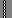

# OSD Glyphs

| PNG                            | Hex  | Dec | Betaflight Name(s)              | Notes |
| -------------------------------|------| --- | ------------------------------- | ----- |
|  | 0x01 | 001 | SYM_RSSI                        | Used in OSD.c      |
|  | 0x02 | 002 | SYM_AH_RIGHT                    | Used in OSD.c      |
|  | 0x03 | 003 | SYM_AH_LEFT SYM_CURSOR          | Used in OSD.c      |
|  | 0x04 | 004 | SYM_THR SYM_HOME                | Used in OSD.c      |
|  | 0x05 | 005 | SYM_THR1 SYM_AIRCRAFT           | Used in OSD.c      |
|  | 0x06 | 006 | SYM_VOLT                        | Used in OSD.c      |
|  | 0x07 | 007 | SYM_MAH                         | Used in OSD.c      |
|  | 0x08 | 008 |                                 |       |
|  | 0x09 | 009 |                                 |       |
|  | 0x0A | 010 |                                 |       |
|  | 0x0B | 011 |                                 |       |
|  | 0x0C | 012 | SYM_M                           | Used in OSD.c      |
|  | 0x0D | 013 | SYM_TEMP_F                      | No longer used in OSD.c ? Using F instead |
|  | 0x0E | 014 | SYM_TEMP_C                      | No longer used in OSD.c ? Using C instead |
|  | 0x0F | 015 | SYM_FT                          | Used in OSD.c      |
|  | 0x10 | 016 |                                 |       |
|  | 0x11 | 017 |                                 |       |
|  | 0x12 | 018 |                                 |       |
|  | 0x13 | 019 | SYM_AH_DECORATION               | Used in OSD.c      |
|  | 0x14 | 020 |                                 |       |
|  | 0x15 | 021 |                                 |       |
|  | 0x16 | 022 |                                 |       |
|  | 0x17 | 023 |                                 |       |
|  | 0x18 | 024 | SYM_HEADING_N                   | Used in OSD.c      |
|  | 0x19 | 025 | SYM_HEADING_S                   | Used in OSD.c      |
|  | 0x1A | 026 | SYM_HEADING_E                   | Used in OSD.c      |
|  | 0x1B | 027 | SYM_HEADING_W                   | Used in OSD.c      |
|  | 0x1C | 028 | SYM_HEADING_DIVIDED_LINE        | Used in OSD.c      |
|  | 0x1D | 029 | SYM_HEADING_LINE                | Used in OSD.c      |
|  | 0x1E | 030 | SYM_SAT_L                       | Used in OSD.c      |
|  | 0x1F | 031 | SYM_SAT_R                       | Used in OSD.c      |
|                                | 0x20 | 032 | SYM_BLANK                       | Used in OSD.c      |
|  | 0x21 | 033 |                                 |       |
|  | 0x22 | 034 |                                 |       |
|  | 0x23 | 035 |                                 |       |
|  | 0x24 | 036 |                                 |       |
|  | 0x25 | 037 |                                 |       |
|  | 0x26 | 038 | SYM_AH_CENTER_LINE              | Used in OSD.c      |
|  | 0x27 | 039 | SYM_AH_CENTER_LINE_RIGHT        | Used in OSD.c      |
|  | 0x28 | 040 |                                 |       |
|  | 0x29 | 040 |                                 |       |
|  | 0x2A | 040 |                                 |       |
|  | 0x2B | 040 |                                 |       |
|  | 0x2C | 040 |                                 |       |
|  | 0x2D | 045 | SYM_COLON                       | Used in OSD.c      |
|  | 0x2E | 046 |                                 |       |
|  | 0x2F | 047 |                                 |       |
|  | 0x30 | 048 |                                 |       |
|  | 0x31 | 049 |                                 |       |
|  | 0x32 | 050 |                                 |       |
|  | 0x33 | 051 |                                 |       |
|  | 0x34 | 052 |                                 |       |
|  | 0x35 | 053 |                                 |       |
|  | 0x36 | 054 |                                 |       |
|  | 0x37 | 055 |                                 |       |
|  | 0x38 | 056 |                                 |       |
|  | 0x39 | 057 |                                 |       |
|  | 0x3A | 058 |                                 |       |
|  | 0x3B | 059 |                                 |       |
|  | 0x3C | 060 |                                 |       |
|  | 0x3D | 061 |                                 |       |
|  | 0x3E | 062 |                                 |       |
|  | 0x3F | 063 |                                 |       |
|  | 0x40 | 064 |                                 |       |
|  | 0x41 | 065 |                                 |       |
|  | 0x42 | 066 |                                 |       |
|  | 0x43 | 067 |                                 |       |
|  | 0x44 | 068 |                                 |       |
|  | 0x45 | 069 |                                 |       |
|  | 0x46 | 070 |                                 |       |
|  | 0x47 | 071 |                                 |       |
|  | 0x48 | 072 |                                 |       |
|  | 0x49 | 073 |                                 |       |
|  | 0x4A | 074 |                                 |       |
|  | 0x4B | 075 |                                 |       |
|  | 0x4C | 076 |                                 |       |
|  | 0x4D | 077 |                                 |       |
|  | 0x4E | 078 |                                 |       |
|  | 0x4F | 079 |                                 |       |
|  | 0x50 | 080 |                                 |       |
|  | 0x51 | 081 |                                 |       |
|  | 0x52 | 082 |                                 |       |
|  | 0x53 | 083 |                                 |       |
|  | 0x54 | 084 |                                 |       |
|  | 0x55 | 085 |                                 |       |
|  | 0x56 | 086 |                                 |       |
|  | 0x57 | 087 | SYM_WATT                        | Used in OSD.c      |
|  | 0x58 | 088 |                                 |       |
|  | 0x59 | 089 |                                 |       |
|  | 0x5A | 090 |                                 |       |
|  | 0x5B | 091 |                                 |       |
|  | 0x5C | 092 |                                 |       |
|  | 0x5D | 093 |                                 |       |
|  | 0x5E | 094 |                                 |       |
|  | 0x5F | 095 |                                 |       |
|  | 0x60 | 096 | SYM_ARROW_SOUTH                 | Used in OSD.c      |
|  | 0x61 | 097 | SYM_ARROW_2                     | Calculated from SYM_ARROW_SOUTH + heading  |
|  | 0x62 | 098 | SYM_ARROW_3                     | Calculated from SYM_ARROW_SOUTH + heading  |
|  | 0x63 | 099 | SYM_ARROW_4                     | Calculated from SYM_ARROW_SOUTH + heading  |
|  | 0x64 | 100 | SYM_ARROW_EAST                  | Calculated from SYM_ARROW_SOUTH + heading  |
|  | 0x65 | 101 | SYM_ARROW_6                     | Calculated from SYM_ARROW_SOUTH + heading  |
|  | 0x66 | 102 | SYM_ARROW_7                     | Calculated from SYM_ARROW_SOUTH + heading  |
|  | 0x67 | 103 | SYM_ARROW_8                     | Calculated from SYM_ARROW_SOUTH + heading  |
|  | 0x68 | 104 | SYM_ARROW_NORTH                 | Calculated from SYM_ARROW_SOUTH + heading  |
|  | 0x69 | 105 | SYM_ARROW_10                    | Calculated from SYM_ARROW_SOUTH + heading  |
|  | 0x6A | 106 | SYM_ARROW_11                    | Calculated from SYM_ARROW_SOUTH + heading  |
|  | 0x6B | 107 | SYM_ARROW_12                    | Calculated from SYM_ARROW_SOUTH + heading  |
|  | 0x6C | 108 | SYM_ARROW_WEST                  | Calculated from SYM_ARROW_SOUTH + heading  |
|  | 0x6D | 109 | SYM_ARROW_14                    | Calculated from SYM_ARROW_SOUTH + heading  |
|  | 0x6E | 110 | SYM_ARROW_15                    | Calculated from SYM_ARROW_SOUTH + heading  |
|  | 0x6F | 111 | SYM_ARROW_16                    | Calculated from SYM_ARROW_SOUTH + heading  |
|  | 0x70 | 112 |                                 |       |
|  | 0x71 | 113 |                                 |       |
|  | 0x72 | 114 |                                 |       |
|  | 0x73 | 115 |                                 |       |
|  | 0x74 | 116 |                                 |       |
|  | 0x75 | 117 |                                 |       |
|  | 0x76 | 118 |                                 |       |
|  | 0x77 | 119 |                                 |       |
|  | 0x78 | 120 |                                 |       |
|  | 0x79 | 121 |                                 |       |
|                                | 0x7A | 122 |                                 |       |
|  | 0x7B | 123 |                                 |       |
|  | 0x7C | 124 |                                 |       |
|  | 0x7D | 125 |                                 |       |
|  | 0x7E | 126 | SYM_AH_CENTER                   | Used in OSD.c      |
|  | 0x7F | 127 |                                 |       |
|  | 0x80 | 128 | SYM_AH_BAR9_0                   | Used in OSD.c      |
|  | 0x81 | 129 | SYM_AH_BAR9_1                   | Calculated in AH using SYM_AH_BAR9_0 as base |
|  | 0x82 | 130 | SYM_AH_BAR9_2                   | Calculated in AH using SYM_AH_BAR9_0 as base |
|  | 0x83 | 131 | SYM_AH_BAR9_3                   | Calculated in AH using SYM_AH_BAR9_0 as base |
|  | 0x84 | 132 | SYM_AH_BAR9_4                   | Calculated in AH using SYM_AH_BAR9_0 as base |
|  | 0x85 | 133 | SYM_AH_BAR9_5                   | Calculated in AH using SYM_AH_BAR9_0 as base |
|  | 0x86 | 134 | SYM_AH_BAR9_6                   | Calculated in AH using SYM_AH_BAR9_0 as base |
|  | 0x87 | 135 | SYM_AH_BAR9_7                   | Calculated in AH using SYM_AH_BAR9_0 as base |
|  | 0x88 | 136 | SYM_AH_BAR9_8                   | Calculated in AH using SYM_AH_BAR9_0 as base |
|  | 0x89 | 137 |                         |       |
|  | 0x8A | 138 | SYM_PB_START                    | Used in OSD.c      |
|  | 0x8B | 139 | SYM_PB_FULL                     | Used in OSD.c      |
|  | 0x8C | 140 | SYM_PB_HALF                     |       |
|  | 0x8D | 141 | SYM_PB_EMPTY                    | Used in OSD.c      |
|  | 0x8E | 142 | SYM_PB_END                      | Used in OSD.c      |
|  | 0x8F | 143 | SYM_PB_CLOSE                    | Used in OSD.c      |
|  | 0x90 | 144 | SYM_BATT_FULL                   | Calculated from SYM_BATT_EMPTY      |
|  | 0x91 | 145 | SYM_BATT_5                      | Calculated from SYM_BATT_EMPTY      |
|  | 0x92 | 146 | SYM_BATT_4                      | Calculated from SYM_BATT_EMPTY      |
|  | 0x93 | 147 | SYM_BATT_3                      | Calculated from SYM_BATT_EMPTY      |
|  | 0x94 | 148 | SYM_BATT_2                      | Calculated from SYM_BATT_EMPTY      |
|  | 0x95 | 149 | SYM_BATT_1                      | Calculated from SYM_BATT_EMPTY      |
|  | 0x96 | 150 | SYM_BATT_EMPTY                  | Used in OSD.c      |
|  | 0x97 | 151 | SYM_MAIN_BATT                   | Used in OSD.c      |
|  | 0x98 | 152 |                                 |       |
|  | 0x99 | 153 |                                 |       |
|  | 0x9A | 154 | SYM_AMP                         | Used in OSD.c      |
|  | 0x9B | 155 | SYM_ON_M                        | Used in OSD.c      |
|  | 0x9C | 156 | SYM_FLY_M                       | Used in OSD.c      |
|  | 0x9D | 157 |                                 |       |
|  | 0x9E | 158 |                                 |       |
|  | 0x9F | 159 |                                 |       |
|  | 0xA0 | 160 |                                 | *Logo Starts Here* |
|                                | 0xFF | 255 | SYM_END_OF_FONT                 |       |