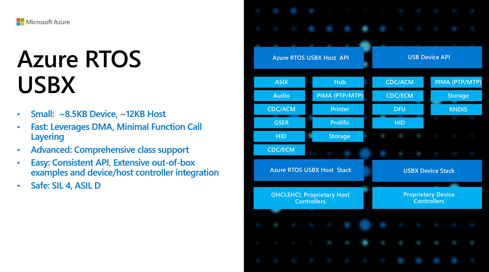
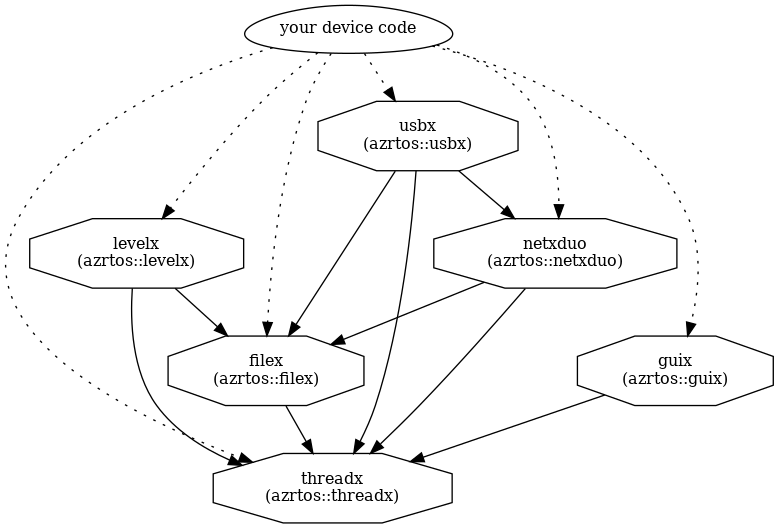

# Azure RTOS USBX

A high-performance USB host, device, and on-the-go (OTG) embedded stack, Azure RTOS USBX is fully integrated with Azure RTOS ThreadX and available for all Azure RTOS ThreadX–supported processors. Like Azure RTOS ThreadX, Azure RTOS USBX is designed to have a small footprint and high performance, making it ideal for deeply embedded applications that require an interface with USB devices.

Here are the key features and modules of USBX:



## Getting Started

Azure RTOS USBX as part of Azure RTOS has been integrated to the semiconductor's SDKs and development environment. You can develop using the tools of choice from [STMicroelectronics](https://www.st.com/content/st_com/en/campaigns/x-cube-azrtos-azure-rtos-stm32.html), [NXP](https://www.nxp.com/design/software/embedded-software/azure-rtos-for-nxp-microcontrollers:AZURE-RTOS), [Renesas](https://github.com/renesas/azure-rtos) and [Microchip](https://mu.microchip.com/get-started-simplifying-your-iot-design-with-azure-rtos).

We also provide [samples](https://github.com/azure-rtos/samples) using hero development boards from semiconductors you can build and test with.

See [Overview of Azure RTOS USBX](https://learn.microsoft.com/azure/rtos/usbx/overview-usbx) for the high-level overview, and all documentation and APIs can be found in: [Azure RTOS USBX documentation](https://learn.microsoft.com/azure/rtos/usbx/).

## Repository Structure and Usage

### Directory layout

    .
    ├── cmake                   # CMakeList files for building the project
    ├── common                  # Core USBX files
    ├── ports                   # Architecture and compiler specific files
    ├── samples                 # Sample codes
    ├── support                 # Misc platform configurations file used by USBX
    ├── LICENSE.txt             # License terms
    ├── LICENSE-HARDWARE.txt    # Licensed hardware from semiconductors
    ├── CONTRIBUTING.md         # Contribution guidance
    └── SECURITY.md             # Microsoft repo security guidance

### Branches & Releases

The master branch has the most recent code with all new features and bug fixes. It does not represent the latest General Availability (GA) release of the library. Each official release (preview or GA) will be tagged to mark the commit and push it into the Github releases tab, e.g. `v6.2-rel`.

## Component dependencies

The main components of Azure RTOS are each provided in their own repository, but there are dependencies between them, as shown in the following graph. This is important to understand when setting up your builds.



> You will have to take the dependency graph above into account when building anything other than ThreadX itself.

### Building and using the library

Instruction for building the USBX as static library using Arm GNU Toolchain and CMake. If you are using toolchain and IDE from semiconductor, you might follow its own instructions to use Azure RTOS components as explained in the [Getting Started](#getting-started) section.

1. Install the following tools:

    * [CMake](https://cmake.org/download/) version 3.0 or later
    * [Arm GNU Toolchain for arm-none-eabi](https://developer.arm.com/downloads/-/arm-gnu-toolchain-downloads)
    * [Ninja](https://ninja-build.org/)

1. Build the [ThreadX library](https://github.com/azure-rtos/threadx#building-and-using-the-library) as the dependency.

1. Cloning the repo.

    ```bash
    $ git clone https://github.com/azure-rtos/usbx.git
    ```

1. Define the features and addons you need in `ux_user.h` and build together with the component source code. You can refer to [`ux_user_sample.h`](https://github.com/azure-rtos/usbx/blob/master/common/core/inc/ux_user_sample.h) as an example.

1. Building as a static library

    Each component of Azure RTOS comes with a composable CMake-based build system that supports many different MCUs and host systems. Integrating any of these components into your device app code is as simple as adding a git submodule and then including it in your build using the CMake `add_subdirectory()`.

    While the typical usage pattern is to include USBX into your device code source tree to be built & linked with your code, you can compile this project as a standalone static library to confirm your build is set up correctly.

    An example of building the library for Cortex-M4:

    ```bash
    $ cmake -Bbuild -GNinja -DCMAKE_TOOLCHAIN_FILE=cmake/cortex_m4.cmake .

    $ cmake --build ./build
    ```

## Professional support

[Professional support plans](https://azure.microsoft.com/support/options/) are available from Microsoft. For community support and others, see the [Resources](#resources) section below.

## Licensing

License terms for using Azure RTOS are defined in the LICENSE.txt file of this repo. Please refer to this file for all definitive licensing information. No additional license fees are required for deploying Azure RTOS on hardware defined in the [LICENSED-HARDWARE.txt](./LICENSED-HARDWARE.txt) file. If you are using hardware not listed in the file or having licensing questions in general, please contact Microsoft directly at https://aka.ms/azrtos-license.

## Resources

The following are references to additional Azure RTOS resources:

- **Product introduction and white papers**: https://azure.com/rtos
- **General technical questions**: https://aka.ms/QnA/azure-rtos
- **Product issues and bugs, or feature requests**: https://github.com/azure-rtos/usbx/issues
- **Licensing and sales questions**: https://aka.ms/azrtos-license
- **Product roadmap and support policy**: https://aka.ms/azrtos/lts
- **Blogs and videos**: http://msiotblog.com and https://aka.ms/iotshow
- **Azure RTOS TraceX Installer**: https://aka.ms/azrtos-tracex-installer

You can also check [previous questions](https://stackoverflow.com/questions/tagged/azure-rtos+usbx) or ask new ones on StackOverflow using the `azure-rtos` and `usbx` tags.

## Security

Azure RTOS provides OEMs with components to secure communication and to create code and data isolation using underlying MCU/MPU hardware protection mechanisms. It is ultimately the responsibility of the device builder to ensure the device fully meets the evolving security requirements associated with its specific use case.

## Contribution

Please follow the instructions provided in the [CONTRIBUTING.md](./CONTRIBUTING.md) for the corresponding repository.
